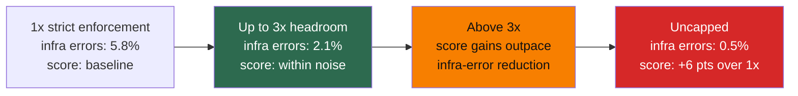

# Chapter 11: Infrastructure Noise

Small differences on benchmark leaderboards carry more uncertainty than their decimal precision suggests. Anthropic's "Quantifying Infrastructure Noise" shows how large that uncertainty can be ([Anthropic — Quantifying Infrastructure Noise in Agentic Coding Evals](https://www.anthropic.com/engineering/infrastructure-noise)).

Static benchmarks score model outputs directly. Agentic coding evals work differently: the model writes programs, runs tests, installs dependencies, and revises its approach over many turns. The runtime is therefore not a passive container; it is part of the problem-solving process. Two agents given different resource budgets are not taking the same test.

### 11.1 The Headline Result

Anthropic ran Terminal-Bench 2.0 across six resource configurations on a Google Kubernetes Engine cluster. The Claude model, harness, and task set remained the same; only the resource floor and ceiling changed. The resulting gap between the most- and least-resourced configurations was 6 percentage points (p < 0.01) ([Anthropic — Quantifying Infrastructure Noise](https://www.anthropic.com/engineering/infrastructure-noise)).

That difference is larger than the typical leaderboard gap between leading models. The implication is straightforward: a 2-point lead may represent a real capability advantage, or it may simply mean that one eval ran on more capable hardware.

### 11.2 The Two Regimes

The results reveal two distinct regimes:

- **From 1× to 3× the per-task resource specification**, scores fluctuated within statistical noise (p = 0.40), while infrastructure error rates fell steadily—from 5.8% under strict enforcement to 2.1% with 3× headroom (p < 0.001). The added capacity absorbed transient memory spikes that would otherwise trigger out-of-memory container failures. Across this range, the added resources made the eval more stable without measurably making the tasks easier.
- **Above 3×**, scores rose faster than infrastructure error rates declined. Between 3× and uncapped resources, infrastructure errors fell by 1.6 percentage points, but task success increased by almost 4 points. At this level, extra resources did more than prevent crashes. They enabled strategies that depended on generous allocations, such as installing large dependencies, running memory-intensive test suites, or brute-forcing solutions with heavyweight tools.

### 11.3 What This Means for Measurement

Tight resource limits reward efficient strategies, while generous limits reward agents that can exploit the available capacity. Both are legitimate properties to measure. The problem arises when results from different configurations are collapsed into a single score without documenting those configurations.

Anthropic's `bn-fit-modify` task illustrates the effect. With generous limits, some models begin by installing an entire Python data-science stack—pandas, networkx, and scikit-learn—before writing any solution code. With tight limits, the pod runs out of memory during installation. A leaner strategy is available: implement the required mathematics from scratch using only the standard library. Some models choose that approach by default. The resource configuration therefore determines which default strategy succeeds ([Anthropic — Quantifying Infrastructure Noise](https://www.anthropic.com/engineering/infrastructure-noise)).

The same effect appears outside Terminal-Bench, although its magnitude is smaller. In Anthropic's SWE-bench experiment, a 5× RAM allocation produced scores 1.54 percentage points higher than a 1× allocation across 227 problems. The difference was smaller than on Terminal-Bench because SWE-bench tasks are less resource-intensive, but the resource increase was still not neutral ([Anthropic — Quantifying Infrastructure Noise](https://www.anthropic.com/engineering/infrastructure-noise)).

### 11.4 The Recommendation

An eval should specify a guaranteed allocation (the floor) separately from a hard ceiling rather than pinning resources to a single value. For Terminal-Bench, a ceiling of 3× the per-task specification is a reasonable default: it reduced infrastructure errors by two-thirds while keeping the score increase well within statistical noise ([Anthropic — Quantifying Infrastructure Noise](https://www.anthropic.com/engineering/infrastructure-noise)). The appropriate multiplier depends on the benchmark and task distribution, so every result should report it explicitly.

For readers of benchmark results, the operational rule is simple: treat leaderboard differences below 3 percentage points with skepticism until resource configurations are documented and matched. A lead of a few points may reflect a genuine capability difference—or merely a larger virtual machine.

---

## Diagram: Resource Configuration vs. Score (Terminal-Bench 2.0 Summary)

The following table summarizes the two regimes reported by Anthropic. The article quantifies error rates only for the 1×, 3×, and uncapped configurations. The intermediate row is therefore qualitative, avoiding a level of precision that the source does not provide.

| Resource Level | Infra Error Rate | Score Change | Interpretation |
|---|---|---|---|
| 1× (strict) | 5.8% | baseline | OOM kills obscure substantive failures |
| 3× | 2.1% | +noise | Practical balance: infra errors cut by 2/3 |
| Above 3× | lower | score begins rising faster than infra errors fall | Agents start exploiting extra RAM |
| Uncapped | 0.5% | +6 pts over 1× | Resource-intensive defaults succeed |

*Above 3×, score gains outpace the decline in infrastructure errors: extra resources enable new strategies rather than merely improving stability.*

---

## Key Takeaways

- **Hardware alone produced a 6-point gap**: the difference between the most- and least-resourced Terminal-Bench 2.0 configurations exceeded typical leaderboard gaps between leading models.
- **There are two resource regimes**: moving from 1× to 3× reduces infrastructure instability; moving above 3× enables resource-intensive strategies.
- **A 3× ceiling is the practical default**: it reduces infrastructure errors by two-thirds while keeping the score increase within statistical noise.
- **Small leaderboard differences deserve skepticism**: differences below 3 percentage points are difficult to interpret until resource configurations are documented and matched.
- **Resource limits shape strategy**: tight limits reward efficiency, while generous limits reward the ability to exploit available capacity. Both are valid measurements, but they should be distinguished.

## Further Reading

- Gian Segato, *Quantifying Infrastructure Noise in Agentic Coding Evals*, Anthropic, Feb 2026. https://www.anthropic.com/engineering/infrastructure-noise
- Mikaela Grace et al., *Demystifying Evals for AI Agents*, Anthropic, Jan 2026. https://www.anthropic.com/engineering/demystifying-evals-for-ai-agents
- Vivek Trivedy, *Improving Deep Agents with Harness Engineering*, LangChain, Feb 2026. https://blog.langchain.com/improving-deep-agents-with-harness-engineering/
