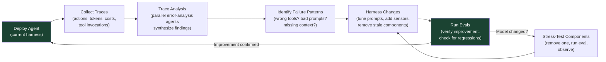

# Chapter 11: Trace-Driven Iteration and Model–Harness Co-Evolution

### 11.1 Traces Are the Feedback Loop

Models today are largely black boxes; their inner mechanisms are hard to interpret. But their inputs and outputs are visible in text, and that is enough to drive systematic improvement. LangChain treats traces as the primary surface for harness debugging: every agent action is stored, including latency, token counts, costs, and tool invocations ([LangChain — Improving Deep Agents with Harness Engineering](https://blog.langchain.com/improving-deep-agents-with-harness-engineering/)).

Their *Trace Analyzer Skill* automates the loop:

1. Fetch experiment traces from LangSmith.
2. Spawn parallel error-analysis agents; the main agent synthesizes findings and suggestions.
3. Aggregate feedback and make targeted changes to the harness.

This is structurally similar to boosting in classical machine learning — iteration focuses on mistakes from previous runs. Human review at step 3 is helpful but not strictly required, mainly to catch changes that overfit to specific tasks at the cost of generalization.

### 11.2 Runtime and Process Observability

Trace-driven iteration needs two kinds of observability. **Runtime observability** records what the system did: tool calls, command outputs, browser actions, latency, token usage, errors, retries, and final environment state. This is the layer LangChain emphasizes when it stores every agent action and aggregates failure patterns from traces.

**Process observability** records why the current work should be accepted: task scope, sprint contracts, rubrics, verification evidence, excluded work, and handoff notes. Anthropic's generator-evaluator harness made this explicit with sprint contracts negotiated before implementation and evaluator rubrics that produced specific feedback when a sprint failed ([Anthropic — Harness Design for Long-Running Application Development](https://www.anthropic.com/engineering/harness-design-long-running-apps)).

The two layers reinforce each other. Runtime signals without process artifacts tell you what happened but not whether it satisfied the intended scope. Process artifacts without runtime signals can become plausible paperwork around broken behavior. A production harness should make both inspectable: the task trajectory, the acceptance criteria, and the evidence that the environment actually reached the desired state.

### 11.3 Stress-Test Load-Bearing Components

Anthropic's harness-design follow-up adds a complementary discipline ([Anthropic — Harness Design for Long-Running Application Development](https://www.anthropic.com/engineering/harness-design-long-running-apps)). Every component in a harness encodes an assumption about what the model cannot do on its own. As models improve, those assumptions go stale. The recommended approach: remove one component at a time, run the eval, observe.

When Opus 4.6 launched with stronger long-context retrieval and better long-horizon coding behavior, Anthropic was able to remove the sprint construct in one version of the harness. The generator ran coherently for over two hours without sprint decomposition. The evaluator, which had been more load-bearing on earlier models, became more situational on 4.6 — useful for tasks at the edge of what the generator could do solo, unnecessary overhead within that boundary. The general principle the team articulates: "the evaluator is not a fixed yes-or-no decision. It is worth the cost when the task sits beyond what the current model does reliably solo."

### 11.4 Model–Harness Co-Evolution

Today's frontier coding models are post-trained with their harnesses in the loop ([LangChain — The Anatomy of an Agent Harness](https://blog.langchain.com/the-anatomy-of-an-agent-harness/)). Useful primitives are discovered, added to the harness, and used in training the next generation, which becomes more capable within that harness. This creates a feedback loop with side effects: changing harness logic can produce worse model performance even when the change should be neutral.

The Codex `apply_patch` tool is the canonical example. Codex models are post-trained on this specific patching format, and OpenCode — built as an open-source alternative to Claude Code — had to add an `apply_patch` tool specifically for GPT/Codex models to mimic the Codex harness; Claude and other models still use normal `edit` and `write` tools ([HumanLayer — Skill Issue: Harness Engineering for Coding Agents](https://www.humanlayer.dev/blog/skill-issue-harness-engineering-for-coding-agents)).

### 11.5 But the Best Harness Is Not Always the One the Model Was Trained In

The corollary, and the practical license to iterate: the harness a model was trained in is often *not* optimal for a given task. Terminal-Bench 2.0 has been a recurring data point in the practitioner discussion — HumanLayer cites Opus 4.6 in Claude Code at position 33, while the same model in a different harness places at position 5, with about four positions of leaderboard noise ([HumanLayer — Skill Issue: Harness Engineering for Coding Agents](https://www.humanlayer.dev/blog/skill-issue-harness-engineering-for-coding-agents); [LangChain — The Anatomy of an Agent Harness](https://blog.langchain.com/the-anatomy-of-an-agent-harness/)). Treat the exact ranks as leaderboard snapshots, not timeless model facts.

LangChain's case study reaches the same conclusion experimentally. They ran a Claude Opus 4.6 test on an early version of their harness that scored 59.6%, competitive but worse than their tuned Codex configuration. The principles generalized — context preparation, verification — but a few rounds of harness iteration tailored to the model would have closed the gap ([LangChain — Improving Deep Agents with Harness Engineering](https://blog.langchain.com/improving-deep-agents-with-harness-engineering/)).

The pragmatic rule: if you change the model, re-examine the harness. Tune what is now load-bearing, strip what is no longer.

### 11.6 Practical Takeaways

LangChain's distilled principles for harness iteration ([LangChain — Improving Deep Agents with Harness Engineering](https://blog.langchain.com/improving-deep-agents-with-harness-engineering/)):

1. **Context engineering on behalf of agents** — onboard the model into its environment with directory structures, available tools, coding best practices, problem-solving strategies.
2. **Help agents self-verify their work** — models bias toward their first plausible solution; prompt aggressively to verify by running tests.
3. **Tracing as a feedback signal** — debug tooling and reasoning together (models go down wrong paths because they lack a tool *or* the instructions for one).
4. **Detect and fix bad patterns in the short term** — guardrails like loop detection are crutches that will dissolve as models improve, but are useful today.
5. **Tailor harnesses to models** — Claude and Codex prompting guides differ for a reason; principles generalize, specifics do not.

HumanLayer's parallel set ([HumanLayer — Skill Issue: Harness Engineering for Coding Agents](https://www.humanlayer.dev/blog/skill-issue-harness-engineering-for-coding-agents)):

What worked: starting simple and adding configuration only after real failures; iterating and throwing away things that did not help; distributing battle-tested configurations across the team via repository-level config; optimizing for iteration speed rather than likelihood of one-shotting; pruning capabilities once you know what you actually need.

What did not work: designing the ideal harness upfront; installing dozens of skills and MCP servers "just in case"; running the full test suite at the end of every session; micro-optimizing which sub-agents could access which tools.

### 11.7 The Misleading Data on AGENTS.md

A worth-reading detail: an ETH Zurich study tested 138 agentfiles (the generic term for AGENTS.md / CLAUDE.md-style instruction files) across various repos and found that LLM-generated ones hurt performance while costing 20% more, that human-written ones helped only about 4%, that agents spent 14–22% more reasoning tokens processing context-file instructions, and that codebase overviews and directory listings did not help in that benchmark because agents could discover repository structure on their own ([HumanLayer — Skill Issue: Harness Engineering for Coding Agents](https://www.humanlayer.dev/blog/skill-issue-harness-engineering-for-coding-agents) citing the ETH Zurich paper).

HumanLayer reads this as confirming their own AGENTS.md guidance — keep files concise, avoid auto-generation, use progressive disclosure rather than dumping every instruction up front, keep contents universally applicable rather than full of conditional rules. Their own CLAUDE.md is under 60 lines.

This should not be read as "do not write repository instructions." It means the root instruction file should be a router, not an encyclopedia. OpenAI's Codex harness guidance takes the same shape: keep essential context repo-local, keep `AGENTS.md` concise, point agents to the right deeper documents, and enforce the most important rules mechanically where possible ([OpenAI — Harness Engineering](https://openai.com/index/harness-engineering/)).

The general principle: more configuration is not better. Every irrelevant instruction is an instruction the agent must process for no benefit, and the *instruction budget* matters as much as the token budget.

### 11.8 Reusable Harness Packages and Skills

Once a harness pattern has survived real use, it should not remain tribal knowledge in one repository. Package it. The practical unit can be a skill, a template bundle, a small scaffold generator, or a set of repo checks. The important property is that it carries both instructions and working artifacts: not just "remember to maintain state," but a progress-log template, a feature-list schema, a startup script, and a validation command.

The Learn Harness Engineering course demonstrates this packaging shape with `harness-creator`, a skill for creating, assessing, and improving five harness subsystems: instructions, state, verification, scope, and session lifecycle ([Learn Harness Engineering — Skills](https://walkinglabs.github.io/learn-harness-engineering/en/skills/)). This is a useful engineering boundary. A reusable harness package should not freeze one ideal workflow forever; it should make proven defaults easy to install, easy to inspect, and easy to remove when traces show that a component is no longer load-bearing.

---

## Diagram: Trace-Driven Iteration Loop

---

## Key Takeaways

- **Traces are the primary debugging surface**: text I/O is visible even when model internals are not — systematic trace analysis drives harness improvement.
- **Observability has two layers**: runtime traces show what happened; process artifacts show why the work should be accepted.
- **The trained harness is not automatically optimal**: leaderboard snapshots show the same model moving substantially under different harnesses.
- **Stress-test components when models change**: every harness component encodes an assumption that may go stale as models improve.
- **Model–harness co-evolution is real**: post-training loops the harness into model training, creating coupling that breaks when either side changes unexpectedly.
- **AGENTS.md has limited ROI when bloated**: keep it concise and human-written, then use progressive disclosure into repo-local docs and mechanical checks.
- **Reusable harness packages preserve hard-won practice**: promote stable patterns into skills, templates, scaffolds, and checks once traces show they help.
- **Iteration speed beats upfront design**: start simple, add only after real failures, prune aggressively.

## Further Reading

- Vivek Trivedy, *Improving Deep Agents with Harness Engineering*, LangChain, Feb 2026. https://blog.langchain.com/improving-deep-agents-with-harness-engineering/
- Prithvi Rajasekaran, *Harness Design for Long-Running Application Development*, Anthropic, Mar 2026. https://www.anthropic.com/engineering/harness-design-long-running-apps
- Vivek Trivedy, *The Anatomy of an Agent Harness*, LangChain, Mar 2026. https://blog.langchain.com/the-anatomy-of-an-agent-harness/
- Kyle Brunet, *Skill Issue: Harness Engineering for Coding Agents*, HumanLayer, Mar 2026. https://www.humanlayer.dev/blog/skill-issue-harness-engineering-for-coding-agents
- OpenAI, *Harness Engineering: Leveraging Codex in an Agent-First World*, Feb 2026. https://openai.com/index/harness-engineering/
- Walking Labs, *Learn Harness Engineering — Skills*. https://walkinglabs.github.io/learn-harness-engineering/en/skills/
