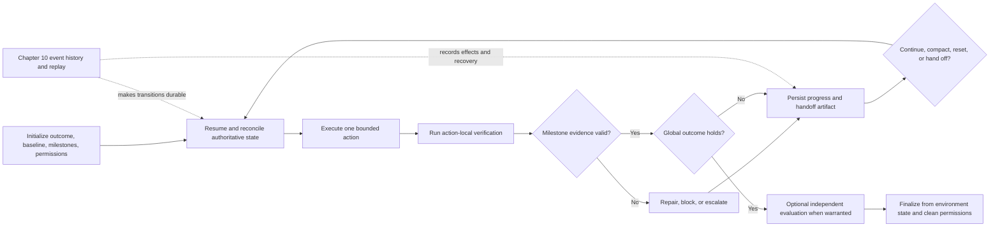

# Chapter 12: Long-Running Agents and Multi-Context Tasks

Long-running agent engineering is **horizon extension**: preserving enough verified intent, progress, and operational context for useful work to continue beyond the useful life of one model context or worker session. It is not the practice of keeping one transcript open indefinitely.

This chapter assumes the durable runtime from [Chapter 10](./10-state-event-history-production-factors.md). Chapter 10 owns event history, replay, checkpoints, retries, action identity, approval-state persistence, and crash recovery; [Chapter 14](./14-human-agent-interaction.md) owns the human approval contract. This chapter asks a different question: **what semantic work state must survive each boundary so that the next context can continue the task correctly?**

### 12.1 Define the Horizon Before Extending It

“Long” can refer to several different quantities:

- **Wall-clock duration**: how long a run remains open.
- **Model-context span**: how much visible input one model call or context can use.
- **Session span**: how long one worker or sandbox is retained.
- **Task horizon**: how difficult a coherent end-to-end task the complete model-plus-harness system can finish at a stated reliability level.

These quantities are not interchangeable. A six-hour process may spend most of its time waiting, and a reset may replace the model context without ending the run or replacing the sandbox. Conversely, one short call may complete a task that took a human expert hours.

METR's **task-completion time horizon** is a useful but narrower capability measure. As of METR's May 8, 2026 Time Horizon 1.1 update, the 50%-time horizon is the human-expert task duration at which a fitted model predicts 50% agent success. METR fits a logistic curve from agent success to human task duration; for most tasks, the human duration is the geometric mean of successful attempts by contracted professionals given similar instructions and affordances. The current suite contains more than one hundred self-contained, automatically graded tasks drawn from RE-Bench, HCAST, and shorter software tasks, primarily in software engineering, machine learning, and cybersecurity. METR warns that current estimates above 16 hours are unreliable ([METR — Task-Completion Time Horizons](https://metr.org/time-horizons/)).

This metric is **not** the amount of time an agent can run autonomously, nor a claim that it can do every task below that duration. The task distribution is comparatively clean and low-context, while longer real projects often require collaboration, tacit knowledge, and interaction with humans. A January 22, 2026 methodological note continued to characterize the 2019–2025 long-run trend as roughly one doubling every 6–7 months, but also warned that the task distribution is not sharply defined and that extrapolation to month- or year-scale work is fragile ([METR — Clarifying Limitations of Time Horizon](https://metr.org/notes/2026-01-22-time-horizon-limitations/)).

The practical lesson is methodological: record the date, task distribution, harness configuration, success threshold, and fitting method whenever citing a horizon number. Do not claim that a new handoff mechanism “extends the METR horizon” unless the complete system is re-evaluated on an appropriate task distribution.

### 12.2 Separate Semantic Continuity from Durable Execution

A long-running system needs two complementary layers:

| Layer | Question it answers | Owned here? |
|---|---|---|
| Durable execution | Which action happened, what result was recorded, and where may execution safely resume without duplicating effects? | No — [Chapter 10](./10-state-event-history-production-factors.md) |
| Horizon extension | What has been achieved, what evidence supports it, what remains risky, and what should the next context do? | Yes |

The distinction prevents two common category errors:

1. A progress document is a **projection**, not a complete causal event history. It may be stale, incomplete, or overwritten.
2. An event log is not automatically a good handoff. A successor should not have to reread thousands of low-level events to discover the current objective and next action.

The durable history makes resumption safe. The handoff makes resumption intelligible. A production system usually needs both.

### 12.3 The Initializer Establishes a Resumable World

An **initializer** is a first-run role, not necessarily a separate model. It turns the request and environment into a work system that later contexts can inspect and operate. In Anthropic's long-running coding experiment, an initializer created a startup script, progress file, initial commit, and comprehensive feature list; later coding sessions made incremental progress and left artifacts for the next context ([Anthropic — Effective Harnesses for Long-Running Agents](https://www.anthropic.com/engineering/effective-harnesses-for-long-running-agents)).

A general initializer should establish:

- **Target outcome and non-goals**: what observable state would satisfy the request, and what is outside scope.
- **Acceptance map**: milestones, dependencies, and verification methods.
- **Reproducible entry path**: commands or procedures to inspect, run, and test the current environment.
- **Baseline evidence**: the initial state of relevant tests, services, data, or external resources.
- **Progress state**: a versioned projection of milestone status, decisions, risks, and next work.
- **Artifact namespace**: stable locations or IDs for code, reports, datasets, screenshots, logs, and other work products.
- **Policy and permission envelope**: applicable restrictions, granted capabilities, approval state, and where authoritative policy is defined.

For software work, repository-local, versioned artifacts are especially effective because a successor can discover and verify them. OpenAI reports using a short repository map, structured documentation, versioned execution plans, progress and decision logs, linters, and documentation-gardening jobs rather than a single large instruction file ([OpenAI — Harness Engineering](https://openai.com/index/harness-engineering/)). This is an implementation pattern, not a requirement that every domain use Git: the invariant is that the authoritative artifacts are addressable, versioned where necessary, and accessible to the next worker.

The initializer should also fail explicitly. If it cannot establish a runnable baseline, resolve the target outcome, or obtain required permissions, it should record a blocker rather than manufacture a confident plan on top of unknown state.

### 12.4 Milestones Turn a Large Goal into Bounded Work

A milestone is a **verifiable intermediate outcome**, not merely an activity label such as “work on the backend.” A useful milestone record contains:

| Field | Purpose |
|---|---|
| `milestone_id` | Stable identity across contexts |
| `outcome` | Observable state that should exist |
| `dependencies` | Required prior state and artifacts |
| `verification` | Checks that can falsify completion |
| `evidence` | Results and artifact pointers from executed checks |
| `status` | `not_started`, `in_progress`, `blocked`, or `verified` |
| `risks` | Known uncertainty, debt, or incomplete coverage |

Anthropic's experiment used a JSON feature list and asked each coding session to work on one feature at a time. The JSON choice, the more-than-200-feature example, and the one-feature slice were observations from that particular coding setup, not universal constants ([Anthropic — Effective Harnesses for Long-Running Agents](https://www.anthropic.com/engineering/effective-harnesses-for-long-running-agents)). Choose the slice size empirically: small enough to finish, verify, and hand off cleanly; large enough to produce meaningful progress.

Milestone state should be monotonic only when the evidence supports it. A previously verified item can return to `in_progress` or `blocked` if dependencies change or a regression invalidates its evidence. A checked box is a navigation aid, not proof.

### 12.5 Make Every Handoff an Artifact Contract

A **handoff** is the semantic package that lets a successor continue without guessing. Whether the successor is the same model after a reset, a different model, a human, or another worker, every handoff must include:

1. **Completed work** — specific changes and milestone transitions, not “made progress.”
2. **Verified evidence** — checks actually run, results, timestamps where relevant, and the scope those checks cover.
3. **Open risks** — failures, uncertainty, untested paths, stale assumptions, and blockers.
4. **Next action** — one bounded, executable step plus its expected result.
5. **Artifact pointers** — stable paths or IDs with version, commit, or content identity where drift matters.
6. **Permission context** — active grants, denials, pending approvals, expiry or scope, and any operation that must be re-authorized.

One possible schema is:

```yaml
handoff_version: 1
objective: "observable target state"
completed_work:
  - milestone_id: M-03
    change: "what changed"
verified_evidence:
  - check: "command, query, or inspection"
    result: "pass/fail plus relevant measurement"
    artifact: "artifact://run/.../evidence/..."
open_risks:
  - "known uncertainty or blocker"
next_action:
  step: "one bounded action"
  expected_result: "observable result"
artifact_pointers:
  - uri: "artifact://project/..."
    version: "commit, digest, or revision"
permission_context:
  grants: ["scoped capabilities"]
  denials: ["known restrictions"]
  pending_approvals: []
```

Do not copy secrets into the handoff. Record the capability reference, scope, or approval ID; let the runtime reattach credentials at the enforcement boundary described in [Chapter 7](./07-sandboxing-runtime-enforcement.md).

The handoff must be persisted before the old context is discarded. Its update and the milestone transition should use the consistency mechanism defined by the runtime—ideally an atomic commit or a version check—so two workers cannot silently publish incompatible successors. The causal record of that commit remains in [Chapter 10's](./10-state-event-history-production-factors.md) event history.

### 12.6 Choose Context Transitions Deliberately

[Chapter 5](./05-compaction-memory-context-handoffs.md) distinguishes context, compaction, memory, and handoff. For long-running work, the harness must choose an explicit transition rather than treating all context pressure as the same problem:

| Transition | Preserves | Best used when | Main risk |
|---|---|---|---|
| Continue | Current visible context | Relevant evidence still fits and remains coherent | Accumulated noise and stale assumptions |
| Compact | A summarized representation inside the ongoing context | Continuity is valuable and a faithful summary fits | Omission or distortion |
| Reset + handoff | Selected semantic state in a fresh context | A clean reasoning surface is worth reconstruction cost | Missing handoff state |
| Worker handoff | Artifacts and execution state across workers | Ownership, specialization, or runtime placement changes | Version and permission mismatch |
| Durable recovery | Recorded results and execution position | Failure, cancellation, deployment, or lease loss | Defined by Chapter 10, not by prompt text |

Anthropic explicitly distinguishes compaction from a context reset: compaction summarizes history in place, while reset starts a fresh context and depends on a structured handoff. In one model-specific experiment, reset was important for Sonnet 4.5's observed “context anxiety,” while Opus 4.5 allowed the reset mechanism to be removed. The same follow-up later removed sprint decomposition for Opus 4.6 ([Anthropic — Harness Design for Long-Running Application Development](https://www.anthropic.com/engineering/harness-design-long-running-apps)). These are evidence that scaffolding should be tested per model and task—not proof that reset, compaction, or sprints are always required.

A context reset must not implicitly reset the durable run, sandbox, permissions, or external resources. Those lifecycles have separate identities. Conversely, replacing a sandbox after compromise or corruption should not be described as a mere context reset.

### 12.7 Resume by Revalidating, Not by Trusting the Note

The successor should treat the handoff as a high-value index whose claims still require reconciliation with authoritative state.

A resume protocol should:

1. Confirm the objective, run identity, configuration versions, artifact revisions, and permission context.
2. Read the latest committed handoff and progress state.
3. Inspect the referenced artifacts rather than relying on pasted summaries.
4. Reproduce the smallest useful baseline: start the service, query the external state, open the document, or run a focused check.
5. Compare the observed state with completed milestones and evidence. Reopen items whose evidence is stale or contradicted.
6. Select one bounded next action and state its expected observable result.
7. After acting, update evidence, progress state, risks, and the next handoff.

Anthropic's coding sessions similarly began by inspecting the working directory, Git history, progress file, feature list, and a basic end-to-end baseline before implementing the next feature ([Anthropic — Effective Harnesses for Long-Running Agents](https://www.anthropic.com/engineering/effective-harnesses-for-long-running-agents)). The general rule is broader than coding: **resume from artifacts, but verify against the environment**.

If the handoff points to missing artifacts, a different version, expired authorization, or a failed baseline, the successor should enter reconciliation or blocked state. It should not continue from an imagined state merely to preserve momentum.

### 12.8 Keep Self-Verification Action-Local

Self-verification is immediate feedback inside the action loop. Examples include running a focused test after an edit, opening a generated file, exercising a browser path, querying a database after a write, or comparing an output with a schema. Anthropic's long-running coding experiment found that explicit end-to-end browser testing caught failures that code inspection and narrower checks missed ([Anthropic — Effective Harnesses for Long-Running Agents](https://www.anthropic.com/engineering/effective-harnesses-for-long-running-agents)).

This makes self-verification valuable, but it does not make the acting agent the final authority on global completion. Local checks may have incomplete coverage, the agent may misread results, and subjective quality may require calibrated judgment.

An **independent evaluator** is conditional, not mandatory for every milestone. Anthropic's 2026 follow-up found separate evaluation especially useful for subjective work and tasks near the generator's capability boundary, but found it could become unnecessary overhead for work the newer model handled reliably; the updated harness moved from per-sprint evaluation to a final pass as the model and harness changed ([Anthropic — Harness Design for Long-Running Application Development](https://www.anthropic.com/engineering/harness-design-long-running-apps)).

Use the evaluation design in [Chapter 11](./11-evaluation.md) and the loop controls in [Chapter 13](./13-loop-engineering.md) to decide when to add an evaluator. Relevant conditions include high impact, subjective or adversarial criteria, weak deterministic checks, behavior near the model's reliability boundary, and evidence that evaluator feedback changes outcomes enough to justify latency and cost. Independence is one design lever, not a substitute for calibrated graders and environment-grounded evidence.

### 12.9 Finalize on Outcome and Environment State

The agent's statement “done” is a transcript event. It is not the outcome. Anthropic's evaluation terminology makes the distinction concrete: a flight-booking agent may say that a reservation was made, while the outcome is whether the reservation actually exists in the environment database ([Anthropic — Demystifying Evals for AI Agents](https://www.anthropic.com/engineering/demystifying-evals-for-ai-agents)).

Finalization should therefore evaluate a task-specific success predicate over authoritative artifacts and environment state:

```text
finalize only if
    required_outcomes_hold(environment, artifacts)
    and required_evidence_is_current
    and no_blocking_risk_is_open
    and required_approvals_are_satisfied
```

Examples include a database row with the correct fields, a deployed endpoint passing a health and behavior check, a file with the required content and format, or a submitted external transaction with a verifiable receipt. The acceptance map decides which outcomes are necessary; not every task needs the same checks.

A checklist can help the agent navigate, and a progress file can summarize prior work, but neither may be the sole completion oracle. If the outcome cannot be verified, report `unverified` or `blocked` with the missing evidence and next action—not `complete` based on confidence.

Finalization also emits a terminal artifact: achieved outcomes, verification evidence, residual risks, artifact pointers, and permission cleanup or transfer. Cleanup should revoke temporary capabilities and identify resources that remain live; it must not erase the durable evidence required for audit or recovery.

### 12.10 Failure Modes and Controls

| Failure mode | Observable symptom | Harness control |
|---|---|---|
| One-shot overreach | Large partial change, no clean stopping point | Bounded milestones and slice budget |
| Premature completion | Some visible progress is mistaken for the whole outcome | Acceptance map plus environment-based finalization |
| Stale progress state | Handoff disagrees with artifacts | Versioned pointers and resume-time reconciliation |
| Evidence laundering | “Tests passed” without command, result, or scope | Structured evidence records |
| Half-finished boundary | Broken baseline at context exit | Boundary health check and explicit blocker state |
| Permission amnesia | Successor repeats a denied action or assumes a grant | Mandatory permission context and revalidation |
| Artifact loss | Summary references inaccessible work | Addressable artifact store and retention policy |
| Reset cargo cult | Frequent resets add cost without improving outcomes | Model/task ablation and reset telemetry |
| Self-certified finish | Agent prose or checklist is the only proof | Outcome predicate over authoritative state |
| Infinite local repair | Repeated verification-fix loop makes no net progress | Loop budgets and escalation from Chapter 13 |

The maintenance burden also grows over long projects. OpenAI reports encoding repository “golden principles” into mechanical rules and recurring cleanup tasks because agents reproduce existing patterns, including bad ones ([OpenAI — Harness Engineering](https://openai.com/index/harness-engineering/)). The general control is to make quality constraints executable and to schedule maintenance as explicit work, rather than expecting each successor to rediscover architectural intent.

### 12.11 Reference Lifecycle



The diagram's loop is semantic. Crash recovery, replay, idempotency, and concurrent ownership remain runtime responsibilities from Chapter 10.

### 12.12 Design Checklist

Before enabling multi-context execution, verify that:

- The target outcome and non-goals are observable.
- The initializer can establish or explicitly fail the baseline.
- Milestones have stable IDs, dependencies, verification, and evidence fields.
- Every handoff contains completed work, verified evidence, open risks, next action, artifact pointers, and permission context.
- Artifact pointers are stable and versioned where drift matters.
- Resume reconciles the note with authoritative artifacts and environment state.
- Context reset, sandbox replacement, and durable recovery are separate operations.
- Self-verification stays action-local; evaluator use is justified by task risk and measured lift.
- Global completion is decided by outcome and environment state, not agent prose or a checklist.
- The Chapter 10 runtime can persist, replay, deduplicate, and recover the underlying execution.
- Finalization records evidence and cleans up temporary permissions and resources.

---

## Key Takeaways

- **Long-running design is horizon extension, not transcript extension.**
- **Chapter 10 supplies durable recovery; Chapter 12 supplies semantic continuity.**
- **The initializer creates a resumable world with baselines, milestones, artifacts, progress state, and permissions.**
- **Every handoff needs six fields:** completed work, verified evidence, open risks, next action, artifact pointers, and permission context.
- **Reset and compaction are model- and task-dependent choices.** Test them instead of hard-coding historical scaffolding.
- **Self-verification provides local feedback.** Independent evaluation is conditional and does not replace environment-grounded evidence.
- **Only the outcome can finish the task.** Agent self-report and checklists are useful projections, never sufficient completion proof.
- **Time-horizon numbers require measurement context.** Include date, task distribution, reliability threshold, harness setup, and method.

## Further Reading

- Justin Young et al., *Effective Harnesses for Long-Running Agents*, Anthropic, Nov 2025. https://www.anthropic.com/engineering/effective-harnesses-for-long-running-agents
- Prithvi Rajasekaran, *Harness Design for Long-Running Application Development*, Anthropic, Mar 2026. https://www.anthropic.com/engineering/harness-design-long-running-apps
- OpenAI, *Harness Engineering: Leveraging Codex in an Agent-First World*, Feb 2026. https://openai.com/index/harness-engineering/
- Anthropic, *Demystifying Evals for AI Agents*, Jan 2026. https://www.anthropic.com/engineering/demystifying-evals-for-ai-agents
- METR, *Task-Completion Time Horizons of Frontier AI Models*, updated May 8, 2026. https://metr.org/time-horizons/
- Joel Becker, *Clarifying Limitations of Time Horizon*, METR, Jan 22, 2026. https://metr.org/notes/2026-01-22-time-horizon-limitations/
