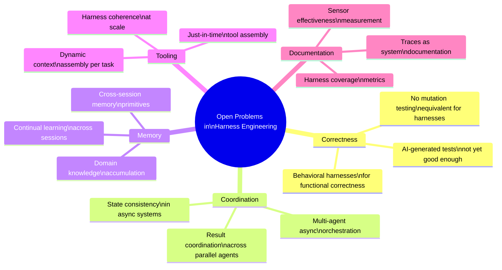

# Chapter 12: Outlook

### 12.1 The Field Is Young

Much of the vocabulary used in this book — initializer agents, context firewalls, sprint contracts, reasoning sandwiches, ambient affordances, computational vs. inferential controls — entered the mainstream agent-engineering conversation within the last twelve to eighteen months. Some underlying ideas are older, but the shared language is recent. Most of the source articles for this textbook were published in 2025 and 2026. The field is moving faster than any single book can document.

LangChain frames the trajectory honestly: as models improve, some of what lives in the harness today will be absorbed into the model. Models will get better at planning, self-verification, and long-horizon coherence natively, requiring less context injection. But the space of interesting harness combinations does not shrink as models improve. It moves ([LangChain — The Anatomy of an Agent Harness](https://blog.langchain.com/the-anatomy-of-an-agent-harness/); [Anthropic — Harness Design for Long-Running Application Development](https://www.anthropic.com/engineering/harness-design-long-running-apps)).

### 12.2 Open Problems

Several recur across the literature:

- **Behavioral harnesses for functional correctness**. Maintainability and architecture-fitness harnesses have decades of pre-existing tooling. Behavior harnesses — does the application functionally do what the user wants? — do not. Today most teams rely on AI-generated tests, and the consensus is that this is not yet good enough ([Thoughtworks — Harness Engineering](https://martinfowler.com/articles/exploring-gen-ai/harness-engineering.html)).
- **Harness coherence at scale**. As guides and sensors multiply, how do they stay consistent? How do we know when sensors that never fire indicate quality versus inadequate detection? There is no equivalent of code coverage or mutation testing for harness coverage yet.
- **Multi-agent coordination beyond synchronous orchestration**. Anthropic's research system runs sub-agents synchronously; asynchronous coordination would unlock more parallelism but adds challenges in result coordination, state consistency, and error propagation ([Anthropic — How We Built Our Multi-Agent Research System](https://www.anthropic.com/engineering/multi-agent-research-system)).
- **Continual learning at the harness level**. Memory primitives that let agents accumulate knowledge of a codebase or domain over many sessions, rather than starting fresh each time, are an active research area ([LangChain — Improving Deep Agents with Harness Engineering](https://blog.langchain.com/improving-deep-agents-with-harness-engineering/)).
- **Just-in-time tool assembly**. Harnesses that dynamically assemble the right tools and context for a given task, rather than pre-configuring everything, are explored by LangChain among others.
- **Tracing as documentation**. LangChain's observation that "in software, the code documents the app; in AI, the traces do" hints at a different model of system documentation that the field has not fully worked out.

### 12.3 The Standing Advice

A few principles repeat across nearly every article in the corpus:

- **Treat context as a finite resource**. Find the smallest set of high-signal tokens that produces the desired outcome.
- **Do the simplest thing that works**. Agents are expensive; workflows often suffice; many tasks need neither.
- **Read the transcripts**. Everything else flows from this.
- **Iterate on what is load-bearing**. Stress-test components when models change. Strip what is no longer pulling weight; tune what is.
- **Tailor harnesses to models, but tailor principles to the field**. Specific prompts and tools change between models. The shape of the work — context engineering, tool design, evaluation, sandboxing, self-verification — does not.

The field is not yet old enough to have textbooks. This document is an attempt to write one anyway, knowing it will go out of date faster than most. The hope is that the citations make it possible to read the originals as the conversation continues.

---

## Diagram: Open Problems Mindmap

---

## Key Takeaways

- **The shared vocabulary is young**: many terms became common in 2025–2026, even when the underlying ideas are older.
- **Models absorb harness, but harness moves**: as models improve and take on more native capabilities, the interesting harness work moves to harder problems, not away.
- **Six open problems dominate the research agenda**: behavioral correctness, harness coherence at scale, async multi-agent coordination, continual learning, just-in-time tool assembly, and traces-as-documentation.
- **Five standing principles cut across all contexts**: finite context, simplest-that-works, read-the-transcripts, iterate-load-bearing, tailor-to-model.
- **Harness engineering is permanent work**: not scaffolding to discard once models improve, but the ongoing craft of building effective systems around increasingly capable cores.

## Further Reading

- Vivek Trivedy, *The Anatomy of an Agent Harness*, LangChain, Mar 2026. https://blog.langchain.com/the-anatomy-of-an-agent-harness/
- Prithvi Rajasekaran, *Harness Design for Long-Running Application Development*, Anthropic, Mar 2026. https://www.anthropic.com/engineering/harness-design-long-running-apps
- Birgitta Böckeler, *Harness Engineering for Coding Agent Users*, Thoughtworks / martinfowler.com, Apr 2026. https://martinfowler.com/articles/exploring-gen-ai/harness-engineering.html
- Jeremy Hadfield et al., *How We Built Our Multi-Agent Research System*, Anthropic, Jun 2025. https://www.anthropic.com/engineering/multi-agent-research-system
- Vivek Trivedy, *Improving Deep Agents with Harness Engineering*, LangChain, Feb 2026. https://blog.langchain.com/improving-deep-agents-with-harness-engineering/
- *Awesome Harness Engineering* reading list: https://github.com/walkinglabs/awesome-harness-engineering
