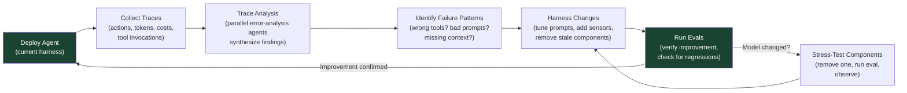

# Chapter 12: Trace-Driven Iteration and Model–Harness Co-Evolution

### 12.1 Traces Are the Feedback Loop

Today's models remain largely black boxes: their internal mechanisms are difficult to interpret. Their inputs and outputs, however, are visible, and that is enough to support systematic improvement. LangChain therefore treats traces as the primary surface for debugging a harness. It records every agent action, along with latency, token counts, costs, and tool invocations ([LangChain — Improving Deep Agents with Harness Engineering](https://blog.langchain.com/improving-deep-agents-with-harness-engineering/)).

Its *Trace Analyzer Skill* automates this loop:

1. Fetch experiment traces from LangSmith.
2. Spawn parallel error-analysis agents; the main agent synthesizes findings and suggestions.
3. Aggregate feedback and make targeted changes to the harness.

The structure resembles boosting in classical machine learning: each iteration focuses on mistakes from earlier runs. Human review at step 3 is helpful, though not strictly required. Its main value is catching changes that improve a few specific tasks at the expense of broader performance.

### 12.2 Runtime and Process Observability

Trace-driven iteration depends on two kinds of observability. **Runtime observability** records what the system actually did: tool calls, command outputs, browser actions, latency, token usage, errors, retries, and the final state of the environment. This is the layer LangChain emphasizes when it stores every agent action and aggregates recurring failure patterns from traces.

**Process observability** records what success meant and why the completed work should be accepted: task scope, sprint contracts, rubrics, verification evidence, excluded work, and handoff notes. Anthropic's generator-evaluator harness made this explicit. Before implementation, a negotiated sprint contract established the scope; if a sprint failed, the evaluator used a rubric to provide specific feedback ([Anthropic — Harness Design for Long-Running Application Development](https://www.anthropic.com/engineering/harness-design-long-running-apps)).

The two layers reinforce each other. Runtime signals without process artifacts show what happened, but not whether the result met the intended scope. Process artifacts without runtime signals can become convincing paperwork wrapped around broken behavior. A production harness should make both inspectable: the task trajectory, the acceptance criteria, and the evidence that the environment reached the desired state.

The OpenReview survey adds an important implementation detail: agent traces should be structured as trees of spans rather than flat logs ([OpenReview — Agent Harness Engineering: A Survey](https://openreview.net/pdf?id=3hXEPbG0dh)). At a minimum, those spans should cover model calls, tool invocations, retrieval steps, context-assembly operations, latency, token usage, cost, retries, permission decisions, and the final outcome state.

That structure is now being standardized. OpenTelemetry, the vendor-neutral observability standard already used across distributed systems, is defining *GenAI semantic conventions*: a shared schema of span and attribute names for LLM and agent telemetry ([OpenTelemetry — Semantic conventions for generative AI spans](https://opentelemetry.io/docs/specs/semconv/gen-ai/gen-ai-spans/)). The conventions name the spans a harness produces, including a top-level `invoke_agent` span, child `chat` spans for model calls, and `execute_tool` spans for tool invocations. They also define standard metrics such as operation duration and token usage.

Adopting these conventions offers two benefits. First, agent traces can use the *same* observability stack as the rest of the system. Teams can query latency, cost, and errors with existing tools instead of maintaining a bespoke agent logger. Second, the standard addresses privacy directly. It defines explicit options for prompt and completion content: omit it, attach it to the span, or store it externally and record a reference. It also recommends against capturing sensitive payloads by default, matching the redaction discipline required by §12.3 and Chapter 17. As of this writing, the GenAI conventions are still marked *Development*, so exact names may change. Their value lies in the direction of the standard, not in any one version.

### 12.3 From Production Trace to Regression Case

Observability should feed directly into verification. A trace that captures a real production failure is too valuable to remain only a debugging artifact. A mature workflow is:

1. Capture a failed or surprising production trajectory.
2. Redact sensitive data and freeze the relevant environment or fixture.
3. Extract the user intent, tool sequence, intermediate state, and final outcome.
4. Write a deterministic or model-graded assertion for the corrected behavior.
5. Add the case to the regression suite, with the original trace as evidence.

This workflow turns traces into a source of eval tasks. It also prevents teams from optimizing for synthetic benchmarks while overlooking failures encountered by their own users. Governance remains part of the pipeline: trace-to-eval systems must preserve privacy, provenance, and permission metadata. Otherwise, they may produce tests that are technically useful but operationally unsafe.

### 12.4 From Practitioner Correction to a Bounded Improvement Task

OpenAI's tax-agent case study extends the loop by one more step. Expert corrections and production traces did not directly rewrite the deployed agent. Instead, they became reviewed findings, tailored evals, and bounded Codex tasks that could be verified before release ([OpenAI — Building Self-Improving Tax Agents with Codex](https://openai.com/index/building-self-improving-tax-agents-with-codex/)).

A safe improvement pipeline has explicit custody at every step:

1. Capture a practitioner correction with the trace and outcome that motivated it.
2. Redact sensitive data, review the finding, and group duplicates into a stable failure class.
3. Convert the class into a reproducible regression eval with immutable evidence.
4. Give a coding agent one bounded change task rather than authority to modify itself freely.
5. Gate the patch on the targeted eval, the wider regression suite, security checks, cost, and latency.
6. Canary the version in production; monitor the original failure signal; roll back if it worsens.

This is **controlled self-improvement**, not uncontrolled self-modification. The deployed agent does not edit its own prompts, tools, memory policy, or evaluator in place. Instead, an external improvement loop proposes a versioned change, and independent evidence and release controls determine whether it advances. Evaluator integrity (§10.4) matters at two points: the original finding must be valid, and the release gate must not be biased toward approving the proposed fix.

### 12.5 Stress-Test Load-Bearing Components

Anthropic's harness-design follow-up adds a complementary discipline ([Anthropic — Harness Design for Long-Running Application Development](https://www.anthropic.com/engineering/harness-design-long-running-apps)). Every harness component encodes an assumption about what the model cannot do on its own. As models improve, those assumptions can become outdated. The recommended test is simple: remove one component, run the eval, and observe the result.

When Opus 4.6 launched with stronger long-context retrieval and better long-horizon coding behavior, Anthropic was able to remove the sprint construct from one version of its harness. The generator remained coherent for more than two hours without sprint decomposition. The evaluator, which had carried more of the workload for earlier models, became useful only in some cases: it still helped with tasks near the edge of what the generator could complete alone, but added unnecessary overhead for tasks well within that boundary. The team summarizes the principle this way: "the evaluator is not a fixed yes-or-no decision. It is worth the cost when the task sits beyond what the current model does reliably solo."

### 12.6 Model–Harness Co-Evolution

Today's frontier coding models are post-trained with their harnesses in the loop ([LangChain — The Anatomy of an Agent Harness](https://blog.langchain.com/the-anatomy-of-an-agent-harness/)). Teams discover useful primitives, add them to the harness, and use them while training the next model generation. The resulting model becomes more capable within that harness. This feedback loop also creates coupling: changing the harness can reduce model performance even when the change appears behaviorally neutral.

The Codex `apply_patch` tool is the canonical example. Codex models are post-trained on this specific patch format. OpenCode, an open-source alternative to Claude Code, therefore had to add an `apply_patch` tool specifically for GPT/Codex models so that it could mimic the Codex harness. Claude and other models continue to use conventional `edit` and `write` tools ([HumanLayer — Skill Issue: Harness Engineering for Coding Agents](https://www.humanlayer.dev/blog/skill-issue-harness-engineering-for-coding-agents)).

### 12.7 But the Best Harness Is Not Always the One the Model Was Trained In

This coupling does not mean that a model's training harness is optimal for every task. Terminal-Bench 2.0 is a recurring example in practitioner discussions. HumanLayer cites Opus 4.6 ranking 33rd in Claude Code and 5th in a different harness, with roughly four positions of leaderboard noise ([HumanLayer — Skill Issue: Harness Engineering for Coding Agents](https://www.humanlayer.dev/blog/skill-issue-harness-engineering-for-coding-agents); [LangChain — The Anatomy of an Agent Harness](https://blog.langchain.com/the-anatomy-of-an-agent-harness/)). These exact ranks are snapshots of a leaderboard, not timeless facts about the model.

LangChain's case study reaches the same conclusion experimentally. Claude Opus 4.6 scored 59.6% on an early version of its harness: competitive, but below its tuned Codex configuration. The broad principles—context preparation and verification—transferred across models, but closing the remaining gap would have required several rounds of iteration tailored to Claude ([LangChain — Improving Deep Agents with Harness Engineering](https://blog.langchain.com/improving-deep-agents-with-harness-engineering/)).

The pragmatic rule is straightforward: when the model changes, re-examine the harness. Strengthen the components that have become load-bearing, and remove those that no longer help.

### 12.8 Practical Takeaways

LangChain distills its experience with harness iteration into five principles ([LangChain — Improving Deep Agents with Harness Engineering](https://blog.langchain.com/improving-deep-agents-with-harness-engineering/)):

1. **Engineer context on the agent's behalf** — orient the model to its environment, including directory structures, available tools, coding practices, and problem-solving strategies.
2. **Help agents verify their own work** — models tend to favor their first plausible solution, so instruct them clearly to run tests and check the result.
3. **Use traces as a feedback signal** — debug tools and reasoning together, because a model may take the wrong path when it lacks either a tool or instructions for using it.
4. **Contain bad patterns in the short term** — guardrails such as loop detection may become unnecessary as models improve, but they remain useful today.
5. **Tailor the harness to the model** — Claude and Codex prompting guides differ for a reason: broad principles transfer, but implementation details often do not.

HumanLayer's parallel set ([HumanLayer — Skill Issue: Harness Engineering for Coding Agents](https://www.humanlayer.dev/blog/skill-issue-harness-engineering-for-coding-agents)):

What worked: starting with a simple harness and adding configuration only after real failures; iterating quickly and discarding changes that did not help; distributing proven configurations through repository-level files; optimizing for iteration speed rather than one-shot success; and pruning capabilities once the team understood what it actually needed.

What did not work: trying to design the ideal harness in advance; installing dozens of skills and MCP servers "just in case"; running the full test suite at the end of every session; and micro-optimizing which tools each sub-agent could access.

### 12.9 The Misleading Data on AGENTS.md

One result is particularly worth noting. An ETH Zurich study tested 138 agentfiles—the generic term for AGENTS.md- or CLAUDE.md-style instruction files—across a range of repositories. It found that LLM-generated files reduced performance while increasing cost by 20%, while human-written files improved performance by only about 4%. Agents also spent 14–22% more reasoning tokens processing context-file instructions. In that benchmark, codebase overviews and directory listings did not help because agents could discover the repository structure on their own ([HumanLayer — Skill Issue: Harness Engineering for Coding Agents](https://www.humanlayer.dev/blog/skill-issue-harness-engineering-for-coding-agents) citing the ETH Zurich paper).

HumanLayer interprets these findings as support for its own AGENTS.md guidance: keep files concise, avoid auto-generation, use progressive disclosure instead of presenting every instruction up front, and reserve the root file for rules that apply universally rather than conditional guidance. Its own CLAUDE.md is fewer than 60 lines.

This does not mean "do not write repository instructions." It means that the root instruction file should act as a router, not an encyclopedia. OpenAI's Codex harness guidance follows the same pattern: keep essential context in the repository, keep `AGENTS.md` concise, direct agents to deeper documents when needed, and enforce the most important rules mechanically where possible ([OpenAI — Harness Engineering](https://openai.com/index/harness-engineering/)).

The broader principle is that more configuration is not automatically better. Every irrelevant instruction consumes attention without improving the result. The *instruction budget* matters as much as the token budget.

### 12.10 Reusable Harness Packages and Skills

Once a harness pattern has proved useful in practice, it should not remain tribal knowledge confined to one repository. Package it as a skill, a template bundle, a small scaffold generator, or a set of repository checks. Whatever the format, it should include both instructions and working artifacts: not merely "remember to maintain state," but also a progress-log template, a feature-list schema, a startup script, and a validation command.

The Learn Harness Engineering course demonstrates this packaging model with `harness-creator`, a skill for creating, assessing, and improving five harness subsystems: instructions, state, verification, scope, and session lifecycle ([Learn Harness Engineering — Skills](https://walkinglabs.github.io/learn-harness-engineering/en/skills/)). This creates a useful engineering boundary. A reusable package should not freeze one supposedly ideal workflow forever. It should make proven defaults easy to install and inspect—and just as easy to remove when traces show that a component is no longer load-bearing.

### 12.11 Meta-Harness: Optimizing the Harness Itself

Once evals and traces exist, the harness itself becomes an object of optimization. The OpenReview survey points to *meta-harness* research that explores harness structure, prompting strategies, tool interfaces, and control-loop choices instead of treating the harness as fixed ([OpenReview — Agent Harness Engineering: A Survey](https://openreview.net/pdf?id=3hXEPbG0dh)).

In practice, this need not mean fully automated architecture search. It can begin with disciplined experimentation:

- A/B test a tool schema or prompt change against the same task suite.
- Ablate one component, such as a planner, context reset, memory layer, or evaluator.
- Vary cost controls, retry policy, and tool-response truncation to see where quality degrades.
- Measure the whole closed loop, not only model output: success rate, pass^k reliability, latency, cost, human escalations, and security false positives.

This extends the idea of load-bearing components: every part of the harness should continue to justify its cost. If a component improves reliability only for rare, high-value tasks, route those tasks through it selectively. If it stops helping after a model upgrade, remove it.

### 12.12 Cross-Layer Coupling

ETCLOVG also serves as a debugging map. When a trace shows an apparently bad model decision, the underlying cause may lie in another layer ([OpenReview — Agent Harness Engineering: A Survey](https://openreview.net/pdf?id=3hXEPbG0dh)):

- A tool-selection error may come from the **Tool** layer, because the action space is too large or the schema hides the important affordance.
- A premature completion may come from the **Lifecycle** layer, because exit criteria are not represented as a durable state machine.
- A regression after cost tuning may come from the **Observability** and **Execution** layers, because resource limits changed latency, timeouts, or benchmark fidelity.
- A security failure may come from the **Governance** layer, because policy, permissions, and audit hooks are inconsistent across training-time alignment, deployment configuration, and runtime enforcement.

Before changing a prompt, annotate the trace review with hypotheses about the responsible layer. Ask which layer made the wrong behavior easy, invisible, or inexpensive. Only then decide whether the right fix is a prompt change, a redesigned tool, a sandbox adjustment, a new metric, a stronger grader, or a governance hook.

---

## Diagram: Trace-Driven Iteration Loop

---

## Key Takeaways

- **Traces are the primary debugging surface**: text I/O is visible even when model internals are not — systematic trace analysis drives harness improvement.
- **Observability has two layers**: runtime traces show what happened; process artifacts show why the work should be accepted.
- **Trace spans should be structured**: model calls, tool calls, retrieval, context assembly, permissions, cost, and outcome state need machine-readable telemetry.
- **A standard is emerging for that telemetry**: OpenTelemetry's GenAI semantic conventions (`invoke_agent`, `chat`, `execute_tool` spans) let agent traces join the ordinary observability stack and codify content-capture patterns for privacy.
- **Production traces should become regression cases**: real failures are the highest-signal eval tasks if privacy and provenance are preserved.
- **Self-improvement must be an external, bounded release loop**: review and group corrections, convert them into evals and scoped change tasks, then gate, canary, and roll back versioned artifacts.
- **The trained harness is not automatically optimal**: leaderboard snapshots show the same model moving substantially under different harnesses.
- **Stress-test components when models change**: every harness component encodes an assumption that may go stale as models improve.
- **Model–harness co-evolution is real**: post-training loops the harness into model training, creating coupling that breaks when either side changes unexpectedly.
- **AGENTS.md has limited ROI when bloated**: keep it concise and human-written, then use progressive disclosure into repo-local docs and mechanical checks.
- **Reusable harness packages preserve hard-won practice**: promote stable patterns into skills, templates, scaffolds, and checks once traces show they help.
- **Meta-harness turns evals into design search**: prompts, tools, retries, context policies, and evaluators can be ablated and optimized like any other system component.
- **Layer attribution prevents prompt-only fixes**: use ETCLOVG to ask which harness layer made a failure possible before changing instructions.
- **Iteration speed beats upfront design**: start simple, add only after real failures, prune aggressively.

## Further Reading

- Vivek Trivedy, *Improving Deep Agents with Harness Engineering*, LangChain, Feb 2026. https://blog.langchain.com/improving-deep-agents-with-harness-engineering/
- Prithvi Rajasekaran, *Harness Design for Long-Running Application Development*, Anthropic, Mar 2026. https://www.anthropic.com/engineering/harness-design-long-running-apps
- Vivek Trivedy, *The Anatomy of an Agent Harness*, LangChain, Mar 2026. https://blog.langchain.com/the-anatomy-of-an-agent-harness/
- Kyle Brunet, *Skill Issue: Harness Engineering for Coding Agents*, HumanLayer, Mar 2026. https://www.humanlayer.dev/blog/skill-issue-harness-engineering-for-coding-agents
- OpenAI, *Harness Engineering: Leveraging Codex in an Agent-First World*, Feb 2026. https://openai.com/index/harness-engineering/
- Walking Labs, *Learn Harness Engineering — Skills*. https://walkinglabs.github.io/learn-harness-engineering/en/skills/
- OpenTelemetry, *Semantic conventions for generative AI spans*. https://opentelemetry.io/docs/specs/semconv/gen-ai/gen-ai-spans/
- *Agent Harness Engineering: A Survey*, OpenReview / TMLR submission, 2026. https://openreview.net/pdf?id=3hXEPbG0dh
- OpenAI, *Building Self-Improving Tax Agents with Codex*, 2026. https://openai.com/index/building-self-improving-tax-agents-with-codex/
