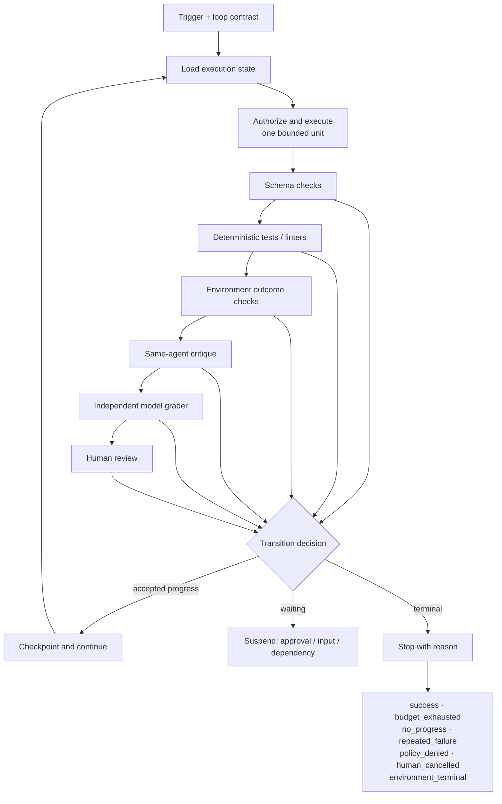

# Chapter 13: Loop Engineering and Verifier Hierarchies

*Agent = Model + Harness.* Chapter 1 introduced the inner agent loop: the harness assembles context, the model proposes an action, the runtime executes it, the environment returns an observation, and the cycle repeats. This chapter treats the control around that cycle as an engineering object. It specifies what starts a run, what one iteration may do, what evidence counts as progress or success, and why the run stops.

The phrase *loop engineering* is useful practitioner vocabulary, but it is not a formal standard or a reference architecture. Addy Osmani uses it for systems that find work, dispatch it, check it, persist state, and decide what happens next ([Addy Osmani — Loop Engineering](https://addyosmani.com/blog/loop-engineering/)). This chapter keeps that operational insight while defining the loop in the book's existing harness, runtime, policy, and evaluation terms.

### 13.1 Research Roots and Practitioner Lineage

The underlying action loop predates the label. ReAct interleaves reasoning traces with task-specific actions so that actions obtain information from an external environment and observations can update the plan ([Yao et al. — ReAct](https://arxiv.org/abs/2210.03629)). A production harness need not expose private reasoning traces, but it does need the observable control cycle: propose action → enforce policy → execute → record observation → update execution state.

Two later practitioner labels describe particular ways of operating that cycle:

- **Ralph** describes a repository-oriented practice in which a single process performs one task per loop and reloads specifications and a plan on every iteration ([Geoffrey Huntley — Ralph Wiggum as a “software engineer”](https://ghuntley.com/ralph/)).
- **Loop engineering** emphasizes triggers, isolated workspaces, reusable instructions, connectors, sub-agents, and state outside one conversation ([Addy Osmani — Loop Engineering](https://addyosmani.com/blog/loop-engineering/)).

These are practitioner lineages, not conformance targets. Neither establishes that every agent must reset context each iteration, use multiple agents, run on a schedule, or progress toward unattended autonomy. Treat each pattern as a design option whose value must be demonstrated for the task.

### 13.2 Start With a Loop Contract

A **loop contract** is the harness configuration that makes a repeated run bounded and testable. Before enabling repetition, define:

- **Trigger:** a human request, event, schedule, or parent run, including deduplication semantics.
- **Goal and acceptance contract:** the requested outcome, allowed scope, constraints, and evidence required for success.
- **Execution state:** the current task, attempt, budget use, policy state, artifacts, and latest accepted checkpoint.
- **Iteration boundary:** the maximum unit of work one pass may attempt and commit.
- **Action envelope:** available tools, identities, resources, side-effect classes, and mandatory approval gates.
- **Verifier plan:** the checks to run, their order, thresholds, abstention behavior, and escalation target.
- **Progress function:** the measurements that distinguish useful change from motion without progress.
- **Stop and suspend rules:** terminal reasons, retry rules, and resumable waiting states.

This contract belongs to the harness and control plane, not to the model's prose. The model may propose that the goal is complete; the harness decides whether the configured evidence supports `success`. Anthropic's production-pattern guidance similarly describes agents as using environmental feedback in a loop, pausing for human input at checkpoints or blockers, and using stopping conditions such as iteration caps to retain control ([Anthropic — Building effective agents](https://www.anthropic.com/engineering/building-effective-agents)).

One bounded iteration can be expressed as:

```text
load execution state
→ select one eligible unit of work
→ authorize and execute bounded actions
→ collect artifacts and environment observations
→ run the configured verifier plan
→ checkpoint accepted progress
→ continue, suspend, or terminate with a reason
```

Iteration count alone is not progress. A useful progress function is task-specific: failing tests decrease, required fields become valid, a target environment changes to the expected state, evidence coverage increases, or a human resolves a named ambiguity. Persist the measurements and artifact identities so that a later run can tell whether anything actually changed.

### 13.3 A Default Verifier Hierarchy

Use the lowest-cost verifier that can supply evidence appropriate to the consequence, then add higher levels when the lower ones leave material uncertainty. The default escalation hierarchy is:

| Level | Verifier | Best evidence | Main limitation |
|---|---|---|---|
| 1 | **Schema checks** | Required fields, types, ranges, and protocol shape | Valid shape does not imply a correct outcome |
| 2 | **Deterministic tests and linters** | Reproducible behavioral assertions, invariants, static rules | Tests can be incomplete or coupled to an implementation |
| 3 | **Environment outcome checks** | The external system reached the intended state | A good end state may hide an unsafe or disallowed path |
| 4 | **Same-agent critique** | Cheap, context-rich detection and repair of obvious defects | The critique can share the maker's assumptions and blind spots |
| 5 | **Independent model grader** | Rubric-based judgment for open-ended or nuanced properties | Independence does not remove model error or correlated failure |
| 6 | **Human review** | Intent, accountability, expert judgment, and ambiguity resolution | Slow, costly, and not automatically consistent |

This is an escalation hierarchy, not a claim that every task should use all six levels or that a later level dominates every earlier one. A human should not replace a checksum, and an independent model should not replace an executable test. Agent evaluations commonly combine code-based, model-based, and human graders; code checks are fast and reproducible, model graders capture nuance but require human calibration, and human grading is slower and more expensive ([Anthropic — Demystifying evals for AI agents](https://www.anthropic.com/engineering/demystifying-evals-for-ai-agents)).

The old slogan “the maker must not be the checker” is too absolute. Same-agent critique can be an efficient repair step when consequences are low and defects are locally visible. Conversely, a nominally independent checker may share the same base model, training distribution, prompt assumptions, tools, or incomplete rubric. Separation is useful only when its measured reduction in error justifies its cost and when correlated failure is understood.

### 13.4 Choose the Verifier From Evidence, Not a Slogan

Chapter 11 defines the verifier profile used here: failure classes, false-positive and false-negative rates, abstention, disagreement, coverage, latency, cost, and correlated failure. Choose and compose levels using five task properties:

1. **Consequence.** Higher-impact or difficult-to-reverse actions require stronger evidence, tighter false-accept targets, and often a policy gate or accountable human review.
2. **Task ambiguity.** Precise outputs favor schema and deterministic checks. Open-ended quality or intent may require a calibrated model rubric, expert review, or explicit abstention.
3. **Capability boundary.** Use evaluation results—not intuition—to ask whether the maker reliably handles this task class. Near the measured boundary, additional critique or an evaluator can add value. Far inside it, that evaluator may only add latency and cost. Anthropic reports this exact task-relative effect in a long-running coding harness: as model capability improved, an evaluator became overhead for work the generator handled reliably but remained useful at the edge of capability ([Anthropic — Harness design for long-running application development](https://www.anthropic.com/engineering/harness-design-long-running-apps)).
4. **Latency and cost.** Run cheap, high-signal checks first and reserve slower graders for unresolved uncertainty. Track verifier cost and latency separately from maker cost and latency.
5. **Correlated failure.** Estimate whether maker and checker fail on the same examples. Different roles, prompts, or models do not by themselves prove useful independence; use Chapter 11's joint-error and disagreement measurements.

A practical policy might be: schema-check every tool result; run tests and linters for each candidate artifact; check the real environment before claiming an external outcome; use same-agent critique for low-cost repair; invoke an independent grader only for residual rubric-based properties; require human review when consequence or unresolved ambiguity exceeds a threshold.

For every verifier, define at least three results rather than forcing a binary answer: `pass`, `fail`, and `abstain`; a versioned contract may also define `partial`. An abstention must route to another verifier or to human resolution; it must never silently become a pass. Calibrate model graders against expert human judgment, as recommended for subjective research and other open-ended evaluations ([Anthropic — Demystifying evals for AI agents](https://www.anthropic.com/engineering/demystifying-evals-for-ai-agents)).

### 13.5 Keep Live Verification Separate From Release Evaluation

A **live verifier** influences the trajectory: it selects retries, provides feedback, accepts a checkpoint, or stops the loop. A **holdout grader** measures the completed system without steering that trajectory. Reusing a release grader's hidden answers or exact rubric as iteration feedback creates a path for evaluator leakage and optimization to the check rather than the underlying task.

Therefore:

- expose only the acceptance evidence required for productive repair;
- keep holdout cases and release thresholds outside the maker's writable state;
- version every schema, test suite, rubric, grader model, and human-review protocol;
- record which verifier result caused each transition;
- periodically compare automated verifier decisions with blinded human labels;
- investigate disagreement and joint error, not only aggregate pass rate.

Outcome checks and trajectory checks answer different questions. The first asks whether the intended state was reached; the second asks whether the route respected policy, budgets, and tool constraints. Anthropic's evaluation guidance explicitly distinguishes graders over outcomes from graders over transcripts and gives examples that combine state checks, required tool calls, turn limits, and quality rubrics ([Anthropic — Demystifying evals for AI agents](https://www.anthropic.com/engineering/demystifying-evals-for-ai-agents)). A loop needs both when a correct outcome could be reached through an unacceptable path.

### 13.6 Stop, Suspend, and Resume Are Different States

Every run must terminate with a machine-readable `stop_reason`, or enter a named nonterminal suspension. The minimum terminal set is:

| Stop reason | Required condition | Retry semantics |
|---|---|---|
| `success` | The configured acceptance contract passed; self-declaration is insufficient | Start a new run only for a new goal or invalidated evidence |
| `budget_exhausted` | Any configured token, time, money, action, or iteration ceiling is reached | Resume only with a newly authorized budget |
| `no_progress` | The progress function stays below its threshold for the configured window | Resume after changing evidence, plan, tools, or task framing |
| `repeated_failure` | The same normalized failure signature recurs beyond its retry allowance | Resume after changing the suspected cause, not by resetting the counter |
| `policy_denied` | The policy decision point denies the proposed action and no allowed alternative remains | A model retry cannot override the decision; change policy or scope through an authorized path |
| `human_cancelled` | An authorized human cancels the run | Do not auto-resume; require a new explicit request |
| `environment_terminal` | The environment reports an absorbing state such as deleted, expired, closed, or irrecoverably failed | Start a new run only if the environment and task contract permit it |

`approval_wait`, missing input, rate-limit backoff, and a temporarily unavailable dependency are normally **suspensions**, not successful or failed terminal states. Persist a checkpoint, the outstanding request, its expiry, and the identity allowed to resolve it. Resume from recorded execution state rather than asking the model to reconstruct the wait from conversation text.

Policy enforcement must remain outside the model loop. NIST defines a policy decision point as the component that computes access decisions and a policy enforcement point as the component that enforces those decisions for protected resources ([NIST — Zero Trust Architecture Glossary](https://pages.nist.gov/zero-trust-architecture/glossary.html)). In this book's architecture, `policy_denied` is therefore a harness/runtime outcome, not an objection the model may talk past.

Precedence must also be explicit. For example, `human_cancelled`, `policy_denied`, and `environment_terminal` should be checked before scheduling another retry; `success` requires current evidence; and budget consumption must be committed atomically enough that concurrent workers cannot each spend the same remaining allowance.

### 13.7 Nested Loops Need Ownership Boundaries

A useful topology separates a fast inner action loop from slower outer control loops:

- the **action loop** executes a bounded unit and consumes immediate environment feedback;
- the **repair loop** uses verifier failures to select another attempt;
- the **task loop** chooses the next unit of work and checks goal-level completion;
- the **release loop** applies holdout evaluation, policy, approval, or deployment controls;
- the **product loop** uses real-world outcomes to revise goals and acceptance contracts.

Do not let an inner loop redefine the success criteria of its parent. A worker may propose a revised plan, but the owner of the parent contract must accept it. Likewise, a child run may return an artifact and evidence; the parent remains responsible for deciding whether that evidence satisfies its own verifier plan.

Evaluator–optimizer loops fit when evaluation criteria are clear and iterative refinement produces measurable value; they are not a default wrapper for every model call ([Anthropic — Building effective agents](https://www.anthropic.com/engineering/building-effective-agents)). Each nested loop should have its own budget, state owner, stop reason, and escalation route so that “retry” cannot expand into an unbounded tree of delegated work.

### 13.8 Context Reset Is One Recovery Strategy

The Ralph practice deliberately performs one repository task per loop and reloads plan and specification artifacts each time ([Geoffrey Huntley — Ralph Wiggum as a “software engineer”](https://ghuntley.com/ralph/)). That can reduce contamination from a long interaction and makes durable artifacts important. It does not prove the stronger claim that memory “lives on disk” or that every iteration should discard context.

Choose context policy from the failure mode:

- **continue the same context** when recent observations and unresolved local state remain useful;
- **compact** when the relevant trajectory can be summarized with traceable references;
- **reset and rehydrate** when stale assumptions or context pressure are causing repeated failure;
- **handoff to another run** when capability, authority, or responsibility changes.

Persist canonical execution state, artifacts, checkpoints, and event history in harness-managed storage. A repository file can be one artifact, but it is not automatically the source of truth for identity, budget, approval, or policy state. Anthropic's long-running harness report describes structured artifacts for handoffs between sessions and also shows that scaffolding should be removed when stronger model capability makes it unnecessary overhead ([Anthropic — Harness design for long-running application development](https://www.anthropic.com/engineering/harness-design-long-running-apps)).

### 13.9 Replace the Autonomy Ladder With a Capability–Control Profile

A single maturity ladder wrongly suggests that every product should progress from manual operation to auto-merge. Design maturity is multidimensional. Record at least these dimensions:

| Dimension | Example values | Design question |
|---|---|---|
| Trigger autonomy | manual · event · schedule · parent run | Who may start work, and how is duplication prevented? |
| Action scope | read-only · draft · reversible write · irreversible effect | What can one iteration change? |
| Verifier strength | hierarchy levels and measured profile | What evidence justifies continuation or success? |
| Runtime durability | ephemeral · checkpointed · replayable | What survives interruption? |
| Policy and approval | allowlist · dynamic policy · mandatory gate | Which decisions are outside model authority? |
| Observability | final artifact · trace · event history · lineage | Can operators reconstruct the decision path? |
| Recovery | retry · compensate · rollback · human repair | How is partial failure contained? |
| Human responsibility | operator · reviewer · approver · accountable owner | Where does judgment and accountability remain? |

A system can be highly mature in durability and observability while intentionally remaining read-only and manually triggered. Another can schedule low-consequence reversible actions but require human approval for release. The target profile follows product value, failure consequence, and evidence—not a universal push toward maximum autonomy. Anthropic likewise recommends adding agentic complexity only when it demonstrably improves outcomes, noting the latency, cost, and compounding-error tradeoffs ([Anthropic — Building effective agents](https://www.anthropic.com/engineering/building-effective-agents)).

### 13.10 Operate the Loop as a Measured Control System

For each run, emit a loop control record containing the contract version, trigger identity, iteration and retry counts, consumed budgets, verifier versions and results, progress measurements, artifacts, policy and approval events, final checkpoint, and `stop_reason`. Chapter 10 supplies durable execution semantics; Chapter 11 supplies verifier calibration; Chapter 12 supplies local self-verification patterns; Chapter 14 supplies human review and approval semantics; Chapters 17–19 connect traces, budgets, policy enforcement, lineage, and fleet operations.

Use those records to answer operational questions:

- Which failure signatures consume the most retries?
- Which verifier levels change decisions rather than merely add cost?
- Where do maker and checker fail together?
- How often does `success` survive holdout and human review?
- Which tasks stop for budget, no progress, denial, cancellation, or terminal environment state?
- Does a context reset improve recovery for the targeted failure class?

Only expand the loop's action scope, trigger autonomy, or retry allowance when the evidence supports that particular change. A loop is engineered when continuation is justified by measured progress and termination is justified by an auditable reason.

---

## Diagram: A Bounded Loop With Escalating Evidence



---

## Key Takeaways

- **“Loop engineering” and “Ralph” are practitioner lineages, not standards.** Use their patterns selectively and measure the result.
- **A loop contract makes repetition bounded.** It defines trigger, state, action envelope, evidence, progress, budgets, and stop or suspend semantics.
- **Use a verifier hierarchy.** Escalate from schema checks through deterministic and environment evidence to critique, independent model grading, and human review only as uncertainty and consequence require.
- **The maker may critique its own work.** Independent checking is valuable when its calibrated error profile and reduced correlated failure justify the cost; it is not an unconditional rule.
- **Every run needs explicit terminal reasons.** Cover success, exhausted budget, no progress, repeated failure, policy denial, human cancellation, and terminal environment state.
- **Waiting is not stopping.** Approval, missing input, and transient dependency waits are durable suspensions with explicit resume authority.
- **There is no universal autonomy ladder.** Mature systems choose a capability–control profile appropriate to their task and risk.

## Further Reading

- Shunyu Yao et al., *ReAct: Synergizing Reasoning and Acting in Language Models*. https://arxiv.org/abs/2210.03629
- Anthropic, *Building effective agents*. https://www.anthropic.com/engineering/building-effective-agents
- Anthropic, *Harness design for long-running application development*. https://www.anthropic.com/engineering/harness-design-long-running-apps
- Anthropic, *Demystifying evals for AI agents*. https://www.anthropic.com/engineering/demystifying-evals-for-ai-agents
- Geoffrey Huntley, *Ralph Wiggum as a “software engineer”*. https://ghuntley.com/ralph/
- Addy Osmani, *Loop Engineering*. https://addyosmani.com/blog/loop-engineering/
- NIST, *Zero Trust Architecture Glossary*. https://pages.nist.gov/zero-trust-architecture/glossary.html
