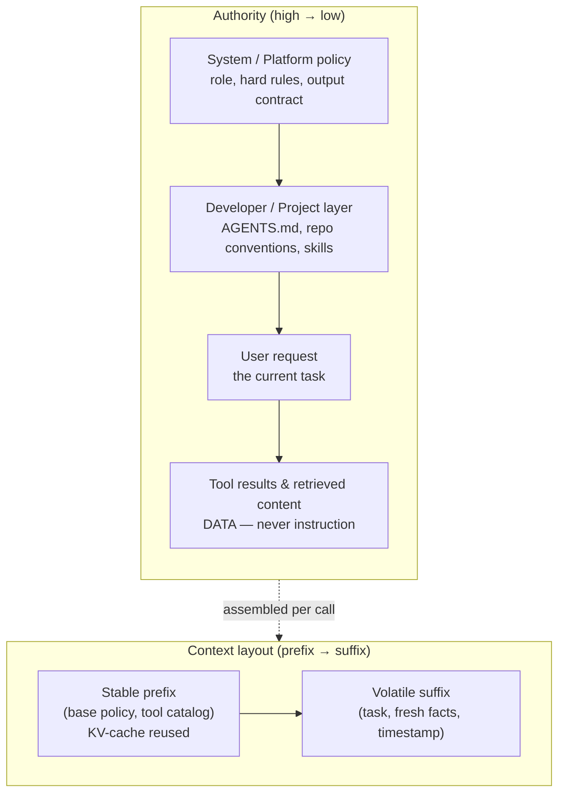

# Chapter 13: System Prompts and Instruction Architecture

The core diagram in the [Preface](./00-preface.md) lists *System Prompts* as the first component of the harness, yet the preceding chapters have treated them as a given. This chapter looks at the instruction layer directly: what belongs in it, how competing instructions are prioritized, how the layer is assembled at runtime, and why it should be engineered with the same discipline as any other part of the system.

### 13.1 The System Prompt Is a Harness Layer, Not a Prompt

A "prompt" in the casual sense is a question typed into a chat box. The system prompt of an agent is something else: a persistent program that ships with the harness and frames every single turn of the agent loop. HumanLayer's twelve-factor manifesto names this directly — *own your prompts* — and argues that for production agents the prompt is core engineering logic, not a string to outsource to a framework's hidden default ([HumanLayer — 12-Factor Agents](https://www.humanlayer.dev/blog/12-factor-agents)). Treating it as application code is the premise of everything below.

The distinction matters because the system prompt does work that no other layer can. It establishes the agent's role and objective, declares the available tools and when to use them, encodes policy the agent must not violate, and sets the output contract. When any of these is vague, the failure does not appear as a syntax error; it appears as drift, over-eagerness, refusal, or a tool used at the wrong moment — failures that are hard to attribute precisely (Ch 10, [Ch 12](./12-trace-driven-iteration.md)).

### 13.2 The Instruction Hierarchy

An agent receives instructions from several origins at once: the platform's system prompt, a developer's configuration, the user's request, and — critically — text that arrives inside tool results and retrieved documents. These do not carry equal authority, and the model must be told so. OpenAI formalized this as the *instruction hierarchy*: models can be trained to treat system-level instructions as privileged over user-level instructions, and both as privileged over content encountered in tool outputs, so that a lower-priority instruction cannot override a higher-priority one ([OpenAI — The Instruction Hierarchy](https://arxiv.org/abs/2404.13208)).

For the harness engineer this is the same boundary that [Chapter 5](./05-sandboxing-guardrails.md) drew for security, seen from the instruction side. Prompt injection is precisely a failure of the hierarchy: text in a web page or file ([the *lethal trifecta*](https://simonwillison.net/2025/Jun/16/the-lethal-trifecta/), Ch 5) tries to promote itself to instruction level. The hierarchy gives two complementary defenses:

- **Rely on the model's trained priority** by placing genuine policy in the system position, never in user-editable or tool-supplied positions.
- **Reinforce it structurally** by labeling untrusted spans as data, because a trained priority is a tendency, not a guarantee.

The practical rule: an instruction's authority should come from *where the harness puts it*, not from how forcefully it is phrased. A constraint that matters belongs in the system layer; a constraint written into a retrieved document is a suggestion the agent is free to ignore — and should be made to ignore.

### 13.3 What Belongs in the System Prompt

Not everything that is true needs to be stated, and an overstuffed system prompt spends the attention budget of [Chapter 2](./02-context-as-finite-resource.md) before the task even begins. A useful division:

- **Belongs in the system prompt**: the agent's role and goal, the high-value rules it must always follow, the tool-use policy that a tool description cannot express on its own (when *not* to use a tool, how tools relate), and the output contract.
- **Belongs in tool descriptions, not the system prompt**: the mechanics of each individual tool (Ch 4). Duplicating tool detail into the system prompt creates two sources of truth that drift apart.
- **Belongs in retrieved context, not the system prompt**: facts that change, that are large, or that are needed only sometimes. These should arrive through just-in-time retrieval (Ch 2), not be baked into a static prefix.

### 13.4 Dynamic Assembly and the Stable-Prefix Constraint

Most real agents do not ship one fixed string. The system prompt is *assembled* per call from parts: a base policy, the current tool set, project-specific instructions, possibly a retrieved skill ([Chapter 4](./04-tools-agent-computer-interface.md)). This assembly collides with the KV-cache economics of [Chapter 2](./02-context-as-finite-resource.md): the cache is reused only for a byte-identical prefix, so anything that changes between calls should live *after* everything that does not.

This turns instruction architecture into a layout problem. Stable, reusable material — base policy, the standing tool catalog — goes first. Volatile material — the current task, freshly retrieved facts, a timestamp — goes last. A system prompt that interpolates the current time or a request ID near its top quietly defeats prefix caching on every turn, paying a latency and cost penalty for no behavioral benefit.

### 13.5 Treat Prompts as Versioned Code

Because the system prompt is load-bearing, a change to it is a change to the system and carries the same regression risk as a code change. The discipline of [Chapter 10](./10-evaluation.md) applies without modification: a prompt edit should be run against the eval suite before and after, with pass rates, failure categories, cost, and latency compared. The model–harness coupling of [Chapter 12](./12-trace-driven-iteration.md) sharpens the point — a prompt tuned for one model can regress on the next, so prompts are versioned alongside the model they were validated against.

Concretely, the instruction layer deserves: version control, a changelog tied to eval results, and an owner. "Own your prompts" means exactly this — the prompt is a maintained artifact with a history, not a string someone edited live in production ([HumanLayer — 12-Factor Agents](https://www.humanlayer.dev/blog/12-factor-agents)).

### 13.6 The Right Altitude

The hardest judgment in writing a system prompt is its level of specificity. Anthropic frames this as finding the *right altitude*: too low, and the prompt becomes a brittle pile of hardcoded if-then rules that break on the first unanticipated case and grow without bound; too high, and the guidance is so vague that the model has no concrete signal to act on ([Anthropic — Effective Context Engineering for AI Agents](https://www.anthropic.com/engineering/effective-context-engineering-for-ai-agents)). The target is guidance specific enough to shape behavior reliably but general enough to transfer across the cases the agent will actually meet.

Altitude is also where over-engineering hides. Every special-case rule added in response to a single bad trace is a hostage to fortune: it narrows behavior, consumes context, and may conflict with a rule added next month. Often the better fix is not another sentence in the system prompt but a tool change, a sensor (Ch 5), or an eval case that pins the behavior down (Ch 10). The transcript tells you which ([Chapter 12](./12-trace-driven-iteration.md)).

### 13.7 Layered Instructions Across the Three Harness Rings

The instruction layer is not monolithic; it mirrors the inner/outer harness structure of [Chapter 1](./01-what-is-an-agent-harness.md). A coding agent typically composes:

- the **builder harness** system prompt shipped by the lab,
- the **user harness** project instructions a team adds — `AGENTS.md` files, repo conventions, review rules (Ch 12) — and
- on-demand **skills** loaded for a particular task (Ch 4).

These compose at runtime into the effective instruction set the model sees. The lesson of [Chapter 12](./12-trace-driven-iteration.md) carries over: do not assume more project instruction is always better. The evidence on sprawling `AGENTS.md` files is mixed, and an over-specified project layer can fight the builder harness it sits on top of. The instruction architecture is something to measure, not to maximize.

---

## Diagram: The Instruction Stack

*Authority flows top-down and is enforced by position, not phrasing; layout flows prefix-to-suffix and is governed by cache economics. The two axes are independent and both must be designed.*

---

## Key Takeaways

- **The system prompt is application code**: a persistent, load-bearing harness layer, not a casual string — own it, version it, and test changes against evals.
- **Authority comes from position, not emphasis**: the instruction hierarchy makes system instructions privileged over user input and tool content; prompt injection is a hierarchy failure, so label untrusted spans as data.
- **Separate what belongs where**: role and policy in the system prompt, mechanics in tool descriptions, changing facts in just-in-time retrieval.
- **Assemble for the cache**: stable instructions first, volatile material last, or prefix caching silently breaks.
- **Aim for the right altitude**: specific enough to steer, general enough to transfer; resist patching every trace with a new hardcoded rule.

## Further Reading

- Eric Wallace et al., *The Instruction Hierarchy: Training LLMs to Prioritize Privileged Instructions*, OpenAI, Apr 2024. https://arxiv.org/abs/2404.13208
- Anthropic Applied AI Team, *Effective Context Engineering for AI Agents*, Anthropic, Sep 2025. https://www.anthropic.com/engineering/effective-context-engineering-for-ai-agents
- Dex Horthy, *12-Factor Agents*, HumanLayer, Apr 2025. https://www.humanlayer.dev/blog/12-factor-agents
- Simon Willison, *The lethal trifecta for AI agents*, Jun 2025. https://simonwillison.net/2025/Jun/16/the-lethal-trifecta/
