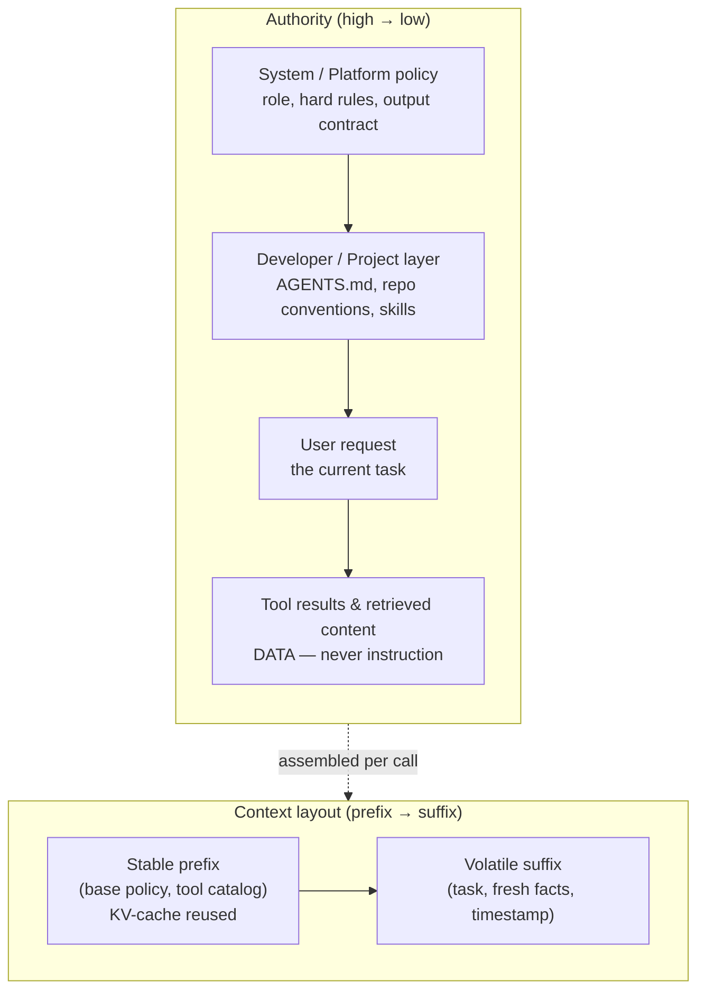

# Chapter 13: System Prompts and Instruction Architecture

The core diagram in the [Preface](./00-preface.md) lists *System Prompts* as the first component of the harness, but the preceding chapters have mostly treated them as a given. This chapter examines the instruction layer directly: what belongs there, how the agent prioritizes competing instructions, how the harness assembles those instructions at runtime, and why the entire layer deserves the same engineering discipline as the rest of the system.

### 13.1 The System Prompt Is a Harness Layer, Not a Prompt

A "prompt" in casual use is a question typed into a chat box. An agent's system prompt is different: it is a persistent program that ships with the harness and frames every turn of the agent loop. HumanLayer's twelve-factor manifesto captures this distinction with the principle *own your prompts*. For a production agent, the prompt is core engineering logic, not a string that should disappear inside a framework's hidden defaults ([HumanLayer — 12-Factor Agents](https://www.humanlayer.dev/blog/12-factor-agents)). The rest of this chapter starts from that premise: treat the system prompt as application code.

The distinction matters because the system prompt performs work that no other layer can. It defines the agent's role and objective, explains when available tools should be used, encodes policies the agent must follow, and sets the output contract. If any of these elements is vague, the system will not raise a syntax error. Instead, the agent may drift from the task, act too eagerly, refuse unnecessarily, or use the right tool at the wrong time. Such failures are often difficult to diagnose precisely (Ch 10, [Ch 12](./12-trace-driven-iteration.md)).

### 13.2 The Instruction Hierarchy

An agent receives text from several sources at once: the platform's system prompt, developer configuration, the user's request, and—critically—tool results and retrieved documents. Not all of this text carries the same authority. OpenAI formalized this distinction as the *instruction hierarchy*: models can be trained to prioritize system-level instructions over user-level instructions, and both over content encountered in tool outputs. The goal is to prevent lower-priority text from overriding higher-priority instructions ([OpenAI — The Instruction Hierarchy](https://arxiv.org/abs/2404.13208)).

For the harness engineer, this is the instruction-side view of the security boundary described in [Chapter 5](./05-sandboxing-guardrails.md). Prompt injection is a failure of that boundary: text in a web page or file tries to elevate itself from untrusted data to an authoritative instruction ([the *lethal trifecta*](https://simonwillison.net/2025/Jun/16/the-lethal-trifecta/), Ch 5). The hierarchy provides two complementary defenses:

- **Use the model's trained priorities** by placing genuine policy in the system position, never in user-editable or tool-supplied content.
- **Reinforce the boundary structurally** by labeling untrusted spans as data, because a trained priority is a tendency rather than a guarantee.

The practical rule is that an instruction's authority should come from *where the harness places it*, not from how forcefully it is worded. A critical constraint belongs in the system layer. The same text inside a retrieved document has no such authority and should be treated as data rather than policy.

### 13.3 What Belongs in the System Prompt

Not every relevant fact belongs in the system prompt. An overstuffed prompt consumes the attention budget described in [Chapter 2](./02-context-as-finite-resource.md) before the task even begins. A useful division of responsibility is:

- **System prompt**: the agent's role and goal, high-value rules that always apply, tool-use policies that individual tool descriptions cannot express (such as when *not* to use a tool or how tools relate to one another), and the output contract.
- **Tool descriptions**: the mechanics of each individual tool (Ch 4). Repeating those details in the system prompt creates two sources of truth that can drift apart.
- **Retrieved context**: facts that change frequently, require substantial space, or matter only for certain tasks. They should arrive through just-in-time retrieval (Ch 2), not be embedded in a static prefix.

### 13.4 Dynamic Assembly and the Stable-Prefix Constraint

Most production agents do not use one fixed string. The harness *assembles* the system prompt for each call from several parts: a base policy, the current tool set, project-specific instructions, and possibly a retrieved skill ([Chapter 4](./04-tools-agent-computer-interface.md)). This assembly must account for the KV-cache economics described in [Chapter 2](./02-context-as-finite-resource.md). Because the cache can reuse only a byte-identical prefix, material that changes between calls should appear *after* material that remains stable.

Instruction architecture is therefore also a layout problem. Stable, reusable material—such as base policy and the standing tool catalog—goes first. Volatile material—such as the current task, newly retrieved facts, and timestamps—goes last. If a system prompt inserts the current time or a request ID near the top, it quietly defeats prefix caching on every turn, adding latency and cost without improving behavior.

### 13.5 Treat Prompts as Versioned Code

Because the system prompt is load-bearing, changing it means changing the system. A prompt edit carries the same regression risk as a code change, so the discipline of [Chapter 10](./10-evaluation.md) applies directly: run the eval suite before and after the edit, then compare pass rates, failure categories, cost, and latency. The model–harness coupling described in [Chapter 12](./12-trace-driven-iteration.md) makes this even more important. A prompt tuned for one model may regress on another, so prompts should be versioned alongside the models against which they were validated.

In practical terms, the instruction layer needs version control, a changelog tied to eval results, and a clear owner. "Own your prompts" means treating each prompt as a maintained artifact with a history—not as a string someone edits live in production ([HumanLayer — 12-Factor Agents](https://www.humanlayer.dev/blog/12-factor-agents)).

### 13.6 The Right Altitude

The hardest judgment in writing a system prompt is choosing the right level of specificity. Anthropic describes this as finding the *right altitude*. At too low an altitude, the prompt becomes a brittle collection of hardcoded if-then rules that fails on unanticipated cases and grows without bound. At too high an altitude, the guidance becomes so abstract that the model has no concrete signal to act on ([Anthropic — Effective Context Engineering for AI Agents](https://www.anthropic.com/engineering/effective-context-engineering-for-ai-agents)). The goal is guidance specific enough to shape behavior reliably, yet general enough to transfer across the cases the agent will encounter.

This is also where over-engineering tends to hide. A special-case rule added in response to one bad trace can become a long-term liability: it narrows behavior, consumes context, and may conflict with a rule added later. Often, the better fix is not another sentence in the system prompt but a tool change, a sensor (Ch 5), or an eval case that makes the expected behavior explicit (Ch 10). Traces provide the evidence needed to choose among these options ([Chapter 12](./12-trace-driven-iteration.md)).

### 13.7 Layered Instructions Across the Three Harness Rings

The instruction layer is not monolithic. It mirrors the inner and outer harness structure described in [Chapter 1](./01-what-is-an-agent-harness.md). A coding agent typically combines:

- the **builder harness** system prompt shipped by the lab,
- the **user harness** project instructions added by the team—`AGENTS.md` files, repository conventions, and review rules (Ch 12)—and
- on-demand **skills** loaded for a particular task (Ch 4).

At runtime, these layers form the effective instruction set seen by the model. The lesson from [Chapter 12](./12-trace-driven-iteration.md) still applies: more project instruction is not always better. Evidence on sprawling `AGENTS.md` files is mixed, and an over-specified project layer can conflict with the builder harness beneath it. Instruction architecture should be measured, not maximized.

### 13.8 Scoped Review Rules as an Instruction Interface

Repository instructions can guide code review as well as code generation. OpenAI's custom Codex review guidance treats concise `AGENTS.md` rules as a **review interface**. Each rule should identify a specific defect, explain where the rule applies, and state how a reviewer can recognize the problem. Directory-scoped files keep those rules close to the code they govern ([OpenAI — Custom Code Review Rules for Codex](https://developers.openai.com/blog/custom-code-review-rules-for-codex)).

Good review rules are short, testable, and high-signal: "flag a new endpoint that bypasses `authorize()`" rather than "follow security best practices." They point to the relevant code or policy and, where possible, to a deterministic check. Like any other instruction, review rules should be versioned and evaluated. Noisy rules create false positives and eventually teach humans to ignore the entire review surface. This is progressive disclosure applied to quality policy: place each rule near the code it governs, reserve global instructions for universal requirements, and move stable invariants into linters or tests.

---

## Diagram: The Instruction Stack

*Authority flows top-down and is enforced by position, not phrasing; layout flows prefix-to-suffix and is governed by cache economics. The two axes are independent and both must be designed.*

---

## Key Takeaways

- **The system prompt is application code**: a persistent, load-bearing harness layer, not a casual string — own it, version it, and test changes against evals.
- **Authority comes from position, not emphasis**: the instruction hierarchy makes system instructions privileged over user input and tool content; prompt injection is a hierarchy failure, so label untrusted spans as data.
- **Separate what belongs where**: role and policy in the system prompt, mechanics in tool descriptions, changing facts in just-in-time retrieval.
- **Assemble for the cache**: stable instructions first, volatile material last, or prefix caching silently breaks.
- **Aim for the right altitude**: specific enough to steer, general enough to transfer; resist patching every trace with a new hardcoded rule.
- **Review rules are an instruction interface**: scope concise, testable defect rules near the code they govern, measure their signal, and move stable invariants into deterministic checks.

## Further Reading

- Eric Wallace et al., *The Instruction Hierarchy: Training LLMs to Prioritize Privileged Instructions*, OpenAI, Apr 2024. https://arxiv.org/abs/2404.13208
- Anthropic Applied AI Team, *Effective Context Engineering for AI Agents*, Anthropic, Sep 2025. https://www.anthropic.com/engineering/effective-context-engineering-for-ai-agents
- Dex Horthy, *12-Factor Agents*, HumanLayer, Apr 2025. https://www.humanlayer.dev/blog/12-factor-agents
- Simon Willison, *The lethal trifecta for AI agents*, Jun 2025. https://simonwillison.net/2025/Jun/16/the-lethal-trifecta/
- OpenAI, *Custom Code Review Rules for Codex*, Jul 2026. https://developers.openai.com/blog/custom-code-review-rules-for-codex
