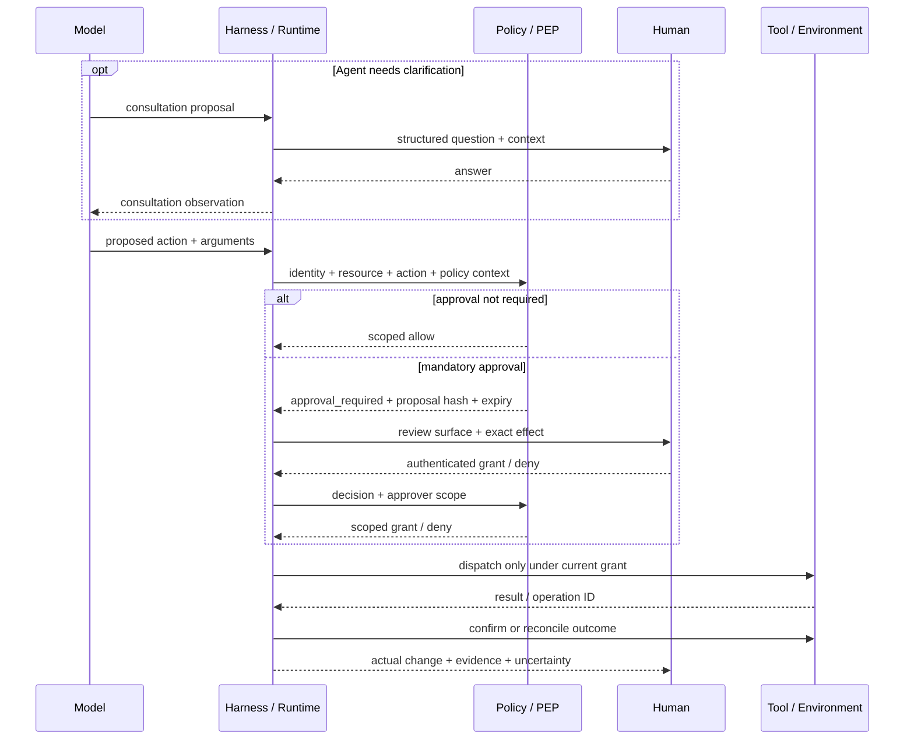

# Chapter 14: Human–Agent Interaction

Humans participate in agent systems in several roles: they supply intent, answer questions, approve or deny consequential actions, steer work in progress, cancel runs, and review evidence. These roles need product and runtime support. They cannot be implemented safely as a vague instruction telling the model to “ask when appropriate.”

Mixed-initiative interface research framed the underlying design problem before modern agents: a system acting on a person's behalf must decide when to act, when to defer, how to account for interruption cost, and how to preserve interaction context ([Horvitz — Principles of Mixed-Initiative User Interfaces](https://www.microsoft.com/en-us/research/publication/principles-of-mixed-initiative-user-interfaces/)). Agent systems add external side effects and long-running state, so the interface must also make authority, evidence, timing, and recovery explicit.

### 14.1 Consultation and Mandatory Approval Are Different Paths

Two human-interaction patterns may look similar in a chat UI but have different security semantics:

| Pattern | Trigger | Meaning | Enforcement owner |
|---|---|---|---|
| **Agent-requested consultation** | The model or workflow proposes a question because intent, facts, or judgment are unclear | Human input becomes an observation that may guide the next model call | Harness/runtime records the question and response; the response does not automatically grant an unrelated capability |
| **Runtime-mandated approval gate** | Policy classifies a proposed action as requiring approval before dispatch | An authenticated, scoped decision permits or denies that exact action under stated conditions | A non-bypassable policy enforcement point (PEP) on the action path |

HumanLayer's “contact humans with tool calls” is a useful orchestration pattern for the first path: represent a question as structured work, suspend, and return the answer to the loop as an observation ([HumanLayer — 12-Factor Agents](https://www.humanlayer.dev/blog/12-factor-agents)). The model can request clarification or recommend that someone review a choice. It may also fail to ask.

The second path therefore cannot depend on a voluntary model call. NIST defines a PEP as the component that enforces access decisions, while its access-control guidance requires enforcement mechanisms not to be bypassable ([NIST — Zero Trust Architecture Glossary](https://pages.nist.gov/zero-trust-architecture/glossary.html); [NIST IR 7987](https://nvlpubs.nist.gov/nistpubs/ir/2014/NIST.IR.7987.pdf)). The MCP tools specification likewise recommends that applications show tool inputs and request confirmation for sensitive operations ([MCP — Tools Specification](https://modelcontextprotocol.io/specification/2025-06-18/server/tools)). The runtime must intercept the action even if the model never emits `request_human_approval`.

An answer to a consultation can cause policy to re-evaluate an action, but it is not itself the mandatory approval unless it was collected through the authenticated gate with the required scope. Conversely, the runtime may require approval for an action the agent believes is routine.

### 14.2 Scale Human Attention with the Stakes

Approval on every action creates habituation and slows useful work; too little review encourages blind trust. Anthropic describes reducing repeated permission prompts by placing file and network operations inside explicit sandbox boundaries, while keeping actions beyond those boundaries subject to confirmation ([Anthropic — Beyond Permission Prompts](https://www.anthropic.com/engineering/claude-code-sandboxing)). The general rule is to spend human attention where the policy-relevant consequences justify it.

Classify an action along at least these dimensions:

- **Reversibility:** can the exact prior state be restored, and has rollback been tested?
- **Blast radius:** one scratch file, one user, one tenant, a production service, or a public audience?
- **External communication:** will the action send, publish, submit, or share something outside the working boundary?
- **Money:** can it create a purchase, transfer, subscription, contract, or metered spend?
- **Production:** can it change live infrastructure, data, access, or availability?
- **Sensitive data:** can it read, transform, expose, retain, or transmit secrets, personal data, regulated data, or tenant-confidential content?

A starting matrix is:

| Action profile | Example | Default interaction | Required evidence |
|---|---|---|---|
| Reversible, sandboxed, narrow blast radius | Read allowed files; run tests; edit a disposable workspace | Execute under existing authorization and report as needed | Action/result record; sandbox boundary |
| Reversible and scoped, but changes durable work | Create a draft or branch; update a non-production artifact | Execute and report, or sample for review according to policy | Diff or versioned artifact; rollback path; checks run |
| External communication | Send email; post a comment; submit a form | Preview exact audience and payload; normally require approval unless a narrow standing policy covers it | Recipient/destination, normalized payload, identity, policy reason |
| Money or binding commitment | Purchase, transfer, paid API expansion, contract acceptance | Mandatory approval with amount, recipient/vendor, limits, and expiry | Exact transaction proposal; budget and authorization evidence |
| Production or broad blast radius | Deploy, modify access, alter live data, rotate credentials | Mandatory approval or stronger change-management gate | Diff/plan, affected resources, tests, rollback, current health |
| Sensitive-data disclosure or movement | Export customer data; send a secret; change sharing scope | Deny unless explicitly authorized; mandatory approval where policy permits | Data class, source, destination, purpose, minimization/redaction evidence |
| Irreversible or destructive | Permanent deletion; unrecoverable publish; destructive migration | Mandatory approval plus recovery or exception plan | Exact target, impact analysis, backups/recovery evidence, expiry |

This is not a universal allowlist. Reversibility can be deceptive: deleting a local file may be harmless if versioned, while sending an “editable” message can still create an irreversible disclosure. Policy should combine the dimensions with identity, purpose, environment, and current resource state.

### 14.3 The Mandatory Gate Binds Approval to an Exact Proposal

A mandatory approval should be issued against an immutable or content-addressed action preview. At minimum, the pending record contains:

```text
proposed_action
normalized_arguments
resource_identity_and_version
acting_user_agent_and_delegation_identity
policy_id_and_version
risk_class_and_policy_reason
approval_scope_and_expiry
```

The decision record adds the authenticated approver identity, approver authority scope, decision, time, conditions, and the proposal hash. The UI may render friendly labels, but the grant must bind to normalized arguments and stable resource identifiers rather than only to natural-language prose.

A **material change** invalidates the prior approval and sends the proposal through policy again. Examples include changing the amount, recipient, destination, target resource or version, data class, external audience, acting identity or delegation, tool semantics, side-effect scope, policy version, or execution time beyond the grant's expiry. Policy should define materiality for the domain; the model must not decide that two actions are “close enough.” Chapter 6 applies the same rule to retries: approval, authorization, and outcome status must be checked again when their inputs change.

Approval establishes permission to attempt the scoped action. It does not prove the tool executed, that a timeout caused no effect, or that the intended outcome occurred. Keep approval ID, dispatch attempt, and outcome evidence distinct.

### 14.4 Approval Events Support Recovery; Audit Requires More

Consultation and approval should enter the workflow event history through explicit transitions such as:

```text
consultation_requested -> consultation_answered
approval_required -> approval_granted | approval_denied | approval_expired
approval_granted -> approval_revoked | action_dispatched
```

Each event carries the run/action identity, sequence, actor, time, proposal or artifact reference, policy version, and previous state. This lets a durable runtime release compute while waiting and later reconstruct whether it may resume. Temporal's event-history model is one concrete example in which persisted events reconstruct workflow state after failure ([Temporal — Events and Event History](https://docs.temporal.io/workflow-execution/event)). Chapter 10 defines this book's event and replay contract.

An event history is not automatically an audit record. NIST SP 800-53 treats audit-record content, generation, review, protection, access, and retention as explicit controls ([NIST SP 800-53 Rev. 5](https://csrc.nist.gov/pubs/sp/800/53/r5/upd1/final)). Approval events become audit evidence only when the system can establish required **completeness, identity, timestamp, integrity, retention, and access** properties. A sampled trace or mutable application log may link to the event, but it cannot silently inherit those guarantees.

The audit representation should preserve what was shown, who decided, which authority they held, what changed after the decision, which action was dispatched, and what outcome was confirmed. It should also minimize unnecessary prompt, personal, and secret content; auditability is not permission to retain everything forever.

### 14.5 Design the Review Surface Around Decisions and Evidence

A useful review surface enables a person to understand what is happening, what decision is required, and what evidence supports it. Human–AI interaction guidelines recommend making system capabilities clear, showing status, supporting correction, and making it easy to dismiss or override incorrect output ([Amershi et al. — Guidelines for Human-AI Interaction](https://www.microsoft.com/en-us/research/publication/guidelines-for-human-ai-interaction/)).

Show, as applicable:

- **plan and current status:** intended milestones, completed work, pending work, and blockers;
- **tool action:** operation name, normalized arguments, resource, acting identity, expected side effects, and idempotency/outcome status;
- **diff or artifact:** the exact version, content hash, rendered change, destination, and rollback option;
- **test and evidence:** checks actually run, results, citations, environment state, and links to complete output;
- **uncertainty:** assumptions, conflicting evidence, missing checks, unknown outcomes, and what would resolve them;
- **policy reason:** why the action was allowed, denied, redacted, sandboxed, or sent for approval; which policy/version applied;
- **decision consequences:** what approval permits, when it expires, and which material changes will require a new decision.

This does not require exposing hidden chain-of-thought. OpenAI's Model Spec notes that some models generate hidden chain-of-thought that is not exposed to developers or users except potentially in summarized form ([OpenAI — Model Spec, Hidden Chain of Thought](https://model-spec.openai.com/2025-10-27)). A review system should rely on concise plans, observable actions, artifacts, checks, sources, policy decisions, and environment outcomes—not private reasoning text or a model's post-hoc rationale.

Separate **pre-action approval** from **post-action review**. Before dispatch, emphasize the exact proposed effect and approval scope. After execution, emphasize what actually changed, verification evidence, residual uncertainty, and recovery options. A “done” message is insufficient for either surface.

### 14.6 Steering and Cancellation Need Event Semantics

Steering is not merely appending a message. Record a `steering_requested` event with requester identity, scope, instruction reference, reason, and time. The controller then records whether it was accepted, rejected, or superseded, and the sequence or step at which it became effective. Normally it can affect the next model call and prevent undispatched future actions; it cannot retroactively change the arguments of an action already dispatched.

Cancellation similarly has at least two states: **cancellation requested** and a terminal **cancelled**, **partially completed**, **failed**, or **unknown** outcome. Temporal's workflow model distinguishes a cancellation request from the resulting terminal state, and activity cancellation is cooperative rather than proof of rollback ([Temporal — Workflow Execution](https://docs.temporal.io/workflow-execution); [Temporal — Events and Event History](https://docs.temporal.io/workflow-execution/event)).

When a steering or cancellation event arrives:

1. stop scheduling new actions within its scope;
2. record the current model/tool call and whether dispatch already occurred;
3. request cancellation from in-flight operations when their contract supports it;
4. do not assume an already dispatched effect was rolled back;
5. reconcile external state and record succeeded, partial, cancelled, failed, or unknown outcomes;
6. invalidate pending approval if the new direction materially changes its proposal;
7. checkpoint or construct a handoff before resuming under the new instruction.

A long, non-interruptible model call may only observe steering after it returns. A remote tool may ignore cancellation or finish before the request arrives. The UI should show this timing honestly: “request received” is not “action stopped.” Chapter 6 owns cancellation and unknown-outcome handling for individual calls; Chapter 10 owns durable state transitions.

### 14.7 From One Review to a Fleet Queue

For one run, a reviewer can inspect the pending action directly. Across a fleet, the queue should prioritize work by **risk and evidence**, not merely arrival time or transcript length. Useful escalation signals include mandatory approvals waiting near expiry, sensitive-data or production actions, broad blast radius, external communication or spend, failed deterministic checks, missing artifacts, conflicting evidence, unknown side effects, novel tool/policy combinations, and repeated human overrides.

Low-risk work with strong outcome evidence may be summarized or sampled according to policy; consequential work should retain the exact proposal and review artifacts. Queue status must link back to the run/action IDs and current event-history state so a stale card cannot approve an action that has changed or already completed.

Cross-run identity, queue ownership, policy administration, revocation, and fleet lifecycle belong to [Chapter 19](./19-agent-fleets-control-plane.md). This chapter supplies the human decision and review contract that the fleet control plane must preserve.

### 14.8 Two Human Paths Around One Action



The consultation path improves intent and judgment. The mandatory path enforces policy. They can appear in the same run, but one cannot substitute for the other.

---

## Key Takeaways

- **Separate consultation from approval:** a model can ask a person for input, but a runtime-mandated gate must not depend on the model volunteering to call it.
- **Bind approval to the exact action:** record normalized arguments, resource, identity, policy/version, risk, scope, and expiry; material change requires a new decision.
- **Scale attention with stakes:** consider reversibility, blast radius, external communication, money, production, and sensitive data together.
- **Approval is permission, not outcome evidence:** dispatch and postcondition confirmation remain separate lifecycle stages.
- **Event history is not automatically audit:** approval events become audit evidence only with defined completeness, identity, integrity, timestamps, retention, and access.
- **Review observable work, not hidden reasoning:** show plan/status, tool actions, diffs or artifacts, tests and evidence, uncertainty, policy reasons, and decision consequences.
- **Steering and cancellation are state transitions:** record when they take effect and reconcile any action already dispatched.
- **Fleet review belongs to the control plane:** Chapter 19 owns cross-run queues, identity, policy administration, revocation, and lifecycle.

## Further Reading

- Eric Horvitz, *Principles of Mixed-Initiative User Interfaces*, CHI 1999. https://www.microsoft.com/en-us/research/publication/principles-of-mixed-initiative-user-interfaces/
- Saleema Amershi et al., *Guidelines for Human-AI Interaction*, CHI 2019. https://www.microsoft.com/en-us/research/publication/guidelines-for-human-ai-interaction/
- Dex Horthy, *12-Factor Agents*, HumanLayer, Apr 2025. https://www.humanlayer.dev/blog/12-factor-agents
- David Dworken and Oliver Weller-Davies, *Beyond Permission Prompts: Making Claude Code More Secure and Autonomous*, Anthropic, Oct 2025. https://www.anthropic.com/engineering/claude-code-sandboxing
- Model Context Protocol, *Tools Specification*, Jun 2025. https://modelcontextprotocol.io/specification/2025-06-18/server/tools
- NIST, *Zero Trust Architecture Glossary*. https://pages.nist.gov/zero-trust-architecture/glossary.html
- NIST, *IR 7987: Policy Machine*. https://nvlpubs.nist.gov/nistpubs/ir/2014/NIST.IR.7987.pdf
- NIST, *SP 800-53 Rev. 5*. https://csrc.nist.gov/pubs/sp/800/53/r5/upd1/final
- Temporal, *Workflow Execution*. https://docs.temporal.io/workflow-execution
- Temporal, *Events and Event History*. https://docs.temporal.io/workflow-execution/event
- OpenAI, *Model Spec*, Oct 2025. https://model-spec.openai.com/2025-10-27
