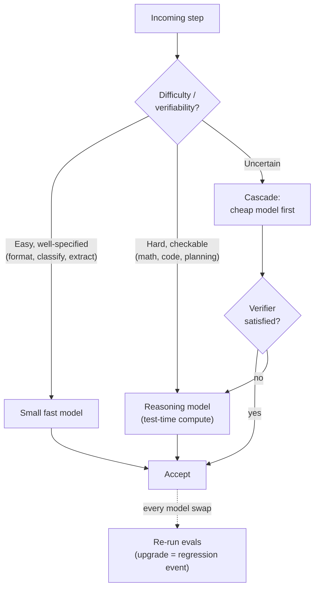

# Chapter 14: Model Selection, Routing, and Reasoning Models

*Agent = Model + Harness.* The previous chapters engineered the harness while treating "the model" as a single fixed choice. In practice the model side is itself a design surface: which model runs a given step, whether a cheaper one would do, and — since the arrival of reasoning models — how much the model should be allowed to think before it acts. This chapter covers the model-facing decisions the harness owns. For what these models are doing internally, the companion volume [*LLM Foundations*](../llm-foundations/) is the reference; here the concern is operational.

### 13.1 Model Choice Is a Harness Decision

The first principle of [Chapter 6](./06-agentic-workflow-patterns.md) — do the simplest thing that works — applies to models as much as to control flow. The largest, most capable model is rarely the right default for every step of an agent loop. Most loops contain a mix of work: a hard planning or synthesis step that genuinely needs a frontier model, surrounded by easy steps — classifying an input, formatting a result, extracting a field — that a smaller, faster, cheaper model handles just as well ([Anthropic — Building Effective Agents](https://www.anthropic.com/engineering/building-effective-agents)).

Treating the model as a single global setting leaves this on the table. The harness can select per step, and the unit of selection is the call, not the application. This is the same instinct as the model-routing note in [Chapter 3](./03-compaction-memory-subagent.md), generalized: capability spent where it does not change the outcome is capability wasted, and in production that waste is measured in latency and dollars on every request.

### 13.2 Routing: Match Model Strength to Task Difficulty

*Routing* in the workflow sense (Ch 6) dispatches an input to a specialized branch. *Model routing* is the same idea applied to model choice: classify the difficulty of a request and send easy ones to a weak, cheap model and hard ones to a strong, expensive one. The challenge is the classifier — routing only pays off if deciding the route is much cheaper than the saving it produces.

RouteLLM showed this can be learned: a router trained on preference data sends queries to a strong or weak model and recovers most of the strong model's quality at a fraction of the cost on standard benchmarks ([RouteLLM](https://arxiv.org/abs/2406.18665)). The harness-level takeaway is not a specific router but the shape of the lever: a small, fast decision in front of an expensive call can move the cost-quality frontier, *if* the routing decision is itself reliable and cheap. A misrouted hard task that fails silently can cost far more than the model it saved.

### 13.3 Cascades and Fallbacks

Routing decides up front. A *cascade* defers the decision: try the cheap model first, accept its answer if a verifier is satisfied, and escalate to a stronger model only when it is not. FrugalGPT demonstrated cascades that match a frontier model's accuracy at a large cost reduction by sending most queries to cheaper models and escalating only the hard residual ([FrugalGPT](https://arxiv.org/abs/2305.05176)).

A cascade is only as good as its escalation signal — the verifier that decides "this answer is not good enough." That is the same verification machinery as everywhere else in this book: a code-based check, a test, a schema validation, or a model-based grader (Ch 5, [Ch 10](./10-evaluation.md)). Without a trustworthy signal, a cascade just adds latency before producing the same wrong answer. The related production pattern is the *fallback*: when the primary model errors, times out, or is rate-limited, fail over to an alternate so the agent degrades gracefully instead of stalling — a reliability concern that belongs with the checkpoint/resume discipline of [Chapter 7](./07-long-running-agents.md).

### 13.4 Reasoning Models and Test-Time Compute

A reasoning model is post-trained — often with reinforcement learning on checkable problems — to generate a long internal chain of reasoning before committing to an answer, spending extra inference tokens to do better on hard problems. DeepSeek-R1 documented that strong reasoning behavior can be elicited largely through RL on verifiable rewards ([DeepSeek-R1](https://arxiv.org/abs/2501.12948)), and a line of work has shown that *test-time compute* — letting a model think longer at inference — can be a more effective use of budget than a larger model on some problems ([Snell et al. — Scaling LLM Test-Time Compute](https://arxiv.org/abs/2408.03314)). The companion volume covers the mechanism (*LLM Foundations*, Ch 7–8); the consequence here is that "how long the model thinks" has become a harness-controllable axis, distinct from "which model."

This is a different scaling axis from anything in [Chapter 11](./11-infrastructure-noise.md). There, more hardware enabled more agent *actions*. Here, more inference budget buys more *thinking* inside a single call, before any tool is touched. Both cost money; they are not interchangeable.

### 13.5 Harnessing Reasoning Models: Don't Fight the Training

A reasoning model changes several harness assumptions, and the failure mode is fighting behavior the model already has:

- **Do not hand-prompt the reasoning it does natively.** Forcing "think step by step" onto a model trained to reason can waste tokens or conflict with its trained behavior. Follow the provider's guidance for that model class.
- **Budget for invisible tokens.** A reasoning model can emit thousands of hidden reasoning tokens before its first visible word. That is real latency and real cost. Where the model exposes a reasoning-effort control, treat it as a first-class harness parameter and, when appropriate, surface it to the user.
- **Do not trust the trace as an explanation.** The reasoning text may be hidden, summarized, or unfaithful to the model's actual computation. Treat any exposed reasoning as a debugging aid, not verification — the same caution the eval chapter applies to model self-reports (Ch 10).
- **Reasoning is not grounding.** A longer internal monologue is still ungrounded generation. It can reason more carefully over evidence the harness supplies, but it cannot manufacture facts it was never given. Tools, retrieval, and verification remain mandatory (Ch 4, [Ch 10](./10-evaluation.md)).

### 13.6 Routing to Reasoning: When the Extra Tokens Pay Off

Reasoning models help most on math, code, planning, and multi-step analysis — work where a checkable, hard sub-problem sits inside the loop. They help least on simple extraction, formatting, and classification, where they are slower and more expensive for no quality gain. This makes reasoning a routing target like any other: send the hard, verifiable step to a reasoning model and keep the surrounding easy steps on a fast non-reasoning model (§13.2).

The micro-agent pattern of [Chapter 6](./06-agentic-workflow-patterns.md) composes naturally here. A deterministic DAG can place a reasoning-model call at exactly the node that needs deliberation — a "reasoning sandwich" with cheap deterministic work on either side — rather than paying for deliberation on every turn of an open-ended loop.

### 13.7 Model Upgrades Are Harness Events

Because frontier models are increasingly post-trained with their harnesses in the loop, the model and the harness are coupled ([Chapter 12](./12-trace-driven-iteration.md)). Swapping the model — an upgrade, a cheaper provider, a quantized variant, a different reasoning class — is therefore a change to the system, not a drop-in. A model that scores higher on public benchmarks can still regress on your workflow because it follows tool descriptions differently, has different verbosity, or reasons when you wanted a fast answer.

The discipline is the one from [Chapter 10](./10-evaluation.md): every model change is a regression event. Run the eval suite before and after, watch failure categories and cost as well as pass rate, and keep the prompts and tools that were validated against the old model versioned alongside it. Readiness validation is per model-plus-harness configuration, not per model.

---

## Diagram: The Model-Selection Decision

*Route easy steps down, hard checkable steps up; cascade when unsure and let a verifier decide escalation. Any change to the model is a regression event for the whole configuration.*

---

## Key Takeaways

- **Model choice is per-step, not per-app**: spend frontier capability only where it changes the outcome; route easy steps to small fast models.
- **Routing decides up front, cascades decide after**: a learned router can shift the cost-quality frontier ([RouteLLM](https://arxiv.org/abs/2406.18665)); a verifier-gated cascade matches strong-model accuracy at lower cost ([FrugalGPT](https://arxiv.org/abs/2305.05176)) — both depend on a cheap, reliable decision signal.
- **Reasoning models add a new axis**: test-time compute trades inference tokens for quality on hard, checkable tasks — distinct from picking a bigger model or buying more hardware.
- **Don't fight the training**: don't hand-prompt native reasoning, budget for hidden tokens, don't trust the trace as explanation, and remember reasoning is not grounding.
- **Model upgrades are harness events**: re-run evals on every swap; readiness is per model-plus-harness configuration.

## Further Reading

- Isaac Ong et al., *RouteLLM: Learning to Route LLMs with Preference Data*, 2024. https://arxiv.org/abs/2406.18665
- Lingjiao Chen, Matei Zaharia, and James Zou, *FrugalGPT: How to Use Large Language Models While Reducing Cost and Improving Performance*, 2023. https://arxiv.org/abs/2305.05176
- Charlie Snell et al., *Scaling LLM Test-Time Compute Optimally Can Be More Effective Than Scaling Model Parameters*, 2024. https://arxiv.org/abs/2408.03314
- DeepSeek-AI, *DeepSeek-R1: Incentivizing Reasoning Capability in LLMs via Reinforcement Learning*, 2025. https://arxiv.org/abs/2501.12948
- Erik Schluntz and Barry Zhang, *Building Effective Agents*, Anthropic, Dec 2024. https://www.anthropic.com/engineering/building-effective-agents
- *LLM Foundations for Harness Engineering* (companion volume), Chapters 5–8. [../llm-foundations/](../llm-foundations/)
