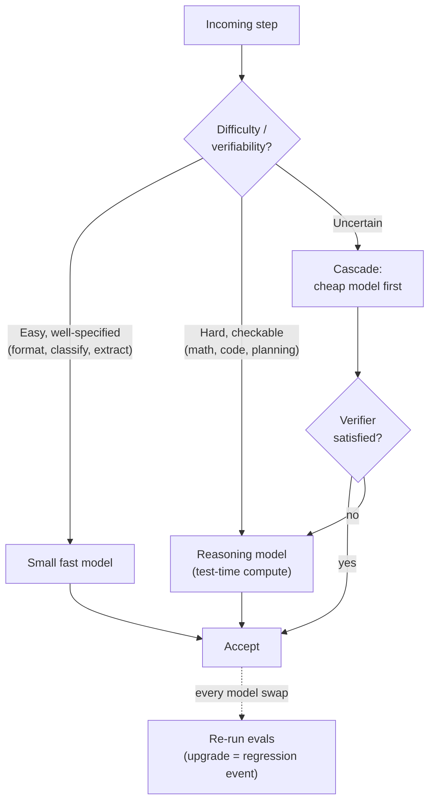

# Chapter 14: Model Selection, Routing, and Reasoning Models

*Agent = Model + Harness.* The previous chapters focused on the harness and treated "the model" as a single, fixed choice. In practice, model selection is another design surface. The harness must decide which model should run each step, whether a cheaper model is sufficient, and — with the arrival of reasoning models — how much inference budget to spend before the model acts. This chapter examines those operational decisions. For an account of what these models do internally, see the companion volume [*LLM Foundations*](../llm-foundations/).

### 14.1 Model Choice Is a Harness Decision

The first principle of [Chapter 6](./06-agentic-workflow-patterns.md) — do the simplest thing that works — applies to model choice as well as control flow. The largest, most capable model is rarely the right default for every step in an agent loop. Most loops mix a few difficult planning or synthesis tasks with many simpler ones, such as classifying an input, formatting a result, or extracting a field. The difficult steps may genuinely need a frontier model; the simpler ones can often be handled just as well by a smaller, faster, and cheaper model ([Anthropic — Building Effective Agents](https://www.anthropic.com/engineering/building-effective-agents)).

Treating the model as a single global setting gives up this opportunity. A harness can choose a model for each step; the unit of selection is the call, not the application. This generalizes the model-routing idea introduced in [Chapter 3](./03-compaction-memory-subagent.md): capability that does not improve the outcome is wasted capability. In production, that waste appears as added latency and cost on every request.

### 14.2 Routing: Match Model Strength to Task Difficulty

In the workflow sense (Ch 6), *routing* dispatches an input to a specialized branch. *Model routing* applies the same idea to model choice: estimate the difficulty of a request, send easy requests to a smaller, cheaper model, and reserve a stronger, more expensive model for harder ones. The classifier is the difficult part. Routing pays off only when the decision is reliable and costs much less than the model usage it saves.

RouteLLM showed that this decision can be learned: a router trained on preference data sends each query to either a strong or a weak model, recovering most of the strong model's quality at a fraction of its cost on standard benchmarks ([RouteLLM](https://arxiv.org/abs/2406.18665)). The harness-level lesson is broader than any particular router. A small, fast decision before an expensive call can improve the cost–quality tradeoff, but only if that decision is itself cheap and dependable. A hard task routed to an inadequate model may fail silently, and the resulting error can cost far more than the model call saved.

### 14.3 Cascades and Fallbacks

Routing chooses a model before attempting the task. A *cascade* defers that choice: try the cheaper model first, accept its answer if it satisfies a verifier, and escalate to a stronger model only if it does not. FrugalGPT demonstrated cascades that match a frontier model's accuracy at substantially lower cost by handling most queries with cheaper models and escalating only the difficult remainder ([FrugalGPT](https://arxiv.org/abs/2305.05176)).

A cascade is only as good as its escalation signal: the verifier that decides whether the first answer is acceptable. It can use the same verification mechanisms discussed throughout this book — a code-based check, a test, schema validation, or a model-based grader (Ch 5, [Ch 10](./10-evaluation.md)). Without a trustworthy signal, a cascade merely adds latency before returning the same wrong answer.

A related production pattern is the *fallback*. If the primary model errors, times out, or is rate-limited, the harness switches to an alternative so the agent degrades gracefully instead of stalling. This is a reliability mechanism rather than a quality decision, and it belongs alongside the checkpoint-and-resume discipline of [Chapter 7](./07-long-running-agents.md).

### 14.4 Reasoning Models and Test-Time Compute

A reasoning model is post-trained — often through reinforcement learning on problems with checkable answers — to perform extended internal reasoning before committing to an answer. It spends additional inference tokens to improve performance on difficult problems. DeepSeek-R1 documented that reinforcement learning with verifiable rewards can elicit strong reasoning behavior ([DeepSeek-R1](https://arxiv.org/abs/2501.12948)). Other work has shown that *test-time compute* — allowing a model to spend more computation during inference — can be a better use of a fixed budget than choosing a larger model for some problems ([Snell et al. — Scaling LLM Test-Time Compute](https://arxiv.org/abs/2408.03314)). The companion volume explains the mechanism (*LLM Foundations*, Ch 7–8). The operational consequence is that "how long the model thinks" is now a harness-controlled axis distinct from "which model runs."

This differs from the scaling discussed in [Chapter 11](./11-infrastructure-noise.md). There, additional hardware enables more agent *actions*. Here, additional inference budget buys more *reasoning* within a single call, before the model uses any tool. Both consume resources, but they are not interchangeable.

### 14.5 Harnessing Reasoning Models: Don't Fight the Training

A reasoning model changes several harness assumptions. The main mistake is to work against behavior the model was trained to provide:

- **Do not manually prompt for reasoning the model already performs.** Adding instructions such as "think step by step" to a model trained to reason can waste tokens or conflict with its learned behavior. Follow the provider's guidance for that model class.
- **Budget for invisible tokens.** A reasoning model may generate thousands of hidden reasoning tokens before producing its first visible word. Those tokens still add latency and cost. If the model exposes a reasoning-effort control, treat it as a first-class harness parameter and, where appropriate, expose it to the user.
- **Do not treat the trace as an explanation.** Reasoning text may be hidden, summarized, or unfaithful to the model's actual computation. Treat any exposed reasoning as a debugging aid, not as verification — the same caution that the evaluation chapter applies to model self-reports (Ch 10).
- **Reasoning is not grounding.** More internal reasoning does not create evidence. A model can analyze supplied evidence more carefully, but it cannot produce facts it was never given. Tools, retrieval, and verification therefore remain necessary (Ch 4, [Ch 10](./10-evaluation.md)).

### 14.6 Routing to Reasoning: When the Extra Tokens Pay Off

Reasoning models are most useful for mathematics, code, planning, and multi-step analysis — tasks that contain a difficult but checkable subproblem. They add less value to simple extraction, formatting, and classification, where extra reasoning often increases latency and cost without improving quality. Reasoning effort should therefore be routed like any other capability: send the difficult, verifiable step to a reasoning model, while keeping the surrounding work on a fast non-reasoning model (§14.2).

This fits naturally with the micro-agent pattern from [Chapter 6](./06-agentic-workflow-patterns.md). A deterministic DAG can place a reasoning-model call exactly where deliberation is needed, with cheaper deterministic work before and after it. This "reasoning sandwich" avoids paying for extended reasoning on every turn of an open-ended loop.

### 14.7 Model Upgrades Are Harness Events

Frontier models are increasingly post-trained with their harnesses in the loop, so model and harness behavior become coupled ([Chapter 12](./12-trace-driven-iteration.md)). Replacing the model — with an upgrade, a cheaper provider, a quantized variant, or a different reasoning class — is therefore a system change, not a drop-in substitution. A model that performs better on public benchmarks can still regress on a specific workflow because it interprets tool descriptions differently, produces a different level of detail, or deliberates where a quick answer is required.

The discipline from [Chapter 10](./10-evaluation.md) applies: treat every model change as a regression event. Run the evaluation suite before and after the change. Compare failure categories and cost, not only pass rate. Keep prompts and tools versioned with the model against which they were validated. Readiness is a property of a model-plus-harness configuration, not of the model alone.

### 14.8 The AI Gateway: Routing as Infrastructure

Sections 14.2–14.3 described routing, cascades, and fallbacks as application *logic*. In production, much of this logic can live in a dedicated infrastructure component: an *AI gateway*, also called an LLM gateway or LLM proxy. The gateway sits between the harness and model providers. It presents one endpoint — often OpenAI-compatible — across multiple providers and handles shared concerns such as routing, fallback, load balancing, retries, per-key budgets and rate limits, caching, and request/response logging. Open-source examples include LiteLLM, which places more than 100 providers behind one interface and provides cost tracking and load balancing ([LiteLLM](https://github.com/BerriAI/litellm)), and Portkey, which also incorporates guardrails and PII redaction into the gateway layer ([Portkey — AI Gateway](https://github.com/Portkey-AI/gateway)).

The gateway belongs in a harness discussion because it centralizes several responsibilities that would otherwise be implemented by each agent. The fallback pattern from §14.3 becomes gateway configuration rather than repeated application code. The cost budgets and per-span attribution from Chapter 17 fit naturally at the gateway because it observes every model call. A stable gateway interface also makes the model-swap discipline from §14.7 easier to apply: operators can canary a new model on a small share of traffic without changing agent code.

This centralization introduces tradeoffs. A gateway becomes a dependency in the hot path, so it needs the circuit breakers and timeouts described in §5.11; if the gateway fails, every agent behind it is affected. Centralization also does not remove the need for a *reliable routing decision* (§14.2). It only gives that decision a common home. Like MCP in §4.3, the gateway is plumbing: it makes a sound routing policy easier to operate, but it cannot turn a poor policy into a good one.

---

## Diagram: The Model-Selection Decision

*Route easy steps to smaller models and difficult, checkable steps to reasoning models. When the right route is uncertain, use a cascade and let a verifier decide whether to escalate. Any model change is a regression event for the entire configuration.*

---

## Key Takeaways

- **Choose models per step, not per application**: reserve frontier capability for the calls where it changes the result, and route straightforward work to smaller, faster models.
- **Routing decides before execution; cascades decide after an attempt**: a learned router can improve the cost–quality tradeoff ([RouteLLM](https://arxiv.org/abs/2406.18665)), while a verifier-gated cascade can match strong-model accuracy at lower cost ([FrugalGPT](https://arxiv.org/abs/2305.05176)). Both require a cheap, reliable decision signal.
- **Reasoning models add a separate design axis**: test-time compute exchanges inference tokens for quality on difficult, checkable tasks. This is different from selecting a larger model or adding hardware.
- **Work with the model's training**: do not manually prompt for native reasoning, budget for hidden tokens, do not treat the reasoning trace as verification, and remember that reasoning does not provide grounding.
- **Treat model upgrades as harness events**: re-run evaluations for every swap. Readiness belongs to the model-plus-harness configuration.
- **Use an AI gateway to centralize routing infrastructure**: LiteLLM, Portkey, and similar proxies can host fallback, budgets, caching, and logging behind one interface. They still require reliable routing decisions and their own circuit breakers.

## Further Reading

- Isaac Ong et al., *RouteLLM: Learning to Route LLMs with Preference Data*, 2024. https://arxiv.org/abs/2406.18665
- Lingjiao Chen, Matei Zaharia, and James Zou, *FrugalGPT: How to Use Large Language Models While Reducing Cost and Improving Performance*, 2023. https://arxiv.org/abs/2305.05176
- Charlie Snell et al., *Scaling LLM Test-Time Compute Optimally Can Be More Effective Than Scaling Model Parameters*, 2024. https://arxiv.org/abs/2408.03314
- DeepSeek-AI, *DeepSeek-R1: Incentivizing Reasoning Capability in LLMs via Reinforcement Learning*, 2025. https://arxiv.org/abs/2501.12948
- Erik Schluntz and Barry Zhang, *Building Effective Agents*, Anthropic, Dec 2024. https://www.anthropic.com/engineering/building-effective-agents
- *LLM Foundations for Harness Engineering* (companion volume), Chapters 5–8. [../llm-foundations/](../llm-foundations/)
- LiteLLM (BerriAI), *Python SDK and Proxy Server (AI Gateway)*. https://github.com/BerriAI/litellm
- Portkey, *AI Gateway*. https://github.com/Portkey-AI/gateway
