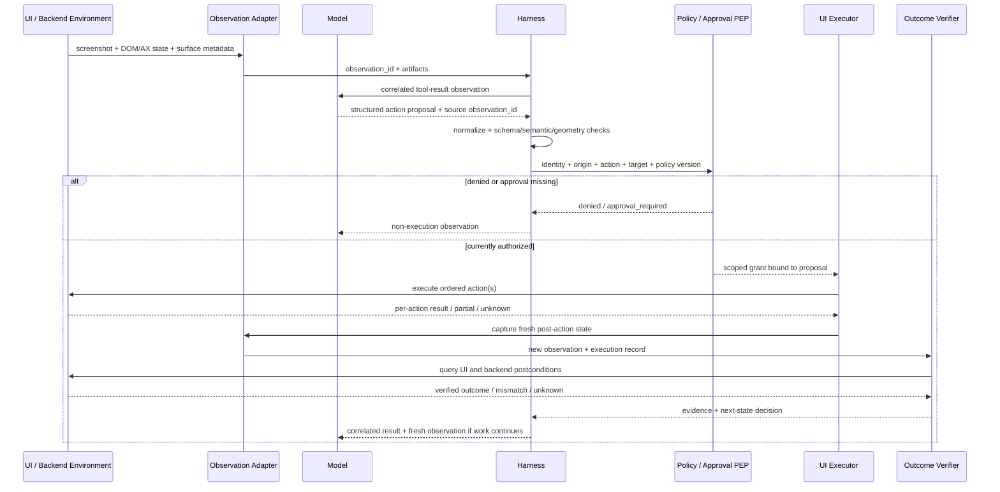

# Chapter 15: Computer-Use and Multimodal Agents

Computer use is a specialization of the tool lifecycle, not a different abstraction. The model receives one or more observations of a user interface, proposes a structured computer action, and the application or harness decides whether and how to execute it. The resulting screenshot, structured state, error, or execution record returns as a correlated tool result/observation. OpenAI's current contract uses `computer_call` actions and `computer_call_output`; Anthropic's client-executed computer tool uses `tool_use` and `tool_result` under the same model-proposes/application-executes boundary ([OpenAI — Computer Use](https://developers.openai.com/api/docs/guides/tools-computer-use); [Anthropic — Computer Use Tool](https://platform.claude.com/docs/en/agents-and-tools/tool-use/computer-use-tool); [Anthropic — How Tool Use Works](https://platform.claude.com/docs/en/agents-and-tools/tool-use/how-tool-use-works)).

The distinctive difficulty is not that an image stops being a tool result or that a click stops being a function-like proposal. It is that GUI observations are partial and perishable, grounding is geometric, actions depend on hidden interface state, and a successful input event may not create the intended environment outcome.

### 15.1 The Structured Computer-Tool Loop

The specialized loop extends [Chapter 6's](./06-tools-invocation-lifecycle.md) invocation lifecycle:

1. **Capture an observation bundle.** Record a screenshot and/or structured UI state with identity, time, geometry, and surface metadata.
2. **Ask the model for an action proposal.** The output is structured, such as `click(x, y)`, `type(text)`, `scroll(direction, amount)`, a key sequence, or a custom DOM/role action.
3. **Normalize and validate.** Bind the proposal to the observation it used; validate action type, arguments, coordinate transform, current application/origin, target scope, and policy.
4. **Authorize and approve.** A non-bypassable enforcement point applies allowlists, sandbox constraints, and any mandatory human gate.
5. **Execute through the application.** Browser automation, an OS input adapter, or another UI runtime performs the action—not the model.
6. **Return an execution result and fresh observation.** Correlate them to the proposal and report `succeeded`, `failed`, `partial`, or `unknown` as appropriate.
7. **Verify the environment outcome.** Decide whether the intended UI and backend postconditions hold; otherwise re-observe, recover, or stop.

OpenAI's built-in loop currently returns ordered actions in a `computer_call`, asks application code to execute them, and expects an updated screenshot in a correlated `computer_call_output`. Anthropic similarly requires application code to translate tool requests into computer actions and return screenshots or command output in `tool_result` blocks ([OpenAI — Computer Use](https://developers.openai.com/api/docs/guides/tools-computer-use); [Anthropic — Computer Use Tool](https://platform.claude.com/docs/en/agents-and-tools/tool-use/computer-use-tool)). Provider payloads differ, but the responsibility boundary is the same.

### 15.2 Keep Six Records Distinct

A robust harness must not collapse these objects into a generic “screen state”:

| Object | What it represents | Minimum useful metadata | What it does not prove |
|---|---|---|---|
| **Screenshot observation** | Rendered pixels captured at one instant | `observation_id`, capture time, image digest, pixel dimensions, viewport, crop, scale/device-pixel ratio, window/tab, current URL or application identity | That the same pixels still exist at dispatch time |
| **DOM/accessibility state** | Structured elements, roles, labels, values, bounds, and relationships exposed by the UI automation surface | snapshot/version ID, frame or window, origin, extraction method, element references | Exact appearance, salience, visibility, or clickability unless explicitly checked |
| **Coordinate grounding** | A mapping from intended target or element reference into the coordinate space of a particular observation | source observation, target reference, bounding box/point, confidence or ambiguity, coordinate transform | That an input event was dispatched |
| **Action proposal** | The model's requested UI operation and arguments | proposal/call ID, source observation ID, action type, normalized arguments, expected effect | Authorization, execution, or success |
| **Execution result** | What the executor knows about dispatch and input-event processing | attempt ID, per-action status, timestamps, active surface, error, partial/unknown status | The intended product state was reached |
| **Environment outcome** | Verified state after the interaction | UI assertions, URL/origin, backend/API state, durable object IDs, external-effect evidence | That the path complied with policy unless process evidence is also checked |

A screenshot can be the payload of a tool result. DOM or accessibility data can be returned in the same result or through a separate tool. A click can be encoded as a provider-defined computer action, a custom function call, or generated code ([OpenAI — Computer Use](https://developers.openai.com/api/docs/guides/tools-computer-use)). These are protocol and interface choices, not mutually exclusive categories.

Keep identity across the chain:

```text
observation_id
  -> grounding_id
  -> proposal_id / provider_call_id
  -> dispatch_attempt_id
  -> execution_result_id
  -> post_action_observation_id
  -> outcome_evidence_id
```

This correlation is what lets an eval or incident review answer whether the model chose the wrong target, the coordinate mapping was wrong, the executor acted on stale state, or the application accepted the input but failed to update its backend.

### 15.3 Choose Observation Channels by the Decision

The harness may expose several complementary observation channels:

- **Screenshot:** preserves rendered layout, styling, overlays, and spatial relationships at capture time.
- **DOM or application tree:** exposes structured content and element identity for supported applications.
- **Accessibility state:** exposes semantic roles, labels, values, checked/expanded state, and hierarchy when the application publishes them.
- **OCR or extracted text:** provides text when structured state is unavailable, but should retain bounding boxes and source-image identity if it will support grounding.
- **Direct environment query:** retrieves authoritative backend or application state for verification rather than perception.

OpenAI's current guide explicitly supports visual computer actions, custom Playwright/Selenium/VNC/MCP harnesses, and code-execution harnesses that can combine screenshots with DOM-based workflows ([OpenAI — Computer Use](https://developers.openai.com/api/docs/guides/tools-computer-use)). This supports a hybrid design: use structured state for stable element identity and efficient reading, pixels for geometry and visual conditions, and direct state queries for outcome verification.

No channel is automatically ground truth for every question. A DOM node may exist while an overlay receives the click; a screenshot may show text without exposing the element's role or stable identity. Playwright therefore checks properties such as visibility, stability, whether an element receives events, enabled state, and editability before supported actions ([Playwright — Auto-Waiting and Actionability](https://playwright.dev/docs/actionability)). A computer-use harness should expose equivalent preconditions where its automation stack permits them.

Observation selection should be task- and model-evaluated. Record which channel and extraction version produced each decision, and archive full observations as artifacts when model context only receives a compact projection.

### 15.4 Grounding Is a Versioned Geometry Contract

**Coordinate grounding** translates an intended target into the executor's coordinate space. It may use:

- raw pixel coordinates predicted from a screenshot;
- an element reference resolved through DOM or accessibility state;
- a numbered overlay such as Set-of-Mark, where candidate regions receive discrete labels ([Yang et al. — Set-of-Mark Prompting](https://arxiv.org/abs/2310.11441));
- a hybrid lookup that selects an element semantically, checks its current bounds, and clicks a verified point.

Every mapping must declare its geometry:

```text
captured_pixel_size, model_visible_size, viewport_size
crop_origin, scroll_container_and_offset, browser_zoom
device_pixel_ratio, resize_scale, coordinate_origin
window_or_frame_id, element_or_mark_id
```

Do not let a provider resize a screenshot invisibly and then apply returned coordinates directly to the original display. Anthropic's current computer-use documentation warns that oversized images may be downscaled before the model sees them, so the model's coordinates refer to the resized image; it recommends client-side resizing with a known scale and calls out Retina device-pixel-ratio handling ([Anthropic — Computer Use Tool](https://platform.claude.com/docs/en/agents-and-tools/tool-use/computer-use-tool)). OpenAI likewise recommends `detail: "original"` for current GPT-5.6 computer-use screenshots and requires coordinate remapping if the client downsizes them ([OpenAI — Computer Use](https://developers.openai.com/api/docs/guides/tools-computer-use)).

Grounding expires with its source observation. Before dispatch, re-resolve element references or verify that the relevant geometry and surface identity remain current. A coordinate should never be treated as a durable identifier for a button.

### 15.5 Observation/Action Races Are Normal

Between capture and dispatch, the interface can change. The central race is:

```text
observe state S0 -> propose action for S0 -> environment becomes S1 -> execute against S1
```

Several mechanisms create this race:

| Mechanism | Failure example | Control |
|---|---|---|
| **Stale screenshot** | A delayed model response clicks a page that already navigated | Bind action to observation age and surface identity; re-observe after a freshness deadline |
| **Layout shift or animation** | The target moves and the coordinate lands on another control | Require stable bounds or re-ground immediately before dispatch |
| **Focus change** | Typing goes to the address bar, terminal, or wrong field | Verify active window/frame and focused element before sensitive input |
| **Scroll drift** | The wrong container scrolled, or a target left the viewport | Record container and offset; verify target in viewport after scrolling |
| **Modal/overlay** | A consent dialog or popup intercepts the click | Detect topmost dialog/overlay and pause or route it through policy |
| **Latency/navigation** | A click is accepted while the next action assumes the old page | Wait for declared navigation/network/UI condition, then capture a new observation |
| **Partial batch execution** | Action 1 succeeds, action 2 fails, action 3 would now be unsafe | Record per-action status; stop dependent actions and return `partial` plus a fresh observation |

OpenAI's current built-in contract can batch ordered actions in one `computer_call` and capture a screenshot after the batch ([OpenAI — Computer Use](https://developers.openai.com/api/docs/guides/tools-computer-use)). That is a latency optimization, not evidence that every batch is atomic. This chapter therefore recommends batching only actions whose preconditions remain valid together and splitting consequential, navigation-producing, focus-sensitive, or weakly reversible actions with observation barriers.

Do not “fix” a race by blindly replaying a click or submit. A lost response or timeout can leave the environment changed even when the executor did not observe success. Use Chapter 6's `partial` and `unknown` states, inspect the UI and backend, and deduplicate or escalate before another consequential attempt.

### 15.6 Validate the Action at Dispatch Time

Computer-use dispatch specializes, but does not bypass, the validation stack from Chapter 6. Before execution, the policy enforcement path should check:

- proposal and observation identity, freshness, and correlation;
- action schema and semantic bounds;
- application, process, window, tab, frame, URL, domain, and origin as applicable;
- current focus, target visibility/stability, overlay state, and coordinate transform;
- actor, tenant, credential scope, policy version, and action allowlist;
- whether the action transmits data, communicates externally, spends money, changes access, modifies production, or is difficult to reverse;
- mandatory approval bound to the exact normalized proposal;
- retry, deduplication, deadline, cancellation, and action-budget state.

The result envelope should be per action, even when a provider batches proposals:

```text
status: denied | not_executed | succeeded | failed | partial | unknown
proposal_id, attempt_id, source_observation_id
surface_before, surface_after
normalized_action, executor_error
post_action_observation, postcondition_evidence
```

The executor should capture a fresh observation after a state-changing action or batch and verify the expected transition. “Mouse event delivered” is an execution result; “form submitted once and order exists with the expected fields” is an environment outcome.

### 15.7 Safety Must Surround the Model

Rendered pages, documents, emails, chats, PDFs, and tool output are untrusted input. OpenAI's computer-use guide says on-screen instructions are not user permission and recommends an isolated environment plus domain/action allowlists; Anthropic warns that content in webpages or images can override instructions in some circumstances and recommends a minimally privileged VM/container, restricted domains, and human confirmation for meaningful consequences ([OpenAI — Computer Use](https://developers.openai.com/api/docs/guides/tools-computer-use); [Anthropic — Computer Use Tool](https://platform.claude.com/docs/en/agents-and-tools/tool-use/computer-use-tool)).

For high-risk UI actions, combine:

1. **Action allowlist:** expose or dispatch only approved action types and scoped targets; deny unexpected keyboard shortcuts, downloads, shell launches, clipboard reads, or credential entry by default.
2. **Sandbox:** use a separate browser profile, container, or VM with minimal filesystem, network, credential, device, and host integration, as defined in [Chapter 7](./07-sandboxing-runtime-enforcement.md).
3. **Domain and origin checks:** evaluate the actual current origin at navigation and dispatch, including redirects, iframes, popups, and newly opened tabs; a remembered domain from the prior screenshot is not current authority.
4. **Mandatory approval:** insert the runtime gate from [Chapter 14](./14-human-agent-interaction.md) immediately before sending/posting, transmitting sensitive data, purchasing, deleting, changing access, accepting terms, or another policy-classified consequence. Approval binds the exact target, payload, identity, origin, and expiry.
5. **Post-action verification:** independently check the new UI and, where possible, authoritative backend state before reporting success or attempting a retry.

Instruction priority remains a behavioral defense: it can tell the model to treat page content as data and to surface suspicious instructions. It is not an allowlist, sandbox, origin check, approval record, or PEP. [Chapter 2](./02-system-prompts-instructions-policy.md) defines that boundary. Provider-side prompt-injection classifiers are also defense in depth; Anthropic explicitly says its computer-use precautions remain necessary even with its classifier layer ([Anthropic — Computer Use Tool](https://platform.claude.com/docs/en/agents-and-tools/tool-use/computer-use-tool)).

### 15.8 Visual Accounting Is Provider- and Model-Specific

There is no portable conversion between “one screenshot” and “one page of text.” Image preprocessing, detail modes, resizing, patch/tile rules, token multipliers, and prices vary by provider, model, snapshot, and API contract ([Anthropic — Vision](https://platform.claude.com/docs/en/build-with-claude/vision); [OpenAI — Images and Vision](https://developers.openai.com/api/docs/guides/images-vision)).

Two dated examples show why. They are not equivalences:

| Contract verified July 31, 2026 | Input example | Documented accounting basis |
|---|---|---|
| Anthropic Vision, **Claude Opus 5** high-resolution tier | 1000×1000 image | `ceil(width/28) × ceil(height/28) = 1,296` visual tokens; the same contract lists a 2,576-pixel long-edge and 4,784-visual-token native limit for Claude 4.7-and-later high-resolution models ([Anthropic — Vision](https://platform.claude.com/docs/en/build-with-claude/vision)) |
| OpenAI Vision, **GPT-5.6**, `detail: "original"` | 1000×1000 image | `ceil(width/32) × ceil(height/32) = 1,024` original patches; the current contract says GPT-5.6 `original` does not resize to a pixel-dimension or patch-budget limit ([OpenAI — Images and Vision](https://developers.openai.com/api/docs/guides/images-vision)) |

For every visual cost or context claim, record:

```text
provider, endpoint, model and snapshot/tool version
verification date, image detail/fidelity mode
source and model-visible dimensions, crop and resize transform
patch/tile rule and multiplier, observed input usage, price contract
```

Optimize from measured task performance and actual usage. Cropping, downscaling, structured UI state, zoom, or fewer observation barriers can reduce cost and latency, but each may reduce legibility or increase race risk. Archive old screenshots as artifacts and keep only decision-relevant observations in model context, following [Chapter 5](./05-compaction-memory-context-handoffs.md); do not discard evidence required for evaluation or incident review.

Round-trip latency is also contract-specific. Anthropic describes its screenshot-based computer tool as slower because actions require screenshot round trips, while OpenAI's current tool can return ordered action batches before the next screenshot ([Anthropic — Tool Combinations](https://platform.claude.com/docs/en/agents-and-tools/tool-use/tool-combinations); [OpenAI — Computer Use](https://developers.openai.com/api/docs/guides/tools-computer-use)). Measure capture, upload, inference, approval wait, dispatch, application settle, and verification separately.

### 15.9 Recovery and Stop Conditions

A computer-use loop should stop or escalate when:

- the verified environment outcome holds;
- policy denies the next action or mandatory approval is denied/expired;
- the current origin, account, application, or target falls outside scope;
- a modal, CAPTCHA, authentication challenge, suspicious instruction, or sensitive-data request requires human handling;
- execution is partial or unknown and reconciliation cannot establish state;
- observation, action, token, cost, or wall-time budget is exhausted;
- the loop repeats without environment progress;
- the user steers or cancels the run.

Stopping because the model emits prose or no longer requests a tool is not sufficient completion evidence. Reconcile any in-flight action and apply the outcome predicate before finalization. Chapters 6 and 14 define unknown effects, steering, cancellation, and approval expiry; [Chapter 13](./13-loop-engineering.md) defines the general loop stop hierarchy.

### 15.10 Evaluate Final UI and Backend State

Computer-use evals should grade the layers separately:

- **Process:** allowed origins, forbidden actions, approval use, sensitive-data handling, budgets, and race recovery.
- **Artifact:** downloaded or edited files, screenshots, exported reports, or other addressable outputs.
- **UI environment state:** visible dialog state, selected value, current page, application state, or rendered confirmation.
- **Backend/external state:** database record, submitted form, sent message, account permission, order, or other durable effect.
- **User outcome:** whether the intended task was actually satisfied.

A final screenshot is evidence, not necessarily the outcome. A confirmation banner can be stale or misleading; backend state can change without a visible confirmation. Anthropic's agent-eval guidance specifically describes browser tasks graded with URL/page-state checks and backend verification, and distinguishes transcript from final environment outcome ([Anthropic — Demystifying Evals for AI Agents](https://www.anthropic.com/engineering/demystifying-evals-for-ai-agents)).

WebArena supplies self-hosted web tasks with functional correctness evaluators, while OSWorld supplies desktop tasks with execution-based evaluation scripts over application and system state ([WebArena](https://arxiv.org/abs/2307.13854); [OSWorld](https://arxiv.org/abs/2404.07972)). Treat them as primary benchmark designs, not substitutes for workload-specific tasks. Apply [Chapter 11's](./11-evaluation.md) isolated baselines, repeated trials, complete trajectories, configuration pinning, grader calibration, and per-slice reporting.

Report slices for observation channel, screen resolution/detail contract, grounding method, application/origin, action type, modal/navigation presence, latency, partial/unknown execution, policy gate, and outcome-verification method. Otherwise an aggregate score can hide that the agent succeeds only on static pages or only when backend verification is absent.

### 15.11 The Full Computer-Use Loop



The screenshot and structured state are observation payloads. The UI operation is a structured proposal. The application executes it, and only postcondition evidence can establish the environment outcome.

### 15.12 Design Checklist

Before releasing a computer-use workflow, verify that:

- Every proposal names the observation and coordinate transform it depends on.
- Screenshot, DOM/accessibility state, grounding, proposal, execution result, and environment outcome have separate identities.
- The executor validates surface, origin, focus, scroll, overlay, and geometry at dispatch time.
- Batched actions have compatible preconditions and produce per-action results.
- Partial and unknown execution stop dependent actions and trigger reconciliation.
- High-risk actions pass through allowlists, sandboxing, origin checks, mandatory approval, and post-action verification.
- On-screen instructions are treated as untrusted content; instruction priority is not used as enforcement.
- Visual accounting records provider, model, version, resolution, detail mode, date, usage, and price contract.
- Completion graders inspect final UI and backend state, not only the trajectory or screenshot.
- Evals restore isolated baselines and report race, grounding, resolution, policy, and outcome slices.

---

## Key Takeaways

- **Computer use is a structured tool loop.** The model proposes; the application validates, authorizes, executes, and returns an observation.
- **Pixels and tool results are not opposites.** A screenshot is commonly the payload of a correlated tool result.
- **Gestures and function calls are not opposites.** Click, type, scroll, and key actions are structured proposals under provider or custom schemas.
- **Keep perception, grounding, execution, and outcome separate.** Their failure modes and evidence differ.
- **Observation/action races are expected.** Staleness, layout, focus, scroll, modals, latency, and partial execution require explicit state handling.
- **Safety surrounds the model.** Allowlists, sandboxing, origin checks, mandatory approvals, and verification create the boundary; instruction priority only assists behavior.
- **Visual accounting is contract-specific.** Never translate screenshots into a universal number of text pages.
- **Environment outcome decides success.** Grade final UI and backend state, with process checks for policy-sensitive paths.

## Further Reading

- OpenAI, *Computer Use*. https://developers.openai.com/api/docs/guides/tools-computer-use
- Anthropic, *Computer Use Tool*. https://platform.claude.com/docs/en/agents-and-tools/tool-use/computer-use-tool
- Anthropic, *How Tool Use Works*. https://platform.claude.com/docs/en/agents-and-tools/tool-use/how-tool-use-works
- Microsoft Playwright, *Auto-Waiting and Actionability*. https://playwright.dev/docs/actionability
- Jianwei Yang et al., *Set-of-Mark Prompting Unleashes Extraordinary Visual Grounding in GPT-4V*, 2023. https://arxiv.org/abs/2310.11441
- Anthropic, *Vision*. https://platform.claude.com/docs/en/build-with-claude/vision
- OpenAI, *Images and Vision*. https://developers.openai.com/api/docs/guides/images-vision
- Anthropic, *Tool Combinations*. https://platform.claude.com/docs/en/agents-and-tools/tool-use/tool-combinations
- Mikaela Grace et al., *Demystifying Evals for AI Agents*, Anthropic, Jan 2026. https://www.anthropic.com/engineering/demystifying-evals-for-ai-agents
- Shuyan Zhou et al., *WebArena: A Realistic Web Environment for Building Autonomous Agents*, 2023. https://arxiv.org/abs/2307.13854
- Tianbao Xie et al., *OSWorld: Benchmarking Multimodal Agents for Open-Ended Tasks in Real Computer Environments*, 2024. https://arxiv.org/abs/2404.07972
