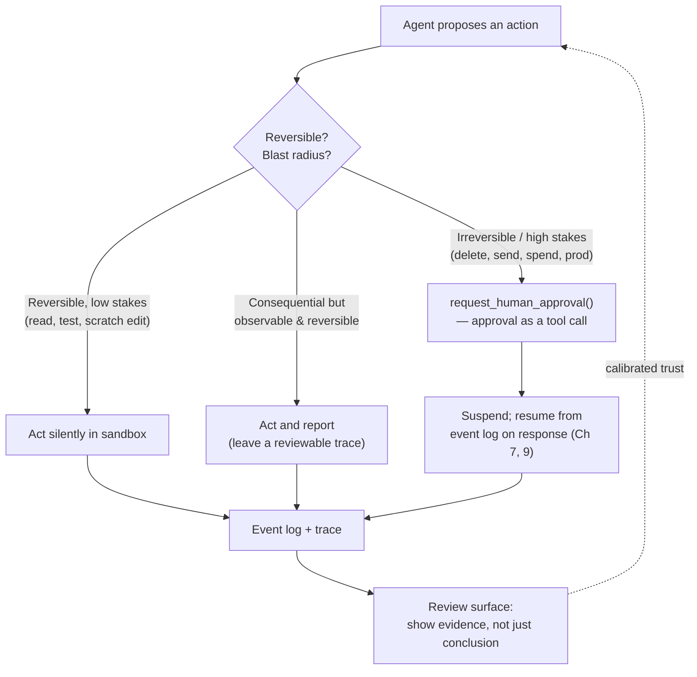

# Chapter 15: Human–Agent Interaction

Most of this book is about the machinery between the model and the world: context, tools, sandboxes, state, evaluation. But for any agent that does consequential work, a human is also inside the loop — approving actions, steering mid-task, reviewing results, deciding when to trust the output. The interface to that human is a harness layer as real as the agent–computer interface of [Chapter 4](./04-tools-agent-computer-interface.md), and it is engineered, not incidental. [Chapter 5](./05-sandboxing-guardrails.md) introduced one corner of it — permission fatigue. This chapter treats the human interface as a whole.

### 14.1 The Human Is Inside the Loop

The agent–computer interface chapter argued that as much engineering should go into how an agent uses tools as into how a human uses a screen. The human–agent interface is the mirror: as much engineering should go into how a human supervises an agent as into how the agent acts. Anthropic's three implementation principles already point here — maintain simplicity, *prioritize transparency by showing the agent's planning steps*, and craft the interface carefully ([Anthropic — Building Effective Agents](https://www.anthropic.com/engineering/building-effective-agents)). Transparency is not a UX nicety; it is what makes supervision possible at all.

The premise is older than agents. Horvitz's principles of *mixed-initiative* interfaces, from 1999, already framed the core problem: a system that acts on a user's behalf must decide when to act autonomously and when to defer, must manage the cost of interrupting the user, and must remember and use the context of the interaction ([Horvitz — Principles of Mixed-Initiative User Interfaces](https://www.microsoft.com/en-us/research/publication/principles-of-mixed-initiative-user-interfaces/)). Every one of those questions reappears, sharper, in an agent that can run a shell.

### 14.2 Two Failure Modes: Permission Fatigue and Blind Trust

The human interface fails in two opposite directions, and a good design has to avoid both at once.

- **Permission fatigue** is the failure of asking too much. When an agent prompts for approval on every action, the human habituates and clicks "allow" without reading, which is worse than no prompt because it manufactures the *appearance* of oversight without the substance ([Anthropic — Beyond Permission Prompts](https://www.anthropic.com/engineering/claude-code-sandboxing), Ch 5). The sandbox exists precisely so that low-stakes actions inside a boundary need no prompt at all.
- **Blind trust** is the failure of asking too little. A fluent, confident output invites the human to rubber-stamp it. When the agent is wrong in a plausible way — a hallucinated citation, a subtly broken refactor — a review surface that does not expose the evidence lets the error through.

These are the two ends of one dial. Turning it toward fewer prompts risks blind trust; toward more prompts risks fatigue. The resolution is not a global setting but *stake-proportionate* interaction: calibrate how much the human is asked to the reversibility and blast radius of the action (§14.3).

### 14.3 Mixed-Initiative: When to Ask vs Act

The central design question is per action: should the agent do it, or ask first? A workable default scales the answer to consequence:

- **Act silently** inside the sandbox for reversible, low-stakes actions — reading files, running tests, editing a scratch workspace (Ch 5). Asking here only trains the human to stop reading.
- **Act and report** for actions that are consequential but observable and reversible — leave a clear trace the human can review after the fact rather than blocking on approval.
- **Ask first** for irreversible or high–blast-radius actions: deleting data, sending an external message, spending money, touching production. This is exactly the *lethal trifecta* boundary (Ch 5) — the moment an agent is about to combine private data, untrusted input, and external reach is the moment a human should be in the loop.

The map is the same capability–control tradeoff the book returns to in the [Outlook](./18-outlook.md): more autonomy is more capability and more control burden. The interface is where that tradeoff is made concrete, action by action.

### 14.4 Approval as a Tool Call

HumanLayer's twelve-factor manifesto makes the cleanest structural move: *contact humans with tool calls*. Instead of treating human approval as a special control-flow exception, model it as just another tool the agent can invoke — `request_human_approval(action, context)` — whose result comes back into the loop like any other observation ([HumanLayer — 12-Factor Agents](https://www.humanlayer.dev/blog/12-factor-agents)).

This unifies human interaction with the rest of the architecture. The approval request is an event in the event log (Ch 9), so it is durable, replayable, and auditable. It composes with the long-running patterns of [Chapter 7](./07-long-running-agents.md): an agent can request approval, suspend, and resume hours later when a human responds, because its state lives in the log, not in a held-open connection. And it makes the human a first-class participant in the trace ([Chapter 12](./12-trace-driven-iteration.md)) rather than an out-of-band interruption.

### 14.5 Designing the Review Surface

When a human does review, the quality of the decision is bounded by what the interface shows. A review surface that presents only the agent's conclusion invites blind trust; one that presents the *evidence behind the conclusion* enables real judgment. For a coding agent this means the diff, the tests that ran, and the commands executed — not just "done." For a research agent it means the sources, not just the summary.

This is the supervision-facing use of the same span telemetry that powers debugging (Ch 12): a good trace is also a good review artifact. The guidance from human-AI interaction research applies directly — make clear what the system can do, make clear how well it did it, and support efficient correction and dismissal of wrong output ([Amershi et al. — Guidelines for Human-AI Interaction](https://www.microsoft.com/en-us/research/publication/guidelines-for-human-ai-interaction/)). An agent that makes its work cheap to verify and cheap to reject is one a human can actually supervise.

### 14.6 Steering and Interruption

Supervision is not only before and after; it is also during. A human watching an agent head down a wrong path needs to redirect it without killing the session and losing all state. Steering is a harness capability: the ability to inject a new instruction into a running agent and have it incorporated on the next turn.

The mechanics connect to earlier chapters. Because the agent loop reassembles context each turn (Ch 1), a steering message is simply added to the context for the next iteration — and, by the recitation logic of [Chapter 3](./03-compaction-memory-subagent.md), placing the correction near the end of context keeps it in the model's most reliable attention span. Interruptibility also depends on clean checkpointing (Ch 7): an agent that can be paused and resumed can be steered; one that holds all its state in a single uninterruptible call cannot.

### 14.7 Calibrating Trust: Transparency and Uncertainty

The goal of the human interface is *calibrated* trust: the human trusts the agent exactly as much as it deserves on this task. Over-trust produces unreviewed errors; under-trust produces fatigue and wasted human time. Two harness levers move calibration:

- **Transparency** — showing planning steps, tool calls, and evidence — lets the human's trust track the agent's actual reasoning rather than its fluency ([Anthropic — Building Effective Agents](https://www.anthropic.com/engineering/building-effective-agents)).
- **Uncertainty signaling** — making it clear when the agent is unsure — directs human attention to where it is needed. This depends on the agent's calibration being trustworthy, which the companion volume warns is itself unreliable (*LLM Foundations*, Ch 10); self-reported confidence is a weak signal, so the harness should prefer grounding the uncertainty in verification (did the tests pass? does a cited source exist?) over the model's own hedging.

### 14.8 Supervising Many Agents

As agents proliferate, the human role shifts from doing the work to supervising agents that do it — and then to supervising *many* agents at once. This is the leverage the field is moving toward, and it changes the interface requirements. One human overseeing ten agents cannot read every trace; the interface must surface what needs attention: which agents are blocked on approval, which are uncertain, which produced results that failed verification.

This raises supervision to a fleet-level concern that the [Outlook](./18-outlook.md) flags as open — human approval interfaces and harness coherence at scale are not solved. The principle that does hold: make supervision *cheap and meaningful*. Cheap, so a human can oversee many agents without drowning; meaningful, so the oversight is real and not a rubber stamp. Every technique in this chapter — stake-proportionate prompting, approval-as-tool-call, evidence-rich review surfaces, steering, calibrated transparency — is in service of that one goal.

---

## Diagram: Stake-Proportionate Interaction

*The dial runs from silent action to mandatory approval; position each action on it by reversibility and blast radius. Approval is a tool call, and review shows evidence — avoiding both permission fatigue and blind trust.*

---

## Key Takeaways

- **The human interface is a harness layer**: as much engineering belongs in how a human supervises an agent as in how the agent acts.
- **Avoid both failure modes**: permission fatigue (asking too much trains rubber-stamping) and blind trust (asking too little lets plausible errors through) are two ends of one dial.
- **Make interaction stake-proportionate**: act silently for reversible low-stakes actions, act-and-report for observable ones, ask first for irreversible or high–blast-radius ones — the lethal-trifecta boundary.
- **Model approval as a tool call**: it becomes durable, replayable, auditable, and composes with long-running suspend/resume.
- **Show evidence, not just conclusions**: an agent whose work is cheap to verify and reject is one a human can actually supervise — at one agent or at a fleet.

## Further Reading

- Erik Schluntz and Barry Zhang, *Building Effective Agents*, Anthropic, Dec 2024. https://www.anthropic.com/engineering/building-effective-agents
- Dex Horthy, *12-Factor Agents* (Factor 7: contact humans with tool calls), HumanLayer, Apr 2025. https://www.humanlayer.dev/blog/12-factor-agents
- David Dworken and Oliver Weller-Davies, *Beyond Permission Prompts: Making Claude Code More Secure and Autonomous*, Anthropic, Oct 2025. https://www.anthropic.com/engineering/claude-code-sandboxing
- Saleema Amershi et al., *Guidelines for Human-AI Interaction*, CHI 2019. https://www.microsoft.com/en-us/research/publication/guidelines-for-human-ai-interaction/
- Eric Horvitz, *Principles of Mixed-Initiative User Interfaces*, CHI 1999. https://www.microsoft.com/en-us/research/publication/principles-of-mixed-initiative-user-interfaces/
