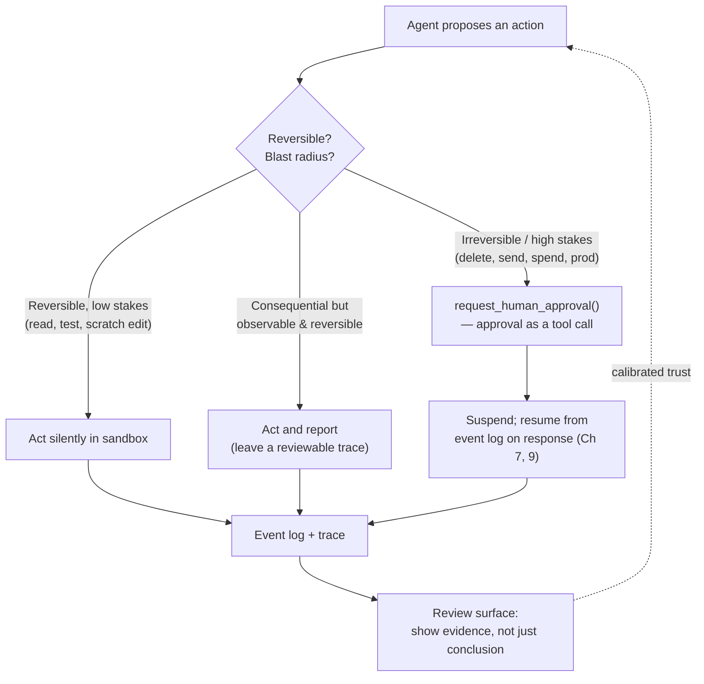

# Chapter 15: Human–Agent Interaction

Most of this book examines the machinery between the model and the world: context, tools, sandboxes, state, and evaluation. Yet whenever an agent performs consequential work, a human is also part of the loop. That person may approve actions, redirect work in progress, review results, and decide how much to trust the output. The interface supporting those decisions is a harness layer in its own right, just like the agent–computer interface described in [Chapter 4](./04-tools-agent-computer-interface.md). It must be deliberately engineered. [Chapter 5](./05-sandboxing-guardrails.md) introduced one aspect of this problem — permission fatigue. This chapter considers the human interface as a whole.

### 15.1 The Human Is Inside the Loop

The agent–computer interface chapter argued that how an agent uses tools deserves as much engineering attention as a conventional user interface. The human–agent interface is its mirror: how a person supervises the agent deserves as much attention as how the agent acts. Anthropic's implementation principles point in the same direction: maintain simplicity, *prioritize transparency by showing the agent's planning steps*, and design the interface carefully ([Anthropic — Building Effective Agents](https://www.anthropic.com/engineering/building-effective-agents)). Transparency is not merely a UX refinement. Without it, meaningful supervision is impossible.

This problem predates modern agents. Horvitz's 1999 principles of *mixed-initiative* interfaces framed the core questions: when should a system acting on a user's behalf proceed autonomously, and when should it defer? How should it account for the cost of interrupting the user? How should it retain and use the context of the interaction ([Horvitz — Principles of Mixed-Initiative User Interfaces](https://www.microsoft.com/en-us/research/publication/principles-of-mixed-initiative-user-interfaces/))? Each question becomes more urgent when the system can run a shell or take other consequential actions.

### 15.2 Two Failure Modes: Permission Fatigue and Blind Trust

Human–agent interfaces tend to fail in two opposite ways, and a sound design must avoid both:

- **Permission fatigue** results from asking too often. If an agent requests approval for every action, the human becomes habituated and clicks "allow" without reading. This can be worse than having no prompt because it creates the *appearance* of oversight without its substance ([Anthropic — Beyond Permission Prompts](https://www.anthropic.com/engineering/claude-code-sandboxing), Ch 5). A sandbox allows low-stakes actions within a defined boundary to proceed without repeated prompts.
- **Blind trust** results from asking too little. Fluent, confident output encourages the human to approve it without scrutiny. When the agent produces a plausible error — such as a fabricated citation or a subtly broken refactor — a review surface that hides the supporting evidence makes that error easier to miss.

These failures sit at opposite ends of the same control. Fewer prompts can encourage blind trust; more prompts can produce fatigue. The solution is not a single global setting but *stake-proportionate* interaction: the amount of human attention required should reflect the action's reversibility and blast radius (§15.3).

### 15.3 Mixed-Initiative: When to Ask vs Act

The central design question must be answered for each action: should the agent proceed, or ask first? A practical default is to scale human involvement with the possible consequences:

- **Act silently** inside the sandbox for reversible, low-stakes actions such as reading files, running tests, or editing a scratch workspace (Ch 5). Requiring approval here only teaches the human to ignore prompts.
- **Act and report** when an action has consequences but remains observable and reversible. Instead of blocking for approval, leave a clear record that the human can review afterward.
- **Ask first** before irreversible or high–blast-radius actions such as deleting data, sending an external message, spending money, or modifying production. This aligns with the *lethal trifecta* boundary (Ch 5): when an agent is about to combine private data, untrusted input, and external reach, a human should be involved.

This is the capability–control tradeoff revisited in [Chapter 18](./18-agent-fleets-identity-control-plane.md): greater autonomy provides greater capability, but also creates a larger control burden. The interface makes that tradeoff concrete for each action.

### 15.4 Approval as a Tool Call

HumanLayer's twelve-factor manifesto proposes a clean structural pattern: *contact humans with tool calls*. Rather than treating human approval as a special exception in the control flow, represent it as a tool the agent can invoke — `request_human_approval(action, context)`. The response then returns to the loop like any other observation ([HumanLayer — 12-Factor Agents](https://www.humanlayer.dev/blog/12-factor-agents)).

This pattern integrates human interaction with the rest of the architecture. The approval request becomes an event in the event log (Ch 9), making it durable, replayable, and auditable. It also composes with the long-running patterns from [Chapter 7](./07-long-running-agents.md): the agent can request approval, suspend, and resume hours later when a human responds because its state resides in the log rather than in an open connection. The human also becomes a first-class participant in the trace ([Chapter 12](./12-trace-driven-iteration.md)), rather than an out-of-band interruption.

### 15.5 Designing the Review Surface

The quality of a human review depends on the information the interface provides. A surface that shows only the agent's conclusion invites blind trust. One that presents the *evidence behind the conclusion* enables an informed decision. For a coding agent, that evidence includes the diff, the tests that ran, and the commands executed — not merely a "done" message. For a research agent, it includes the sources behind the summary.

This review evidence can come from the same span telemetry used for debugging (Ch 12): a useful trace also makes a useful review artifact. Guidance from human–AI interaction research applies directly. The interface should explain what the system can do, show how well it performed, and make incorrect output easy to correct or dismiss ([Amershi et al. — Guidelines for Human-AI Interaction](https://www.microsoft.com/en-us/research/publication/guidelines-for-human-ai-interaction/)). Human supervision becomes practical when the agent's work is inexpensive to verify and, when necessary, reject.

### 15.6 Steering and Interruption

Supervision happens during execution as well as before and after it. If a human sees an agent heading down the wrong path, they need to redirect it without terminating the session or losing its state. The harness must therefore support *steering*: injecting a new instruction into a running agent so that the next turn incorporates it.

The mechanism follows from earlier chapters. Because the agent loop rebuilds context on each turn (Ch 1), the harness can add the steering message to the next iteration. Following the recitation logic from [Chapter 3](./03-compaction-memory-subagent.md), placing the correction near the end of the context keeps it within the model's most reliable attention span. Steering also depends on clean checkpointing (Ch 7). An agent that can pause and resume can accept a correction; one that keeps all state inside a single uninterruptible call cannot.

### 15.7 Calibrating Trust: Transparency and Uncertainty

The goal of the human interface is *calibrated trust*: the human should trust the agent only to the degree warranted by the current task and evidence. Too much trust allows errors to pass without review; too little creates fatigue and wastes human attention. Two harness mechanisms help achieve this balance:

- **Transparency** — showing planning steps, tool calls, and evidence — helps the human base trust on the agent's work rather than on the fluency of its response ([Anthropic — Building Effective Agents](https://www.anthropic.com/engineering/building-effective-agents)).
- **Uncertainty signaling** — identifying where the result remains uncertain — directs human attention to the places that need it. This mechanism is useful only if its signals are trustworthy. As the companion volume explains, model confidence is often poorly calibrated (*LLM Foundations*, Ch 10). The harness should therefore ground uncertainty in external verification — for example, whether tests passed or a cited source exists — instead of relying on the model's own hedging.

### 15.8 Supervising Many Agents

As agents become more common, the human role shifts from performing work to supervising agents that perform it — and eventually to supervising *many* agents at once. This shift changes the interface requirements. A person overseeing ten agents cannot read every trace. The interface must identify what needs attention: agents waiting for approval, results with unresolved uncertainty, and outputs that failed verification.

Code review becomes a bottleneck when agents produce changes faster than humans can inspect them. The review queue should therefore be ordered by **risk and evidence**, not by arrival time or trace length. Failed deterministic checks, high-blast-radius actions, security-sensitive paths, novel tool use, policy-rule hits, weak or conflicting grader evidence, and large unexplained diffs should rise to the top. Low-risk changes backed by strong verification can be summarized or sampled, while consequential changes retain their full artifacts. Custom scoped review rules (§13.8) can make this routing more precise.

At this scale, supervision becomes a fleet-level control-plane concern, as described in [Chapter 18](./18-agent-fleets-identity-control-plane.md). The governing principle is to make supervision both *efficient and meaningful*: efficient enough for one person to oversee many agents, and meaningful enough to prevent oversight from becoming a rubber stamp. Every technique in this chapter — stake-proportionate prompting, approval as a tool call, evidence-rich review surfaces, steering, and calibrated transparency — serves that goal.

---

## Diagram: Stake-Proportionate Interaction

*The interaction model ranges from silent action to mandatory approval. Place each action on that range according to its reversibility and blast radius. Treat approval as a tool call, and show evidence during review to avoid both permission fatigue and blind trust.*

---

## Key Takeaways

- **Treat the human interface as a harness layer**: how a person supervises an agent deserves as much engineering attention as how the agent acts.
- **Avoid both failure modes**: asking too often creates permission fatigue and encourages rubber-stamping; asking too little encourages blind trust and allows plausible errors through.
- **Match interaction to the stakes**: act silently for reversible, low-stakes actions; act and report for observable, reversible actions; and ask first for irreversible or high–blast-radius actions at the lethal-trifecta boundary.
- **Represent approval as a tool call**: approval then becomes durable, replayable, auditable, and compatible with long-running suspend-and-resume workflows.
- **Show evidence, not only conclusions**: practical supervision depends on making an agent's work easy to verify and reject, whether one human oversees one agent or an entire fleet.
- **Rank fleet reviews by risk**: surface failed checks, sensitive paths, policy hits, novel actions, and weak evidence before low-risk work backed by strong verification.

## Further Reading

- Erik Schluntz and Barry Zhang, *Building Effective Agents*, Anthropic, Dec 2024. https://www.anthropic.com/engineering/building-effective-agents
- Dex Horthy, *12-Factor Agents* (Factor 7: contact humans with tool calls), HumanLayer, Apr 2025. https://www.humanlayer.dev/blog/12-factor-agents
- David Dworken and Oliver Weller-Davies, *Beyond Permission Prompts: Making Claude Code More Secure and Autonomous*, Anthropic, Oct 2025. https://www.anthropic.com/engineering/claude-code-sandboxing
- Saleema Amershi et al., *Guidelines for Human-AI Interaction*, CHI 2019. https://www.microsoft.com/en-us/research/publication/guidelines-for-human-ai-interaction/
- Eric Horvitz, *Principles of Mixed-Initiative User Interfaces*, CHI 1999. https://www.microsoft.com/en-us/research/publication/principles-of-mixed-initiative-user-interfaces/
- OpenAI, *Custom Code Review Rules for Codex*, Jul 2026. https://developers.openai.com/blog/custom-code-review-rules-for-codex
