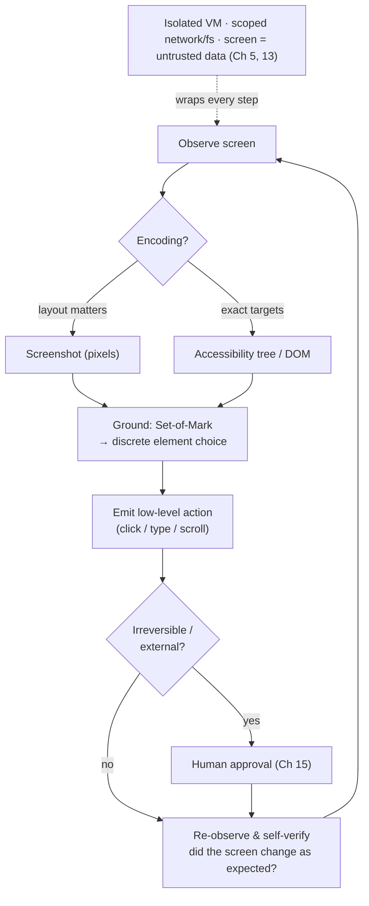

# Chapter 16: Computer-Use and Multimodal Agents

[Chapter 4](./04-tools-agent-computer-interface.md) built the agent–computer interface out of well-defined tools: functions with schemas, MCP servers, code APIs. A growing class of agents works differently. Instead of calling a clean API, they operate software the way a person does — looking at a screen and moving a cursor, typing into fields, clicking buttons. These *computer-use* agents, and the multimodal perception they depend on, raise harness problems the API-tool chapters do not, and they are the frontier where the most ambitious general-purpose agents now live.

### 15.1 Beyond the API: Agents That Operate Software

The motivation is reach. Most software has no agent-friendly API; it has a GUI built for humans. An agent that can see a screen and act on it can use anything a person can — legacy desktop apps, web sites without an API, internal tools no one will ever wrap in MCP. Anthropic's computer-use models and OpenAI's Computer-Using Agent both take this route: the model receives screenshots, reasons about them, and emits low-level actions like "click at (x, y)" or "type this string" ([Anthropic — Computer use](https://www.anthropic.com/news/3-5-models-and-computer-use); [OpenAI — Computer-Using Agent](https://openai.com/index/computer-using-agent/)).

This is a genuinely different agent loop from the one in [Chapter 1](./01-what-is-an-agent-harness.md). The observation is an image rather than a tool result; the action is a UI gesture rather than a function call; and the environment is an entire operating system or browser rather than a curated tool set. Everything the book has said about tools, context, and safety still applies, but each acquires a visual, lower-level character.

### 15.2 The Environment Is the Tool Surface

In the ACI chapter, the harness engineer *chose* the tools and could keep them few and high-affordance (Ch 4). A computer-use agent inherits its action surface from the environment: every button, menu, and field on the screen is a potential target. The careful tool curation of [Chapter 4](./04-tools-agent-computer-interface.md) is no longer available the same way, because the "tools" are whatever the application happens to expose visually.

This inverts a key lever. The harness can no longer reduce the action space by offering fewer tools; instead it must help the agent *perceive* the action space accurately and constrain *where* the agent is allowed to act. The design work moves from tool selection to perception and scoping — which is what the next sections are about.

### 15.3 Encodings of the Screen

A screen can be presented to the model in several ways, and the choice is a harness decision with direct consequences — exactly the multimodal point the companion volume makes about images becoming tokens (*LLM Foundations*, Ch 2). The main encodings:

- **Screenshot pixels** preserve visual layout and styling but are token-heavy and can blur small text. The model must locate elements visually.
- **DOM or HTML** (for web) preserves exact text and structure but loses what is actually visible — hidden, off-screen, and visually-overlapped elements all look the same.
- **Accessibility tree** exposes a structured, semantic view built for assistive tech: roles, labels, and states, often far more compact than raw DOM.
- **OCR** recovers text from pixels but discards structure and spatial relationships.

None is complete. A screenshot shows what a human sees but not the underlying structure; a DOM dump shows structure but not salience. Production systems often *combine* encodings — a screenshot for layout plus an accessibility tree or DOM for exact targets — which is more robust but spends more context. This is the same precision-versus-budget tension as retrieval (Ch 2), now in the visual domain.

### 15.4 Grounding: From Seeing to Clicking

The hardest problem unique to computer-use agents is *visual grounding*: translating an intention ("click the Submit button") into a concrete action (a click at specific coordinates). A model can correctly identify that a button should be pressed and still emit the wrong pixel location. Grounding error is a failure mode with no analog in API tools, where naming a function is exact.

A common harness technique is *Set-of-Mark prompting*: overlay the screenshot with numbered marks on candidate interactive elements, so the model selects a discrete label ("click element 7") instead of producing raw coordinates ([Yang et al. — Set-of-Mark Prompting](https://arxiv.org/abs/2310.11441)). This converts an error-prone continuous grounding problem into a more reliable discrete choice, at the cost of an element-detection step that the harness must provide. The related SeeAct line of work showed that even strong vision models need this kind of grounding scaffold to act reliably on real web pages — perception and action are separable, and the gap between them is where the harness earns its keep ([Zheng et al. — GPT-4V is a Generalist Web Agent](https://arxiv.org/abs/2401.01614)).

### 15.5 The Action Space and Its Failure Modes

Computer-use actions are low-level and stateful in a way function calls are not. A click depends on the screen being in the state the model thinks it is in; a page that loaded slowly, a modal that popped up, or a layout that shifted can invalidate an action the model already decided on. The loop must therefore re-observe after every action — the screen is the new ground truth — and tolerate that observations and actions can desynchronize.

This makes self-verification, the headline lever of [Chapter 7](./07-long-running-agents.md), even more central. After acting, the agent should check that the screen changed as expected before proceeding. It also makes recovery harder: undoing a GUI action is rarely as clean as reversing an API call, so the stake-proportionate interaction of [Chapter 15](./15-human-agent-interaction.md) matters more — a computer-use agent about to confirm an irreversible dialog is exactly where a human checkpoint belongs.

### 15.6 Latency, Cost, and the Token Weight of Pixels

Every turn of a computer-use loop sends an image into context, and images are expensive in tokens — a single high-resolution screenshot can cost as much as a page of text (*LLM Foundations*, Ch 2). A task that takes a human thirty clicks is thirty screenshots through the context window, which interacts badly with the finite-context budget of [Chapter 2](./02-context-as-finite-resource.md) and the prefill-skew of agentic workloads.

The harness levers are the familiar ones, sharpened. Downscale screenshots as far as the task tolerates — but no further, since shrinking can erase the very text the agent needs to read. Avoid retaining old screenshots in context after their information is extracted; keep a compact note of what a prior screen showed rather than the pixels (the *keep the wrong stuff out* discipline of [Chapter 3](./03-compaction-memory-subagent.md) applies to images most of all). And prefer a structured encoding (accessibility tree) over pixels when it suffices, reserving the expensive screenshot for when layout truly matters.

### 15.7 Safety: The Widest Attack Surface

A computer-use agent is the [lethal trifecta](https://simonwillison.net/2025/Jun/16/the-lethal-trifecta/) (Ch 5) in its most concentrated form. It reads untrusted content (any web page or document on screen), it often has access to private data (whatever is open in the browser or filesystem), and it can communicate externally (it can navigate, submit forms, send messages). Prompt injection here is not hypothetical text in a tool result; it is a malicious instruction rendered on a web page the agent is looking at, which the model may read as a command.

The defenses are the sandboxing and governance of [Chapter 5](./05-sandboxing-guardrails.md), made stricter because the action surface is so broad. Run the agent in an isolated environment — a dedicated VM or container, not the user's primary session. Scope network and filesystem access. Require human approval before irreversible or external actions (Ch 15). And treat everything on the screen as untrusted data, never as instruction — the instruction-hierarchy discipline of [Chapter 13](./13-system-prompts-and-instructions.md) is load-bearing when the "data" is a full rendered web page.

### 15.8 Evaluating Computer-Use Agents

Because the environment is an entire OS or browser, evaluation must be environmental, not text-based — the *outcome* distinction of [Chapter 10](./10-evaluation.md) is unavoidable here, since the only thing that matters is whether the task was actually accomplished in the environment. Realistic benchmarks built for this provide the model: WebArena offers a self-hostable, realistic web environment with execution-based success checks ([WebArena](https://arxiv.org/abs/2307.13854)), and OSWorld extends the idea to open-ended tasks across a real desktop operating system ([OSWorld](https://arxiv.org/abs/2404.07972)).

The lesson from these benchmarks reinforces the whole book: computer-use agents are far from saturated on realistic tasks, and the gap between "the model can perceive the screen" and "the agent reliably completes the task" is exactly the harness gap — grounding scaffolds, re-observation, recovery, scoping, and verification. As always, the right eval is the workload eval (Ch 10): a public computer-use benchmark is background signal; whether the agent can drive *your* application reliably is the release signal.

---

## Diagram: The Computer-Use Loop

*Perceive → ground → act → re-observe, wrapped in a sandbox. Grounding turns "see" into "click"; re-observation handles a stateful screen; the sandbox contains the widest attack surface in the book.*

---

## Key Takeaways

- **Computer-use agents trade clean APIs for reach**: they operate GUIs the way humans do, so they can use software that has no agent API — at the cost of a harder loop.
- **The environment is the action surface**: tool curation gives way to perception and scoping; the harness helps the agent see the action space accurately and constrains where it may act.
- **Screen encoding is a harness choice**: pixels, DOM, accessibility tree, and OCR each preserve different things; combining them is more robust but costs context.
- **Grounding is the unique failure mode**: translating intent into a correct click is error-prone; discrete techniques like Set-of-Mark make it more reliable than raw coordinates.
- **Widest attack surface, strictest sandbox**: a computer-use agent is the lethal trifecta concentrated — isolate it, scope it, gate irreversible actions, and treat the whole screen as untrusted data.

## Further Reading

- Anthropic, *Introducing computer use, a new Claude 3.5 Sonnet, and Claude 3.5 Haiku*, Oct 2024. https://www.anthropic.com/news/3-5-models-and-computer-use
- OpenAI, *Computer-Using Agent (Operator)*, Jan 2025. https://openai.com/index/computer-using-agent/
- Jianwei Yang et al., *Set-of-Mark Prompting Unleashes Extraordinary Visual Grounding in GPT-4V*, 2023. https://arxiv.org/abs/2310.11441
- Boyuan Zheng et al., *GPT-4V(ision) is a Generalist Web Agent, if Grounded* (SeeAct), 2024. https://arxiv.org/abs/2401.01614
- Shuyan Zhou et al., *WebArena: A Realistic Web Environment for Building Autonomous Agents*, 2023. https://arxiv.org/abs/2307.13854
- Tianbao Xie et al., *OSWorld: Benchmarking Multimodal Agents for Open-Ended Tasks in Real Computer Environments*, 2024. https://arxiv.org/abs/2404.07972
