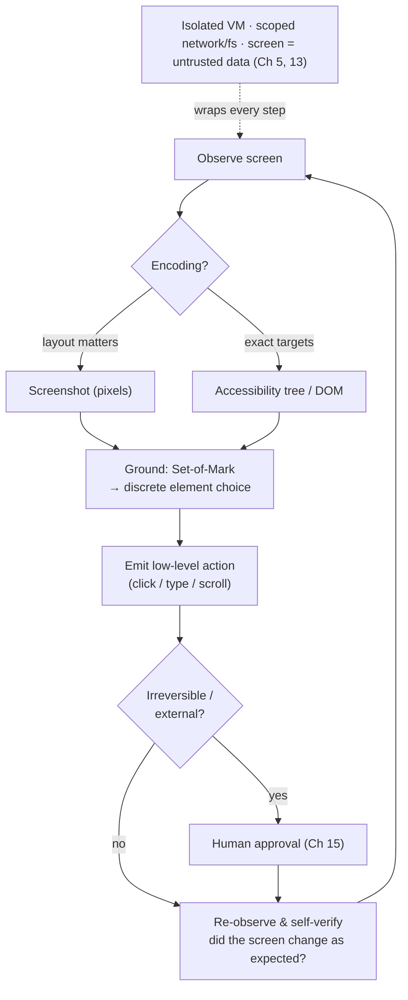

# Chapter 16: Computer-Use and Multimodal Agents

[Chapter 4](./04-tools-agent-computer-interface.md) built the agent–computer interface from well-defined tools: functions with schemas, MCP servers, and code APIs. A growing class of agents works differently. Instead of calling a clean API, these agents operate software as a person would: they look at a screen, move a cursor, type into fields, and click buttons. Such *computer-use* agents depend on multimodal perception and introduce harness problems that do not arise with API-based tools. They are also where many of today's most ambitious general-purpose agents operate.

### 16.1 Beyond the API: Agents That Operate Software

The motivation is reach. Most software has no agent-friendly API; it has a graphical interface designed for people. An agent that can see and act on a screen can use software that would otherwise remain inaccessible: legacy desktop applications, websites without APIs, and internal tools that no one is likely to wrap in MCP. Anthropic's computer-use models and OpenAI's Computer-Using Agent follow this approach. The model receives screenshots, reasons about what they show, and emits low-level actions such as "click at (x, y)" or "type this string" ([Anthropic — Computer use](https://www.anthropic.com/news/3-5-models-and-computer-use); [OpenAI — Computer-Using Agent](https://openai.com/index/computer-using-agent/)).

This loop differs substantially from the one in [Chapter 1](./01-what-is-an-agent-harness.md). Its observation is an image rather than a tool result. Its action is a UI gesture rather than a function call. Its environment is an entire operating system or browser rather than a curated tool set. Everything this book has said about tools, context, and safety still applies, but now at a lower level and through a visual interface.

### 16.2 The Environment Is the Tool Surface

In the ACI chapter, the harness engineer *chose* the tools and could offer a small set of actions with clear affordances (Ch 4). A computer-use agent instead inherits its action surface from the environment: every button, menu, and field on the screen is a potential target. The careful tool curation described in [Chapter 4](./04-tools-agent-computer-interface.md) is no longer possible in the same form, because the "tools" are whatever the application exposes visually.

This shift changes a key design lever. The harness can no longer reduce the action space simply by offering fewer tools. Instead, it must help the agent *perceive* the available actions accurately and constrain *where* the agent may act. The design problem moves from tool selection to perception and scoping, the subjects of the next sections.

### 16.3 Encodings of the Screen

A harness can represent a screen to the model in several ways, and the choice has direct consequences. As the companion volume explains, images ultimately become tokens (*LLM Foundations*, Ch 2). The main screen encodings are:

- **Screenshot pixels** preserve visual layout and styling, but they consume many tokens and may make small text hard to read. The model must locate elements visually.
- **DOM or HTML** (for the web) preserves exact text and document structure, but does not reliably show what the user can actually see. Hidden, off-screen, and visually overlapped elements may be difficult to distinguish.
- **Accessibility tree** provides a structured, semantic view designed for assistive technology. It exposes roles, labels, and states, often in a form much more compact than the raw DOM.
- **OCR** recovers text from pixels, but discards much of the structure and many of the spatial relationships.

No single encoding is complete. A screenshot shows what a person sees but not the underlying structure; a DOM dump exposes structure but not visual salience. Production systems therefore often *combine* encodings—for example, using a screenshot for layout and an accessibility tree or DOM for exact targets. The combination is more robust, but consumes more context. This is the same precision-versus-budget tradeoff found in retrieval (Ch 2), now applied to the visual domain.

### 16.4 Grounding: From Seeing to Clicking

The hardest problem unique to computer-use agents is *visual grounding*: translating an intention such as "click the Submit button" into a concrete action at specific screen coordinates. A model may correctly decide which button to press and still click the wrong location. API-based tools have no direct equivalent of this failure mode, because selecting a named function is exact.

A common harness technique is *Set-of-Mark prompting*. The harness overlays numbered marks on candidate interactive elements in the screenshot, allowing the model to select a discrete label such as "click element 7" instead of generating raw coordinates ([Yang et al. — Set-of-Mark Prompting](https://arxiv.org/abs/2310.11441)). This turns an error-prone continuous grounding problem into a more reliable discrete choice, but requires the harness to detect and label candidate elements first. The related SeeAct line of work showed that even strong vision models need this kind of grounding scaffold to act reliably on real web pages. Perception and action are separate capabilities, and the harness must bridge the gap between them ([Zheng et al. — GPT-4V is a Generalist Web Agent](https://arxiv.org/abs/2401.01614)).

### 16.5 The Action Space and Its Failure Modes

Computer-use actions are lower-level and more state-dependent than function calls. A click succeeds only if the screen is still in the state the model expects. A slowly loading page, an unexpected modal, or a shifting layout can invalidate an action that the model has already chosen. The loop must therefore re-observe the screen after every action and treat the new screen as ground truth. It must also be designed for the possibility that observations and actions will fall out of sync.

This makes self-verification, the central lever of [Chapter 7](./07-long-running-agents.md), even more important. After each action, the agent should confirm that the screen changed as expected before continuing. Recovery is also harder: reversing a GUI action is rarely as clean as undoing an API call. The stake-proportionate interaction described in [Chapter 15](./15-human-agent-interaction.md) therefore matters even more. A computer-use agent about to confirm an irreversible dialog is exactly where a human checkpoint belongs.

### 16.6 Latency, Cost, and the Token Weight of Pixels

Each turn of a computer-use loop sends an image into context, and images are expensive in tokens. A single high-resolution screenshot can cost as much as a page of text (*LLM Foundations*, Ch 2). A task that requires thirty clicks may therefore send thirty screenshots through the context window. This pattern quickly consumes the finite-context budget described in [Chapter 2](./02-context-as-finite-resource.md) and compounds the prefill-heavy nature of agent workloads.

The familiar harness levers still apply, but they require careful tuning. Downscale screenshots as much as the task allows, but not so far that the text or controls the agent needs become unreadable. Once the useful information has been extracted, remove old screenshots from context and retain a compact note of what the prior screen showed instead. The *keep the wrong stuff out* discipline of [Chapter 3](./03-compaction-memory-subagent.md) is especially important for images. When a structured representation such as an accessibility tree is sufficient, prefer it to pixels and reserve screenshots for cases in which layout genuinely matters.

### 16.7 Safety: The Widest Attack Surface

A computer-use agent concentrates all three parts of the [lethal trifecta](https://simonwillison.net/2025/Jun/16/the-lethal-trifecta/) (Ch 5). It reads untrusted content from any webpage or document on the screen. It may have access to private data through the browser or filesystem. And it can communicate externally by navigating, submitting forms, or sending messages. Here, prompt injection is not merely malicious text hidden in a tool result. It can be an instruction rendered directly on a webpage the agent is viewing, which the model may mistake for a legitimate command.

The defenses are the sandboxing and governance controls from [Chapter 5](./05-sandboxing-guardrails.md), applied more strictly because the action surface is so broad. Run the agent in an isolated environment—a dedicated VM or container, not the user's primary session. Limit its network and filesystem access. Require human approval before irreversible or external actions (Ch 15). Treat everything displayed on the screen as untrusted data, never as an instruction. The instruction hierarchy from [Chapter 13](./13-system-prompts-and-instructions.md) becomes essential when the "data" is an entire rendered webpage.

### 16.8 Evaluating Computer-Use Agents

Because the environment is an entire operating system or browser, evaluation must measure environmental outcomes rather than text alone. The *outcome* distinction from [Chapter 10](./10-evaluation.md) is unavoidable: what matters is whether the agent actually completed the task in the environment. Purpose-built benchmarks illustrate this approach. WebArena provides a self-hostable, realistic web environment with execution-based success checks ([WebArena](https://arxiv.org/abs/2307.13854)), while OSWorld extends the idea to open-ended tasks in a real desktop operating system ([OSWorld](https://arxiv.org/abs/2404.07972)).

These benchmarks reinforce a theme that runs throughout this book: computer-use agents remain far from saturated on realistic tasks. The gap between "the model can perceive the screen" and "the agent reliably completes the task" is the harness gap—grounding scaffolds, re-observation, recovery, scoping, and verification. As always, the right eval is the workload eval (Ch 10). A public computer-use benchmark provides background evidence; reliable operation of *your* application is the evidence that should determine release readiness.

---

## Diagram: The Computer-Use Loop

*Perceive → ground → act → re-observe, wrapped in a sandbox. Grounding turns "see" into "click"; re-observation handles a stateful screen; the sandbox contains the widest attack surface in the book.*

---

## Key Takeaways

- **Computer-use agents trade clean APIs for reach**: they operate GUIs as people do, giving them access to software without agent APIs, but making the loop harder to control.
- **The environment becomes the action surface**: tool curation gives way to perception and scoping; the harness must help the agent see available actions accurately and constrain where it may act.
- **Screen encoding is a harness choice**: pixels, DOM, accessibility trees, and OCR preserve different information; combining them improves robustness but consumes more context.
- **Grounding is the distinctive failure mode**: translating intent into the correct click is error-prone; discrete techniques such as Set-of-Mark are more reliable than raw coordinates.
- **The widest attack surface requires the strictest sandbox**: a computer-use agent concentrates the lethal trifecta, so isolate it, limit its scope, gate irreversible actions, and treat the entire screen as untrusted data.

## Further Reading

- Anthropic, *Introducing computer use, a new Claude 3.5 Sonnet, and Claude 3.5 Haiku*, Oct 2024. https://www.anthropic.com/news/3-5-models-and-computer-use
- OpenAI, *Computer-Using Agent (Operator)*, Jan 2025. https://openai.com/index/computer-using-agent/
- Jianwei Yang et al., *Set-of-Mark Prompting Unleashes Extraordinary Visual Grounding in GPT-4V*, 2023. https://arxiv.org/abs/2310.11441
- Boyuan Zheng et al., *GPT-4V(ision) is a Generalist Web Agent, if Grounded* (SeeAct), 2024. https://arxiv.org/abs/2401.01614
- Shuyan Zhou et al., *WebArena: A Realistic Web Environment for Building Autonomous Agents*, 2023. https://arxiv.org/abs/2307.13854
- Tianbao Xie et al., *OSWorld: Benchmarking Multimodal Agents for Open-Ended Tasks in Real Computer Environments*, 2024. https://arxiv.org/abs/2404.07972
