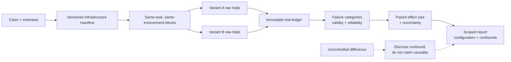

# Chapter 16: Infrastructure Noise in Agent Evals

Chapter 11 defined an evaluation result as evidence about a complete, versioned model-plus-harness configuration. This chapter examines one easily hidden part of that configuration: the infrastructure in which trials run. For an agent that installs dependencies, calls services, runs tests, and changes environment state over many turns, CPU, memory, storage, network, concurrency, and time limits can alter both whether the run completes and which strategies are feasible. Anthropic's infrastructure study makes the boundary concrete: two agents with different resource budgets or time limits are not taking the same test ([Anthropic — Quantifying infrastructure noise in agentic coding evals](https://www.anthropic.com/engineering/infrastructure-noise)).

The phrase **infrastructure noise** is claim-relative. If an eval claims to isolate a model or harness change, uncontrolled infrastructure variation is a nuisance variable or confounder. If it claims to measure an end-to-end product under a declared production contract, rate limits, timeouts, and resource ceilings are part of the tested system and their failures count toward reliability. Decide which claim you are making before deciding what to hold constant or exclude.

### 16.1 Define the Estimand Before Running Trials

An **estimand** is the quantity the experiment is designed to estimate. Infrastructure studies commonly ask one of three different questions:

1. **Model-plus-harness comparison under a fixed environment:** hold infrastructure constant and estimate the outcome difference between systems A and B.
2. **Infrastructure sensitivity:** hold the model, harness, tasks, and graders constant and estimate what changes when one infrastructure factor changes.
3. **Production-system reliability:** sample the infrastructure conditions users will actually encounter and estimate the complete system's outcome, latency, cost, and failure distribution.

These questions require different treatment of failures. An unexpected cluster setup failure may invalidate a model-capability trial. A timeout imposed by the declared product contract is a system reliability failure, not removable “noise.” Preserve Chapter 11's distinction among task verdict, infrastructure-invalid trial, and in-scope reliability failure.

Write the target claim and the treatment contrast before looking at scores:

```text
Claim: changing X from A to B changes metric Y
Population: declared task suite and slices
Fixed configuration: model, harness, graders, and named infrastructure fields
Experimental unit: one trial
Pairing/blocking keys: task × replicate × environment block
Primary effect: absolute difference in outcome rate
Uncertainty: declared interval or model, clustered at the task/block level
Invalid-trial policy: versioned inclusion, exclusion, and retry rules
```

Without this contract, “same benchmark” can conceal different experiments.

### 16.2 The Anthropic Resource Experiment Is a Named Case Study

Anthropic ran Terminal-Bench 2.0 on a Google Kubernetes Engine cluster under six resource configurations, ranging from using each task's resource specification as both allocation floor and hard ceiling (`1×`) to uncapped resources. The same Claude model, harness, and task set were used; the intended treatment was resource configuration ([Anthropic — Quantifying infrastructure noise in agentic coding evals](https://www.anthropic.com/engineering/infrastructure-noise)).

The reported results belong to that setup:

| Comparison | Experimental setting | Reported result |
|---|---|---|
| Terminal-Bench `1×` → `3×` ceiling | Same model, harness, task set; increasing headroom over per-task specifications | Infrastructure errors fell from 5.8% to 2.1% (`p < 0.001`); success scores fluctuated within the experiment's noise (`p = 0.40`) |
| Terminal-Bench `3×` → uncapped | Same six-configuration study | Infrastructure errors fell another 1.6 percentage points while success increased by almost 4 percentage points |
| Terminal-Bench `1×` → uncapped | Extremes of the same study | Success differed by 6 percentage points (`p < 0.01`) |
| SWE-bench `1×` → `5×` RAM | Crossover experiment over 227 problems with 10 samples each | Score increased by 1.54 percentage points |

Anthropic interpreted the Terminal-Bench curve as two empirical regimes. Up to roughly `3×`, additional headroom mainly reduced container failures; above that point, additional resources enabled approaches involving large dependencies, expensive subprocesses, or memory-intensive tests. The `bn-fit-modify` example showed some models installing a Python data-science stack under generous limits but exhausting memory during installation under tight limits, while a standard-library solution remained possible ([Anthropic — Quantifying infrastructure noise in agentic coding evals](https://www.anthropic.com/engineering/infrastructure-noise)).

This case also illustrates why allocation and enforcement must be reported separately. Kubernetes distinguishes resource **requests** used for scheduling from resource **limits** enforced by the runtime; CPU and memory limits also have different enforcement behavior ([Kubernetes — Resource Management for Pods and Containers](https://kubernetes.io/docs/concepts/configuration/manage-resources-containers/)). A label such as “8 GB machine” is not a complete execution contract.

### 16.3 Three Percentage Points Is Not a Universal Threshold

Anthropic concluded that, until resource methodology is standardized, leaderboard differences below 3 percentage points deserved skepticism **for the studied agentic-coding setting until configurations were documented and matched**. The article tied that advice to an observed spread just below 2 points across moderate Terminal-Bench resource configurations, naive binomial intervals of roughly 1–2 points, and a 6-point spread at allocation extremes ([Anthropic — Quantifying infrastructure noise in agentic coding evals](https://www.anthropic.com/engineering/infrastructure-noise)).

Do not convert that case-specific diagnostic into any of these claims:

- differences below 3 points are never real;
- differences above 3 points are significant;
- 3 points is an acceptable regression budget;
- every benchmark has 3 points of infrastructure noise;
- matching RAM alone removes all infrastructure confounding.

A universal cutoff ignores sample size, paired structure, task mix, baseline rate, variance, multiple comparisons, grader error, and the infrastructure variables actually changed. For a new eval, estimate its own effect size and uncertainty under its own design. NIST's guidance on intervals for a binomial proportion makes the interval depend on the observed count and sample size rather than a fixed percentage-point rule ([NIST/SEMATECH — Confidence Intervals for a Proportion](https://itl.nist.gov/div898/handbook/prc/section2/prc241.htm)).

### 16.4 Freeze and Publish an Infrastructure Manifest

Extend Chapter 11's `EvalConfiguration` with an infrastructure manifest. Record configured values and, where available, observed values:

| Variable family | Minimum fields to pin or record |
|---|---|
| **Hardware and resources** | Cloud/provider, region/zone, node or VM type, CPU architecture, vCPU request and limit, memory request and limit, accelerators, ephemeral-storage request and limit, scheduler class, autoscaling behavior |
| **Disk and filesystem** | Local/remote storage type, capacity, IOPS/throughput policy, filesystem and mount options, workspace location, free space at start, snapshot/reset mechanism |
| **Network** | Allowed destinations, DNS/proxy configuration, egress path, bandwidth/connection limits, region to each dependency, network emulation, outage or incident status |
| **Container image** | Image registry, repository, immutable digest, base-image digest, OS/runtime versions, entrypoint, sandbox/runtime version |
| **Dependencies** | Lockfile and package-manager versions, repository/index snapshot, system packages, compilers, test runners, browser/drivers, installation policy |
| **Service and rate limits** | Model/provider endpoint and region, account tier, quotas, requests/tokens per interval, connection pools, retry and backoff policy, observed throttling |
| **Cache state** | Image, package, build, repository, DNS, retrieval, and application caches; cold/warm treatment; priming sequence; reset or sharing scope |
| **Parallelism and contention** | Evaluation concurrency, workers per node, agent subprocess limits, neighboring workloads, task scheduling/order, queue policy |
| **Timeouts and clocks** | End-to-end, model, tool, command, install, test, network, queue, idle, and cleanup timeouts; retry budget; clock/timezone controls |

Do not identify an image only by a mutable tag. Docker documents that a tag can later resolve to a different image and that a digest pins the image version; it also documents how build caches and unpinned packages can change what a later build installs ([Docker — Building best practices](https://docs.docker.com/build/building/best-practices/)). Record dependency lock hashes and repository snapshots in addition to the image digest because trials may install software after startup.

“Warm” is not a single state. Name which cache is warm, who primed it, whether it is shared across trials, and whether the agent can observe artifacts from another trial. If cache state is not the treatment, reset or balance it across variants. If it is the treatment, define cold and warm protocols precisely.

### 16.5 Pair by Task and Environment When Possible

For an A/B comparison, run both variants on the same `task_id` and the same declared baseline. Place them in matched environment blocks: same image and dependencies, hardware/resource class, network policy, cache treatment, timeout policy, grader version, and a narrow run window. Repeat enough trials per task to represent model non-determinism, and randomize or counterbalance A/B order within blocks.

The resulting observations are paired because each A result has a natural B counterpart for the same task and block. NIST defines paired observations in exactly this way—measurement `i` in one sample is naturally matched to measurement `i` in the other—and analyzes their within-pair differences ([NIST/SEMATECH — Analysis of Paired Observations](https://www.itl.nist.gov/div898/handbook/prc/section3/prc311.htm)). NIST's experimental-design guidance likewise recommends holding controllable nuisance factors constant within blocks and randomizing the factors that cannot be controlled ([NIST/SEMATECH — Randomized Block Designs](https://www.itl.nist.gov/div898/handbook/pri/section3/pri332.htm)).

“Same environment” does not mean reusing contaminated state. Start each trial from the same immutable or recoverable baseline but give it an isolated namespace, filesystem, credentials, and external-resource scope. A matched block should equalize intended conditions without letting one trial's artifacts help the other.

If pairing is impossible—for example, variants use incompatible hardware, providers, or time windows—report an unpaired comparison and name the confounds. Region, time of day, account tier, image, concurrency, or provider incident can remain plausible alternative explanations; Anthropic specifically identifies cluster health, hardware, concurrency, egress bandwidth, and time-varying API conditions as possible sources of variance, while noting that it had not formally quantified the time-of-day observation ([Anthropic — Quantifying infrastructure noise in agentic coding evals](https://www.anthropic.com/engineering/infrastructure-noise)). Do not describe the observed difference as the causal effect of the model or harness alone.

### 16.6 Preserve a Raw Trial Ledger

A leaderboard point estimate is not sufficient evidence. Store one immutable record per trial:

```text
InfrastructureTrial {
  task_id, trial_id, replicate_id, pair_or_block_id, variant,
  start_time, run_order, model_and_harness_version,
  task_suite_and_grader_version, infrastructure_manifest_hash,
  node_or_worker_id, image_digest, dependency_lock_hash,
  configured_resources, observed_peak_resources,
  cache_treatment, concurrency, rate_limit_events,
  phase_timings, retries, timeout_reason,
  task_verdict, validity, failure_category,
  artifact_ids, trajectory_id, environment_outcome_id
}
```

Publish or preserve raw trial rows alongside the aggregate, subject to privacy and security controls. At minimum report the number of tasks, trials per task and variant, pass/fail/partial counts, invalid trials, retries, and missing records. Anthropic recommends multiple trials because agent outputs vary and emphasizes stable environments for coding evals ([Anthropic — Demystifying evals for AI agents](https://www.anthropic.com/engineering/demystifying-evals-for-ai-agents)).

Use a versioned failure taxonomy:

- model/agent substantive failure;
- CPU, memory, accelerator, process, or disk exhaustion;
- storage or filesystem failure;
- network, DNS, proxy, or egress failure;
- container-image, dependency, package-index, or setup failure;
- provider error, rate limit, or backoff exhaustion;
- timeout, queue delay, or cancellation;
- concurrency contention or worker eviction;
- cache contamination or failed reset;
- harness, grader, fixture, cleanup, or logging failure.

Classification depends on the claim. A rate limit inside the declared production contract is a valid reliability failure. A grader outage outside the tested system may make the trial invalid. Record the reason code before applying retry or exclusion policy so that infrastructure errors cannot disappear into a rerun.

### 16.7 Report Effect Size and Uncertainty Together

For a binary outcome, start with the absolute pass-rate difference in **percentage points**, with raw numerators and denominators. Relative lift or a rate ratio may supplement it, but always include the baseline: “1.5×” can describe very different absolute changes at 2% and 60% baselines.

For paired repeated trials, compute task-level differences so that tasks with more retained attempts do not silently dominate:

```text
d_task = mean(outcome_B for task and matched blocks)
       - mean(outcome_A for task and matched blocks)
primary effect = mean(d_task across the declared task population)
```

Choose an interval or statistical model that respects the design: paired task bootstrap, an appropriate matched binary procedure, or a hierarchical model when trials are nested under tasks and environment blocks. Report the sampling unit, confidence or credible level, method, assumptions, and sensitivity to invalid-trial handling. Chapter 11 explains why treating correlated attempts as independent overstates precision.

Every result table should contain:

- raw task and trial counts for each variant;
- absolute effect size and, if useful, a relative effect with its baseline;
- uncertainty interval and any pre-specified hypothesis-test result;
- failure-category counts and deltas;
- latency, cost, and resource-use distributions;
- invalid, missing, retried, and excluded trials by reason;
- per-task or per-slice results, not only a pooled score;
- the complete configuration or its content-addressed manifest.

A `p`-value does not replace the effect size or interval. Likewise, a narrow interval does not repair an uncontrolled confound or a broken grader. If many infrastructure variants or slices are compared, declare primary contrasts before looking at results and account for exploratory multiplicity in the interpretation.

### 16.8 Diagnose Why a Score Changed

Separate at least four mechanisms:

1. **Reliability stabilization:** fewer otherwise-invalid or in-scope infrastructure failures reach the grader.
2. **Strategy enablement:** the agent can now install, search, compile, test, or brute-force approaches that the tighter configuration prevented.
3. **Latency-budget interaction:** faster hardware, warmer caches, less contention, or different rate limits let more work fit inside the same timeout.
4. **Uncontrolled confounding:** another configuration or time-varying condition changed with the intended treatment.

Compare both outcome and trajectory evidence: failure reasons, resource peaks, install and test behavior, subprocess count, service throttling, queue time, and phase latency. In Anthropic's Terminal-Bench case, the `1×`–`3×` range was dominated by declining infrastructure errors, while the rise above `3×` outpaced that decline and coincided with resource-intensive strategies ([Anthropic — Quantifying infrastructure noise in agentic coding evals](https://www.anthropic.com/engineering/infrastructure-noise)). That is evidence about that experiment, not a universal breakpoint.

Do not relabel every infrastructure-sensitive success as score inflation. If the product genuinely provides the larger resource budget, exploiting it may be valid capability. The report should say whether it measures efficiency under constraint, maximum task success under a budget, or reliability under production conditions.

### 16.9 Run a Sensitivity Matrix, Not One “Clean” Configuration

A pinned baseline supports comparison but does not show robustness. Before release or publication, test the important configuration boundaries:

| Factor | Example controlled contrast | Evidence to inspect |
|---|---|---|
| Hardware/resources | Declared request/limit floor vs calibrated ceiling | Outcome, OOM/throttling, peak use, strategy change |
| Disk/network | Local vs remote disk; normal vs declared bandwidth/latency condition | I/O errors, install/test latency, timeout interaction |
| Image/dependencies | Same image digest; then one planned dependency upgrade | Reproducibility, setup failures, behavioral deltas |
| Rate limits | Declared quota tiers or controlled throttling | Retry/backoff behavior, queue time, incomplete tasks |
| Warm caches | Precisely defined cold vs warm treatment | Hit rate, latency/cost, contamination checks |
| Parallelism | Low vs production concurrency at fixed per-trial limits | Contention, tail latency, eviction, outcome |
| Timeouts | Production timeout vs a diagnostic longer timeout | Near-boundary completions, hung phases, strategy changes |

Screen one factor at a time when diagnosis is the goal; use a pre-specified factorial or blocked design when interactions matter. Do not change model, harness, image, resources, concurrency, and timeout together and then attribute the entire score delta to one component.

### 16.10 Publish a Reconstructible Result

An infrastructure-aware report should include:

- claim, estimand, task population, slices, and decision owner;
- model, agent harness, evaluation harness, tool, grader, and policy versions;
- experiment design, pairing/blocking, order randomization, run dates, and locations;
- complete infrastructure manifest, including resource allocation **and enforcement**;
- raw trial ledger or a privacy-preserving derivation with checksums;
- point estimates, raw counts, effect sizes, uncertainty, and failure categories;
- invalid-trial, retry, missing-data, and exclusion policies with sensitivity analysis;
- named confounds and the limits of causal or cross-lab comparison;
- release decision, exception owner, and monitoring or rerun trigger.

OpenAI's evaluation playbook similarly asks reports to disclose the tested system, harness and tool access, elicitation method, budgets, safeguards, and validity checks because these determine what claim the result can support ([OpenAI — A shared playbook for trustworthy third-party evaluations](https://openai.com/index/trustworthy-third-party-evaluations-foundations/)).

Cross-lab reproduction does not require identical vendor names, but it does require equivalent experimental contracts or an explicit statement of differences. If equivalence cannot be established, publish separate results rather than normalizing away the discrepancy. A benchmark score becomes useful evidence when another reviewer can reconstruct what ran, classify what failed, and understand which uncertainty belongs to sampling and which belongs to configuration.

---

## Diagram: From Infrastructure Variables to a Scoped Claim



---

## Key Takeaways

- **Infrastructure noise is claim-relative.** A nuisance variable in a model comparison can be an in-scope reliability condition in a product eval.
- **The 3-percentage-point advice is a named Anthropic case result.** It is not a universal significance threshold, regression budget, or estimate of every benchmark's noise.
- **Publish the full execution contract.** Hardware/resources, disk/network, image and dependencies, rate limits, cache state, parallelism, and timeouts all belong in the manifest.
- **Pair by task and environment when possible.** Use matched baselines and blocks, then analyze within-pair differences; otherwise disclose the unpaired confounds.
- **Preserve raw trials and failure categories.** Distinguish substantive failure, in-scope system reliability failure, and infrastructure-invalid trials before retrying or excluding anything.
- **Report effect size with uncertainty.** Include raw counts, sampling unit, per-slice effects, intervals, invalid-trial sensitivity, latency, cost, and resource use—not only a leaderboard point estimate.
- **Keep every multiplier and score shift attached to its setup.** The `3×`, 6-point, and 1.54-point results describe specific Anthropic experiments, not portable constants.

## Further Reading

- Gian Segato, *Quantifying infrastructure noise in agentic coding evals*, Anthropic. https://www.anthropic.com/engineering/infrastructure-noise
- Mikaela Grace et al., *Demystifying evals for AI agents*, Anthropic. https://www.anthropic.com/engineering/demystifying-evals-for-ai-agents
- NIST/SEMATECH, *Randomized Block Designs*. https://www.itl.nist.gov/div898/handbook/pri/section3/pri332.htm
- NIST/SEMATECH, *Analysis of Paired Observations*. https://www.itl.nist.gov/div898/handbook/prc/section3/prc311.htm
- NIST/SEMATECH, *Confidence Intervals for a Proportion*. https://itl.nist.gov/div898/handbook/prc/section2/prc241.htm
- Kubernetes, *Resource Management for Pods and Containers*. https://kubernetes.io/docs/concepts/configuration/manage-resources-containers/
- Docker, *Building best practices*. https://docs.docker.com/build/building/best-practices/
- OpenAI, *A shared playbook for trustworthy third-party evaluations*. https://openai.com/index/trustworthy-third-party-evaluations-foundations/
