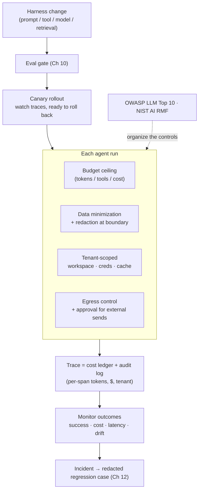

# Chapter 17: AgentOps — Cost, Privacy, and Production Operations

The chapters so far have built an agent that works. Running that agent in production for real users introduces three concerns that the loop itself tends to hide: what each run *costs*, how it handles *sensitive data*, and how to *change the harness safely* once people depend on it. These concerns are easy to overlook, but they often separate a working demonstration from a reliable product. [Chapter 5](./05-sandboxing-guardrails.md) covered the security threat model, and [Chapter 11](./11-infrastructure-noise.md) covered measurement noise. This chapter addresses the operational economics, data governance, and release discipline that surround both.

The emerging name for this discipline is **AgentOps**. AWS organizes it into four connected pillars: **governance and security**, **build and operations**, **evaluation**, and **observability** ([AWS — AgentOps](https://aws.amazon.com/blogs/machine-learning/agentops-operationalize-agentic-ai-at-scale-with-amazon-bedrock-agentcore/)). The term is useful because it covers the full lifecycle. An agent is planned, developed, built, tested, deployed, maintained, monitored, and eventually retired. Production ownership spans that entire path; it does not begin at the monitoring dashboard.

AgentOps also changes what counts as a release. The deployable artifact is not merely model code or a prompt. It is a versioned bundle containing the model and inference settings, system and project instructions, tool catalog and schemas, memory policy, sandbox image, identity and authorization policy, graders, budgets, and routing rules. The release record should identify this complete configuration so that engineers can attribute an incident to a specific version and roll it back. Chapter 18 moves up one level: the control plane registers these artifacts and governs their identities and fleet lifecycle, while AgentOps focuses on operating and improving them.

### 17.1 Cost: Budgeting the Agent

An agent is the most expensive way to run a model because a single user request can expand into many model calls, tool round-trips, and—with reasoning models—long internal token streams ([Chapter 14](./14-model-selection-routing-reasoning.md)). The total cost is also difficult to predict: an open-ended loop may take three turns or thirty. This is the operational reason the book keeps returning to "do the simplest thing that works" ([Chapter 6](./06-agentic-workflow-patterns.md)). Every additional turn incurs another charge.

A production agent therefore needs an explicit *budget*, just as the long-running agents in [Chapter 7](./07-long-running-agents.md) need checkpoints. In practice, this means:

- **A per-task ceiling** on tokens, tool calls, or wall-clock cost. When the agent reaches that ceiling, it stops and asks for direction instead of looping indefinitely. An unbounded loop can become a runaway bill.
- **The cost levers established earlier**: route easy steps to cheaper models and reserve frontier and reasoning models for steps that need them (Ch 14); cache stable prefixes so repeated context is not paid for on every turn (Ch 2); return token-efficient tool responses and use code execution instead of placing large results directly in context (Ch 4).
- **A build-or-not decision**: the cheapest agent is the one you do not run. Many tasks are better served by a workflow or a single model call, and cost should be part of that design choice (Ch 6).

The cascade and routing patterns in [Chapter 14](./14-model-selection-routing-reasoning.md) are cost controls as much as quality controls. FrugalGPT's central result is that most of the spending produced by a naive "always call the best model" strategy can be avoided without sacrificing accuracy ([FrugalGPT](https://arxiv.org/abs/2305.05176)).

Caching deserves closer attention because two distinct mechanisms are involved. The KV/prefix cache from [Chapter 2](./02-context-as-finite-resource.md) serves *identical* prefixes at lower cost. A *semantic cache*, by contrast, serves *similar* requests: it embeds an incoming query and returns a stored response when a previous query is sufficiently close, an approach popularized by GPTCache ([Fu Bang — GPTCache](https://github.com/zilliztech/GPTCache)). For high-volume, repetitive queries, a semantic cache can eliminate entire model calls rather than merely reduce their cost.

That benefit introduces a correctness risk that prefix caching does not. A false semantic-cache hit may return a subtly incorrect answer to a question that only *resembled* a cached one. A semantic cache must therefore be tuned: its similarity threshold trades savings against the risk of false matches. It should be evaluated with the same discipline as any other harness change (§17.5). Both cache types, along with the per-key budgets described above, can be enforced naturally at the *AI gateway* (§14.8). Because every call passes through the gateway, it provides one place to apply cost controls consistently across agents.

### 17.2 Cost Attribution and the Trace

A budget is enforceable only when cost is *measured*, and the trace is the natural place to measure it. The span telemetry from [Chapter 12](./12-trace-driven-iteration.md)—a tree of spans for model calls, tool calls, and retrieval—can also serve as a cost ledger. Attach token counts and dollar costs to each span, and the trace shows both what the agent did and what each step cost. This turns a vague complaint such as "the agent is expensive" into a concrete observation such as "this tool returns 8,000-token results on every call," which engineers can act on.

Cost attribution belongs in the same iteration loop as failure analysis. A step that is expensive but contributes little value is a candidate for a cheaper model, a more concise tool response, or removal. This is the trace-driven process from [Chapter 12](./12-trace-driven-iteration.md), applied to cost rather than correctness. As [Chapter 11](./11-infrastructure-noise.md) warned, cost and resource configuration can also affect measured behavior. Cost should therefore be reported alongside capability, not as a separate concern.

### 17.3 Privacy and Data Governance

An agent handles data on every run. It reads files, queries databases, retrieves documents, and sends requests to model providers and tools. Each step creates an opportunity for sensitive data to leak, and the harness is responsible for controlling those paths. The threat is most acute in the *lethal trifecta* described in [Chapter 5](./05-sandboxing-guardrails.md): an agent that can access private data, consume untrusted content, and communicate externally can be induced to exfiltrate that data ([Simon Willison — The lethal trifecta](https://simonwillison.net/2025/Jun/16/the-lethal-trifecta/)). Privacy is therefore not separate from security; it is the data-handling side of the same problem.

The relevant harness-level controls are:

- **Minimize what enters context.** Data the agent never sees cannot leak. Retrieve the slice needed for the task, not the whole record (Ch 2), and prefer handles over raw sensitive content.
- **Redact at the boundary.** Remove secrets and PII before content enters the model context or a trace. Traces are durable and are often sent to third-party observability tools, so an unredacted trace can itself become a data leak (Ch 12).
- **Enforce permissions during retrieval.** Filter data according to what the *user* is allowed to see before retrieval, not after generation. An agent must not provide access to data that its user could not otherwise read (Ch 5, [Ch 12](./12-trace-driven-iteration.md)).
- **Govern egress.** The harness can break the external-communication leg of the trifecta. Restrict where the agent may send data, and require approval before external transmission (Ch 15).

### 17.4 Multi-Tenancy and Isolation

When one agent platform serves multiple users or organizations, isolation becomes a correctness requirement rather than an optional safeguard. Two failure modes are especially important. *State bleed* occurs when one tenant's context, memory, or cached prefix appears in another tenant's session. This failure is catastrophic and easy to introduce when memory (Ch 3) or prefix caching (Ch 2) is added without tenant scoping. *Authority bleed* occurs when an agent uses one tenant's credentials on behalf of another. It is the multi-tenant form of the delegated-authorization problem discussed in [Chapter 5](./05-sandboxing-guardrails.md).

The required discipline follows the managed-agent architecture from [Chapter 7](./07-long-running-agents.md): use durable per-tenant workspaces, scope each sandbox to one tenant's resources, and issue narrowly scoped credentials that are never shared across the brain/hands boundary. The event log (Ch 9) should include tenant identity so that every action can be attributed correctly. That attribution is also what makes auditing (Ch 5) meaningful in a shared system.

### 17.5 Releasing Harness Changes

A harness is software, and changing software that people depend on requires release discipline. Harness changes are unusually risky, however, because their effects are statistical rather than deterministic. A prompt edit, a new tool, a model swap, or a retrieval adjustment can alter behavior on inputs that no one tested. The resulting regression may affect only a small percentage of cases instead of causing an obvious crash ([Chapter 10](./10-evaluation.md), [Chapter 12](./12-trace-driven-iteration.md)).

That risk calls for three release practices:

- **Gate every change on evals.** Run the suite before and after the change, comparing pass rate, failure categories, cost, and latency. The regression discipline from [Chapter 10](./10-evaluation.md) becomes the release gate.
- **Roll out gradually.** Eval suites never cover the full input distribution, so treat a harness change like any other risky deployment. Release it to a fraction of traffic, monitor production traces and outcome metrics, and remain ready to roll back. A canary catches cases that the eval suite missed while limiting their impact.
- **Version the entire configuration together.** Because the model and harness are coupled, as described in [Chapter 12](./12-trace-driven-iteration.md), the unit of release is the complete *configuration*—model, prompts, tools, and retrieval policy—not any single component. Readiness validation (Ch 10) applies to that configuration, and a rollback must restore the full configuration rather than only the prompt.

### 17.6 Monitoring, SLOs, and Incident Response

Evals run before release; monitoring continues afterward. The two provide different evidence: evals measure a curated distribution, while production reveals the real one. The span telemetry from [Chapter 12](./12-trace-driven-iteration.md) provides the monitoring substrate. On top of it, an agent system needs the familiar components of production monitoring, adapted to agent-specific behavior:

- **Measure outcomes, not just uptime.** A liveness check showing that the API responds says nothing about whether tasks succeed. Track task success rate, escalation and approval rates, cost per task, and latency percentiles (p50/p95/p99, as in Ch 6) as first-class signals.
- **Alert on drift.** A rising failure rate, increasing cost per task, or declining self-verification pass rate can constitute an incident even when nothing has crashed. These are characteristic failure patterns for agents.
- **Turn production failures into regression cases.** The trace-to-eval loop from [Chapter 12](./12-trace-driven-iteration.md) is also an incident-response loop. Redact each production failure, convert it into a reproducible eval case, and fix the underlying issue so that the same incident cannot recur silently.

### 17.7 Governance Frameworks

These concerns are not only matters of internal engineering. For many deployments, they are also external requirements. Four reference frameworks can help structure the work, ranging from voluntary guidance to binding law.

- **OWASP Top 10 for LLM Applications** lists common risk categories—including prompt injection, sensitive-information disclosure, excessive agency, and supply-chain risks—and maps closely to the controls in [Chapter 5](./05-sandboxing-guardrails.md) and this chapter ([OWASP — Top 10 for LLM Applications](https://genai.owasp.org/llm-top-10/)).
- **NIST AI Risk Management Framework** provides a higher-level structure—govern, map, measure, and manage—for organizations that need an auditable risk process around an agent deployment ([NIST — AI Risk Management Framework](https://www.nist.gov/itl/ai-risk-management-framework)).
- **ISO/IEC 42001:2023**, the first AI management-system standard, is the AI analogue of ISO 27001. It specifies how an organization establishes, operates, and continually improves a management system for AI, and organizations can certify against it ([ISO/IEC 42001:2023](https://www.iso.org/standard/42001)).
- **The EU AI Act** (Regulation (EU) 2024/1689) is the first comprehensive AI law. It classifies systems by risk tier and imposes binding obligations—including risk management, data governance, transparency, human oversight, and logging—on high-risk uses, with provisions phasing in through 2026–2027 ([EU AI Act — Regulation (EU) 2024/1689](https://eur-lex.europa.eu/eli/reg/2024/1689/oj/eng)). The Act and ISO 42001 are complementary but distinct: ISO 42001 certification provides evidence of a sound process, not automatic proof of compliance with the AI Act.

None of these frameworks replaces the engineering described in this book. Instead, they organize that work and make it understandable to auditors, customers, and regulators. The [Outlook](./19-outlook.md) identifies cross-layer governance coherence as an open problem because policy, audit, and runtime enforcement still live in separate layers. These frameworks provide the best current scaffolding for keeping those layers aligned.

---

## Diagram: The Production Wrapper

*Cost, privacy, and tenancy are enforced per run; the trace is both the cost ledger and the audit log; every harness change passes an eval gate and a canary before reaching production.*

---

## Key Takeaways

- **Agents need explicit budgets**: cap tokens, tool calls, or cost per task, and use routing, cascades, caching, and token-efficient tools to prevent an open-ended loop from becoming a runaway bill ([FrugalGPT](https://arxiv.org/abs/2305.05176)).
- **The trace is the cost ledger**: attach token counts and dollar costs to each span so that "the agent is expensive" becomes a specific engineering problem that can be fixed.
- **Privacy is the data-handling side of the lethal trifecta**: minimize what enters context, redact at the boundary—including traces—enforce user permissions during retrieval, and control egress.
- **Multi-tenancy requires isolation**: scope workspaces, credentials, memory, and prefix caches per tenant, and include tenant identity in the event log. State bleed and authority bleed are catastrophic failures.
- **Two caches have two risk profiles**: a prefix cache serves identical context cheaply; a semantic cache serves *similar* queries and can skip entire calls, but a false hit returns the wrong answer. Tune its threshold and evaluate it like any other harness change.
- **Releasing a harness change is a statistical deployment**: gate changes on evals, canary them gradually, version the entire configuration together, and turn production failures into regression cases.
- **AgentOps covers the whole lifecycle**: governance and security, build and operations, evaluation, and observability apply from planning through retirement. Release the model, tools, memory, policy, sandbox, graders, and budgets as one versioned configuration.
- **Governance frameworks range from guidance to law**: the OWASP LLM Top 10 and NIST AI RMF organize controls; ISO/IEC 42001 certifies the management process; and the EU AI Act imposes binding obligations on high-risk uses.

## Further Reading

- Lingjiao Chen, Matei Zaharia, and James Zou, *FrugalGPT: How to Use Large Language Models While Reducing Cost and Improving Performance*, 2023. https://arxiv.org/abs/2305.05176
- Simon Willison, *The lethal trifecta for AI agents*, Jun 2025. https://simonwillison.net/2025/Jun/16/the-lethal-trifecta/
- OWASP, *Top 10 for Large Language Model Applications*, 2025. https://genai.owasp.org/llm-top-10/
- NIST, *AI Risk Management Framework (AI RMF 1.0)*, 2023. https://www.nist.gov/itl/ai-risk-management-framework
- Gian Segato, *Quantifying Infrastructure Noise in Agentic Coding Evals*, Anthropic, Feb 2026. https://www.anthropic.com/engineering/infrastructure-noise
- Dex Horthy, *12-Factor Agents*, HumanLayer, Apr 2025. https://www.humanlayer.dev/blog/12-factor-agents
- Fu Bang, *GPTCache: An Open-Source Semantic Cache for LLM Applications*, NLP-OSS @ EMNLP 2023. https://github.com/zilliztech/GPTCache
- *ISO/IEC 42001:2023 — Information technology — Artificial intelligence — Management system*, ISO, 2023. https://www.iso.org/standard/42001
- *Regulation (EU) 2024/1689 (Artificial Intelligence Act)*, European Union, Jun 2024. https://eur-lex.europa.eu/eli/reg/2024/1689/oj/eng
- AWS, *AgentOps: Operationalize Agentic AI at Scale with Amazon Bedrock AgentCore*, 2026. https://aws.amazon.com/blogs/machine-learning/agentops-operationalize-agentic-ai-at-scale-with-amazon-bedrock-agentcore/
