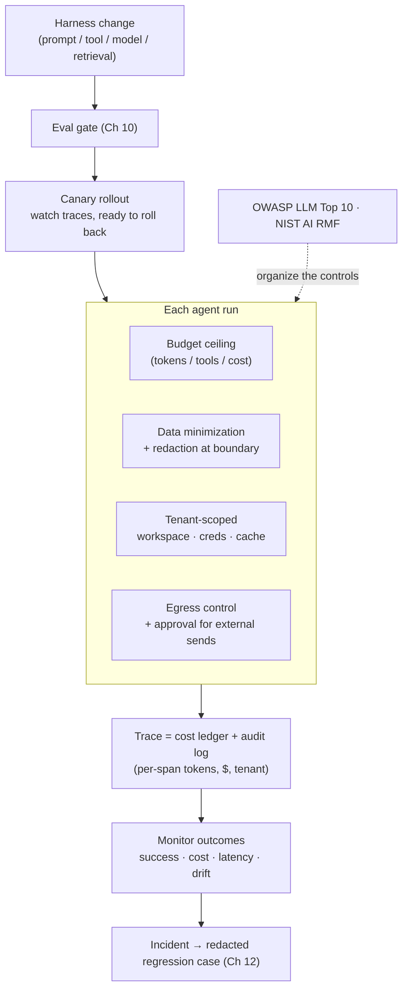

# Chapter 17: Cost, Privacy, and Production Operations

The chapters so far have built an agent that works. Running it in production for real users adds three concerns that the agent loop itself hides: what each run *costs*, what it does with *sensitive data*, and how the harness is *changed safely* once people depend on it. None is glamorous, and each is where a working demo quietly fails to become a working product. [Chapter 5](./05-sandboxing-guardrails.md) covered the security threat model and [Chapter 11](./11-infrastructure-noise.md) covered measurement noise; this chapter covers the operational economics, data governance, and release discipline around them.

### 16.1 Cost: Budgeting the Agent

An agent is the most expensive way to run a model, because a single user request expands into many model calls, tool round-trips, and — with reasoning models — long internal token streams ([Chapter 14](./14-model-selection-routing-reasoning.md)). Worse, the cost of a task is not known in advance: an open-ended loop can take three turns or thirty. This is the operational reason the book keeps returning to "do the simplest thing that works" ([Chapter 6](./06-agentic-workflow-patterns.md)) — every agentic turn is a recurring charge, not a one-time one.

A production agent therefore needs an explicit *budget*, the way [Chapter 7](./07-long-running-agents.md) needed a checkpoint. Concretely:

- **A per-task ceiling** on tokens, tool calls, or wall-clock cost, after which the agent stops and asks rather than looping indefinitely. An unbounded loop is a runaway bill.
- **The cost levers already established**: route easy steps to cheap models and reserve frontier and reasoning models for steps that need them (Ch 14); cache stable prefixes so repeated context is not repaid every turn (Ch 2); return token-efficient tool responses and use code execution to avoid dumping large results into context (Ch 4).
- **A build-or-not decision**: the cheapest agent is the one not run. Many tasks are better served by a workflow or a single call, and the cost analysis is part of choosing (Ch 6).

The cascade and routing patterns of [Chapter 14](./14-model-selection-routing-reasoning.md) are cost controls as much as quality controls; FrugalGPT's central result is that most of the spend on a naive "always call the best model" strategy is avoidable without losing accuracy ([FrugalGPT](https://arxiv.org/abs/2305.05176)).

### 16.2 Cost Attribution and the Trace

A budget is only enforceable if cost is *measured*, and the place it is measured is the trace. The span telemetry of [Chapter 12](./12-trace-driven-iteration.md) — a tree of spans for model calls, tool calls, and retrieval — is also the cost ledger: attach token counts and dollar cost to each span and the trace tells you not just what the agent did but what each step cost. This turns "the agent is expensive" into "this tool returns 8,000-token results on every call," which is an engineering task rather than a complaint.

Cost attribution also feeds the same iteration loop as failures. A step that is both expensive and low-value is a candidate for a cheaper model, a tighter tool response, or removal — the trace-driven iteration of [Chapter 12](./12-trace-driven-iteration.md) applied to the cost axis instead of the correctness axis. As [Chapter 11](./11-infrastructure-noise.md) warned, cost and resource configuration also interact with measured behavior, so cost should be reported alongside capability, not separately.

### 16.3 Privacy and Data Governance

An agent touches data on every run — reading files, querying databases, retrieving documents, sending requests to model providers and tools. Each of those is a place where sensitive data can leak, and the harness owns the controls. The threat is sharpest as the *lethal trifecta* of [Chapter 5](./05-sandboxing-guardrails.md): an agent with access to private data, exposure to untrusted content, and a path to communicate externally can be induced to exfiltrate that data ([Simon Willison — The lethal trifecta](https://simonwillison.net/2025/Jun/16/the-lethal-trifecta/)). Privacy is not a separate concern from security; it is the data-handling face of it.

The harness-level controls:

- **Minimize what enters context.** Data the agent never sees cannot leak. Retrieve the slice needed for the task, not the whole record (Ch 2), and prefer handles over raw sensitive content.
- **Redact at the boundary.** Strip secrets and PII before content crosses into the model context or into a trace — traces are durable and often shipped to third-party observability tools, so an un-redacted trace is its own leak (Ch 12).
- **Respect permission at retrieval time.** Filter by what the *user* is allowed to see before retrieval, not after generation; an agent must not become a way to read data its user could not (Ch 5, [Ch 12](./12-trace-driven-iteration.md)).
- **Govern egress.** The external-communication leg of the trifecta is the one the harness can cut: constrain where the agent can send data, and require approval for external sends (Ch 15).

### 16.4 Multi-Tenancy and Isolation

When one agent platform serves many users or organizations, isolation becomes a correctness property, not just a nicety. Two failure modes matter. *State bleed* — one tenant's context, memory, or cached prefix leaking into another's session — is catastrophic and easy to introduce when memory (Ch 3) and prefix caching (Ch 2) are added without tenant scoping. *Authority bleed* — an agent acting with one tenant's credentials on another's behalf — is the multi-tenant version of the delegated-auth concern from [Chapter 5](./05-sandboxing-guardrails.md).

The discipline follows the managed-agent architecture of [Chapter 7](./07-long-running-agents.md): durable per-tenant workspaces, sandboxes scoped to a single tenant's resources, and credentials that are scoped and never shared across the brain/hands boundary. The event log (Ch 9) should carry tenant identity so that every action is attributable, which is also what makes audit (Ch 5) meaningful in a shared system.

### 16.5 Releasing Harness Changes

A harness is software, and changing software that people depend on needs release discipline — yet harness changes are unusually risky because their effect is statistical, not deterministic. A prompt edit, a new tool, a model swap, or a retrieval tweak can shift behavior on inputs no one tested, and the regression may be a few percent of cases rather than a crash ([Chapter 10](./10-evaluation.md), [Chapter 12](./12-trace-driven-iteration.md)).

The release practices that follow:

- **Gate every change on evals.** Run the suite before and after, comparing pass rate, failure categories, cost, and latency — the regression discipline of [Chapter 10](./10-evaluation.md) is the release gate.
- **Roll out gradually.** Because eval suites never cover the full input distribution, treat a harness change like any risky deploy: release to a fraction of traffic, watch production traces and outcome metrics, and be ready to roll back. Canarying is how the cases the eval missed are caught cheaply.
- **Version the whole configuration together.** The model–harness coupling of [Chapter 12](./12-trace-driven-iteration.md) means the unit of release is the *configuration* — model, prompts, tools, retrieval policy — not any one part. Readiness validation (Ch 10) is per configuration, and rollback must restore the configuration, not just the prompt.

### 16.6 Monitoring, SLOs, and Incident Response

Evals run before release; monitoring runs after. The two are complementary: evals measure a curated distribution, production tells you about the real one. The span telemetry of [Chapter 12](./12-trace-driven-iteration.md) is the monitoring substrate, and the operational additions are the ones any production system needs, specialized for agents:

- **Outcome metrics, not just uptime.** A liveness check that the API responds says nothing about whether tasks are succeeding. Track task success rate, escalation/approval rate, cost per task, and latency percentiles (p50/p95/p99, as in Ch 6) as first-class signals.
- **Alert on drift.** A rising failure rate, a climbing cost-per-task, or a falling self-verification pass rate is an incident even when nothing has crashed — these are the agent-specific failure shapes.
- **Production failures become regression cases.** The trace-to-eval loop of [Chapter 12](./12-trace-driven-iteration.md) is also the incident-response loop: a production failure is redacted, turned into a reproducible eval case, and engineered out permanently so the same incident cannot recur silently.

### 16.7 Governance Frameworks

These concerns are not only internal engineering; for many deployments they are external requirements. Two reference frameworks help structure the work without reinventing it. The OWASP Top 10 for LLM Applications enumerates the common risk classes — prompt injection, sensitive-information disclosure, excessive agency, supply-chain risks — and maps cleanly onto the controls of [Chapter 5](./05-sandboxing-guardrails.md) and this chapter ([OWASP — Top 10 for LLM Applications](https://genai.owasp.org/llm-top-10/)). The NIST AI Risk Management Framework offers a higher-level structure — govern, map, measure, manage — for organizations that need an auditable risk process around an agent deployment ([NIST — AI Risk Management Framework](https://www.nist.gov/itl/ai-risk-management-framework)).

Neither framework replaces the engineering in this book; they organize it and make it legible to auditors, customers, and regulators. The [Outlook](./18-outlook.md) flags cross-layer governance coherence as an open problem precisely because policy, audit, and runtime enforcement still live in separate layers — these frameworks are the current best scaffolding for keeping them aligned.

---

## Diagram: The Production Wrapper

*Cost, privacy, and tenancy are enforced per run; the trace is both the cost ledger and the audit log; every harness change passes an eval gate and a canary before reaching production.*

---

## Key Takeaways

- **Agents need explicit budgets**: an open-ended loop is a runaway bill; cap tokens/tools/cost per task, and use routing, cascades, caching, and token-efficient tools to control spend ([FrugalGPT](https://arxiv.org/abs/2305.05176)).
- **The trace is the cost ledger**: attach per-span tokens and dollars so "the agent is expensive" becomes a specific, fixable engineering task.
- **Privacy is the data face of the lethal trifecta**: minimize what enters context, redact at the boundary (traces leak too), filter retrieval by user permission, and control egress.
- **Multi-tenancy demands isolation**: scope workspaces, credentials, memory, and prefix caches per tenant, and carry tenant identity in the event log — state bleed and authority bleed are catastrophic.
- **Releasing a harness change is a statistical deploy**: gate on evals, canary gradually, version the whole configuration together, and turn production failures into regression cases; OWASP LLM Top 10 and NIST AI RMF organize the controls.

## Further Reading

- Lingjiao Chen, Matei Zaharia, and James Zou, *FrugalGPT: How to Use Large Language Models While Reducing Cost and Improving Performance*, 2023. https://arxiv.org/abs/2305.05176
- Simon Willison, *The lethal trifecta for AI agents*, Jun 2025. https://simonwillison.net/2025/Jun/16/the-lethal-trifecta/
- OWASP, *Top 10 for Large Language Model Applications*, 2025. https://genai.owasp.org/llm-top-10/
- NIST, *AI Risk Management Framework (AI RMF 1.0)*, 2023. https://www.nist.gov/itl/ai-risk-management-framework
- Gian Segato, *Quantifying Infrastructure Noise in Agentic Coding Evals*, Anthropic, Feb 2026. https://www.anthropic.com/engineering/infrastructure-noise
- Dex Horthy, *12-Factor Agents*, HumanLayer, Apr 2025. https://www.humanlayer.dev/blog/12-factor-agents
