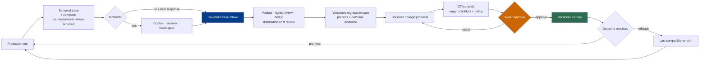

# Chapter 17: Trace-Driven Iteration

A production trace can show where time went, which components interacted, and which errors appeared along one observed execution path. That makes traces valuable for debugging and for discovering candidate regression cases. It does not make them the system of record for every other purpose.

Chapter 10 defines a **trace** as observability data composed of spans, timestamps, attributes, events, links, and status. OpenTelemetry exposes those objects through its tracing API and allows implementations to sample what is recorded or exported ([OpenTelemetry — Trace API](https://opentelemetry.io/docs/specs/otel/trace/api/); [OpenTelemetry — Trace SDK](https://opentelemetry.io/docs/specs/otel/trace/sdk/)). This chapter asks how to use that fallible, potentially incomplete signal to improve a versioned model-plus-harness system safely.

### 17.1 Trace Is One Evidence Product, Not Four

Keep these products separate:

| Product | Required property | Primary use | Why a sampled trace cannot replace it |
|---|---|---|---|
| **Trace** | Queryable spans and causal/correlation metadata under a declared sampling policy | Observability, performance diagnosis, failure discovery | Sampling may drop an entire execution or individual detail |
| **Event history** | Ordered, durable accepted events under a recovery/replay contract | Reconstruct execution state and resume | Trace order and retention are not authoritative workflow state |
| **Eval trajectory** | Every model, tool, observation, artifact, and policy event required by declared graders for one trial | Grade process behavior | Production instrumentation may omit or redact grader-required evidence |
| **Audit record** | Defined content, identity, timestamps, completeness, integrity, access, protection, and retention | Accountability, investigation, compliance | A trace may be mutable, sampled, access-scoped differently, or retained for too short a period |

Temporal's event history is an append-only workflow record used for recovery, while OpenTelemetry sampling can intentionally discard attributes, events, status, or complete spans ([Temporal — Events and Event History](https://docs.temporal.io/workflow-execution/event); [OpenTelemetry — Trace SDK](https://opentelemetry.io/docs/specs/otel/trace/sdk/)). NIST treats audit generation, content, protection, review, access, and retention as explicit controls rather than properties inherited from an arbitrary log ([NIST SP 800-53 Rev. 5](https://csrc.nist.gov/pubs/sp/800/53/r5/upd1/final)). Chapter 11 likewise requires a complete eval trajectory for the evidence a grader consumes.

The products should link to one another without collapsing. A span may carry an event-history ID; an eval trajectory may be built from unsampled instrumentation plus artifacts; an audit pipeline may copy selected protected records. The lineage is useful precisely because the guarantees remain explicit.

### 17.2 Correlate Durable IDs with Trace and Span IDs

Chapter 10 defines application identities that outlive an observability backend:

```text
session_id -> run_id -> step_id -> action_id -> attempt_id
call_id attaches to the step or attempt that issued the protocol exchange
```

Trace identities answer different questions. W3C Trace Context standardizes propagation of `trace-id`, parent/span identity, and trace flags across service boundaries ([W3C — Trace Context](https://www.w3.org/TR/trace-context/)). Do not substitute those transport-oriented IDs for durable workflow identities.

| Durable identity | Trace correlation | Important distinction |
|---|---|---|
| `session_id` | Attribute on relevant root and child spans | One session may contain many runs and traces |
| `run_id` | Attribute on every span for the run; often correlated with one root trace or a linked series of traces | A long-running run can outlive trace retention or cross trace boundaries |
| `step_id` | Attribute on the orchestration span representing that logical transition | Repeating a loop step under explicit semantics does not make `span_id` the source of workflow position |
| `action_id` | Attribute on the intended-effect span and all delivery attempts | Remains stable across retries; it is not a tool-call transport ID |
| `attempt_id` | Attribute on one model/tool execution-attempt span | Changes for each attempt under the same logical step or action |
| `call_id` | Attribute on the provider/protocol model or tool span and correlated result | Identifies one exchange; it does not supply idempotency for an external effect |
| `trace_id` / `span_id` | Native observability correlation | May be sampled, regenerated at boundaries, or absent from durable recovery data |

Use a parent–child relationship for synchronous causal nesting. Use span **links** for work joined from a queue, fan-out/fan-in branches, retries tied to an earlier attempt, or operations that start after the original trace ended; OpenTelemetry allows links to spans in the same or another trace ([OpenTelemetry — Trace API](https://opentelemetry.io/docs/specs/otel/trace/api/)). Preserve `causation_id` and `correlation_id` in the durable event envelope as well, because a trace backend is not the source of truth for accepted state.

### 17.3 Design Spans for Questions, Not Maximum Payload

A span represents one operation. OpenTelemetry lets instrumentation set attributes, add timestamped events, set status, record exceptions, and link related spans ([OpenTelemetry — Trace API](https://opentelemetry.io/docs/specs/otel/trace/api/); [OpenTelemetry — Exceptions](https://opentelemetry.io/docs/specs/otel/trace/exceptions/)). Use each field deliberately:

- **Attributes** hold stable, queryable facts: durable IDs, operation type, component and configuration versions, model/tool name and schema version, tenant-safe classification, token/cost counters, retry number, policy outcome, and artifact references. Avoid raw secrets, full prompts, high-cardinality payloads, or mutable prose as primary keys.
- **Events** record point-in-time facts inside the operation: retry scheduled, approval requested, first byte received, timeout observed, cancellation requested, result normalized, or postcondition checked. An event on a span is still observability data, not automatically an accepted workflow event.
- **Status** summarizes the operation's tracing status. OpenTelemetry defines `Unset`, `Ok`, and `Error`; it does not encode the application's complete state machine ([OpenTelemetry — Trace API](https://opentelemetry.io/docs/specs/otel/trace/api/)). Keep `partial`, `cancelled`, `unknown outcome`, policy denial, and business success as explicit domain attributes/events and durable state.
- **Errors** should use a stable category and safe description, plus a reference to full diagnostics when needed. OpenTelemetry's exception convention records an unhandled exception as an event when it causes the span to end in error ([OpenTelemetry — Exceptions](https://opentelemetry.io/docs/specs/otel/trace/exceptions/)). A caught exception followed by successful recovery should not make the entire run look failed without qualification.
- **Links** represent non-tree relationships rather than forcing every asynchronous dependency into a false parent–child chain.

OpenTelemetry's GenAI semantic conventions define emerging names for model, agent, and tool spans, but the conventions remain versioned and parts may be marked Development ([OpenTelemetry — GenAI Spans](https://opentelemetry.io/docs/specs/semconv/gen-ai/gen-ai-spans/)). Pin the convention version, document local extensions, and map provider fields at the adapter boundary. Do not bake a changing semantic-convention draft into durable business state.

A minimal span envelope might be:

```text
trace_id, span_id, parent_span_id, links
session_id, run_id, step_id, action_id, attempt_id, call_id
operation, component_version, model_or_tool_version
started_at, ended_at, status, error_type
policy_decision, token_and_cost_counters, artifact_refs
sampling_policy_version, content_capture_mode
```

### 17.4 Sampling Policy Is Part of the Interpretation

OpenTelemetry sampling exists to reduce collection overhead and volume; a sampler may `DROP`, `RECORD_ONLY`, or `RECORD_AND_SAMPLE`, and an unrecorded span discards its attributes, events, and status ([OpenTelemetry — Trace SDK](https://opentelemetry.io/docs/specs/otel/trace/sdk/)). Therefore a dashboard built from exported traces answers a question about the sampled population unless the estimator and inclusion probabilities justify a broader claim.

Define and version the sampling policy:

- baseline probability or rule for ordinary successful runs;
- higher-priority capture for errors, policy denials, approval flows, unknown side effects, novel versions, and canary traffic;
- head- versus tail-sampling behavior and what happens if downstream services disagree;
- content-capture mode, redaction point, storage location, retention, and access class;
- how metrics or ledgers that require complete counts are produced outside sampled trace export;
- how operators discover blind spots when the collector, exporter, or instrumentation fails.

Priority sampling improves diagnostic coverage; it does not create a statistically representative dataset automatically. If failure traces are oversampled, their raw fraction is not the production failure rate. If successful runs are rarely sampled, absence of a failure pattern is weak evidence. Maintain unsampled counters or another complete operational record for billing, hard policy events, and durable recovery instead of asking traces to provide guarantees their sampling policy removed.

### 17.5 Three Activities That Must Not Be Confused

| Activity | Question | Evidence | Output |
|---|---|---|---|
| **Trace grader** | Did a complete evaluation trajectory follow a declared process rule? | Unsampled trial trajectory, events, tool arguments, approvals, budgets, artifacts | Versioned grader verdict for one trial |
| **Outcome grader** | Did the artifact, environment, or user/business state satisfy the success criterion? | Tests, state queries, independent API checks, artifact inspection, user/business events | Versioned outcome verdict or score |
| **Incident investigation** | What happened in production, what was affected, why, and how should the system contain and recover? | Traces plus event history, logs, audit records, configuration, external-system state, human reports | Timeline, impact, containment/recovery actions, contributing causes, follow-ups |

Anthropic's agent-eval guidance separates transcript/trajectory evidence from the outcome and warns against judging only what the agent said ([Anthropic — Demystifying Evals for AI Agents](https://www.anthropic.com/engineering/demystifying-evals-for-ai-agents)). NIST's incident-response guidance treats preparation, detection, response, and recovery as organizational risk-management activities, not as a grader pass/fail decision ([NIST SP 800-61 Rev. 3](https://csrc.nist.gov/pubs/sp/800/61/r3/final)).

A production trace analyzer may flag “missing approval span.” That is a hypothesis for investigation unless the relevant record is known complete. A trace grader in an eval can fail a trial only when the evaluation harness guaranteed that the required approval evidence would be captured. An outcome grader can still pass the final artifact while a process grader fails a policy violation; neither verdict replaces incident triage for an actual production event.

### 17.6 Turn Production Failures into Governed Regression Cases

Production failures are valuable sources of candidate eval tasks, but copying traces directly into a suite creates privacy, rights, duplication, and validity risks. Use a governed intake pipeline:

1. **Triage the live event first.** Preserve volatile evidence and handle containment, notification, and recovery through the incident process; do not delay response while designing an eval.
2. **Establish use rights.** Check user notice or consent where required, contract terms, data-processing purpose, third-party content licenses, and intellectual-property restrictions before repurposing production material. NIST's AI RMF core calls for documented management of privacy and third-party data/software rights across AI-system risk work ([NIST — AI RMF Core](https://airc.nist.gov/airmf-resources/airmf/5-sec-core/)).
3. **Minimize and redact.** Remove secrets, credentials, personal and tenant data, unnecessary payloads, and production identifiers; preserve protected evidence separately when investigation or legal obligations require it.
4. **Reconstruct complete evidence.** Join the sampled trace with authorized event-history records, artifacts, configuration versions, and external outcomes. Mark missing facts; do not invent a complete trajectory from a partial trace.
5. **Create an isolated fixture.** Replace live side effects with a reproducible environment, synthetic or licensed data, scoped identities, and deterministic reset/teardown.
6. **Deduplicate and cluster.** Several alerts may be one underlying failure. Keep lineage to every source incident while preventing repeated copies from silently overweighting one class.
7. **Review distribution shift.** Decide whether the case belongs in a representative task distribution, a historical-regression slice, a high-risk policy suite, or incident-only testing. Do not change the headline distribution without versioning and disclosure.
8. **Write separate process and outcome assertions.** State what trace evidence must be complete and what independent environment result establishes success.
9. **Adjudicate and version.** Review task fairness, solvability, leakage, rights, grader behavior, and expected failure before accepting the case.

OpenAI's evaluation playbook identifies contamination, broken tasks, reward hacking, refusals, and sandbagging as validity hazards and recommends reporting the tested system, harness, budget, and validity checks ([OpenAI — Trustworthy Third-Party Evaluations](https://openai.com/index/trustworthy-third-party-evaluations-foundations/)). Escaped production failures can strengthen a regression suite, but a growing archive of only failures is not a representative sample of ordinary traffic. Chapter 11's suite versioning, slices, isolation, and grader calibration still apply.

### 17.7 Trace Review Produces Hypotheses, Not Automatic Fixes

Trace review should classify the likely boundary before proposing a change:

| Symptom | Candidate causes to test | Evidence to collect |
|---|---|---|
| Wrong tool or malformed call | Tool description/schema, context selection, model capability, router choice | Proposal, catalog/version, validation errors, relevant context, comparison trials |
| Repeated loop or premature stop | Stop state, error normalization, context compaction, no-progress detector, model behavior | Step/action IDs, error classes, state transitions, budgets, final outcome |
| Correct transcript, wrong external state | Tool timeout, duplicate/partial effect, stale observation, missing postcondition check | Action/attempt IDs, operation ID, event history, environment query |
| Policy or approval failure | Missing PEP, stale policy, identity/delegation mismatch, UI or event bug | Policy input/version, decision, approval proposal hash, dispatch evidence |
| Latency or cost regression | Model/routing change, cache miss, retrieval/tool latency, retry fan-out, infrastructure change | Child spans, sampling-adjusted metrics, configuration diff, controlled eval |

The model's text is one component, not the default root cause. Repair may require a prompt, but it may instead require a typed tool, state transition, sandbox rule, policy gate, context transformation, infrastructure fix, or grader change. Record the hypothesis and falsifying test before editing the harness; otherwise teams can overfit a vivid trace without fixing the failure class.

### 17.8 Meta-Harness Changes Need a Release Pipeline

A “self-improving agent” should mean that production evidence informs an external, governed improvement process—not that the deployed agent rewrites its active prompt, tools, memory policy, runtime, or grader without bounds. OpenAI's tax-agent case study describes expert corrections becoming reviewed findings, targeted evals, and bounded coding tasks rather than directly rewriting the deployed agent ([OpenAI — Building Self-Improving Tax Agents with Codex](https://openai.com/index/building-self-improving-tax-agents-with-codex/)).

Apply the same release discipline to human-authored and meta-harness-generated changes:

1. **Bound the proposal.** Name the failure class, component, owner, expected effect, and files/configuration allowed to change.
2. **Create a version.** Pin the model, prompts, tool schemas/implementations, retrieval configuration, memory policy, sandbox image, runtime, policies, budgets, and graders affected.
3. **Run offline evals.** Require the targeted regression, broader holdout suite, critical policy slices, grader calibration checks, and cost/latency/reliability comparisons.
4. **Obtain approval.** A responsible owner reviews the change, evidence, known limitations, deployment scope, canary plan, and rollback trigger. The candidate cannot approve itself.
5. **Canary safely.** Start with a bounded traffic slice, limited authority, isolated tenants or tasks where appropriate, and enhanced outcome monitoring.
6. **Promote or roll back.** Use declared criteria, preserve the decision and lineage, and restore the last compatible version when a trigger fires.

Production traffic may generate traces, findings, candidate tests, or change proposals. It must not grant a process unbounded authority to mutate active production configuration and immediately evaluate itself on the same traffic. Separate proposal, evaluation, approval, deployment, and outcome monitoring identities; prevent the candidate from editing its holdout tasks or release grader.

### 17.9 Model–Harness Dependence Creates a Testing Responsibility

Performance belongs to a tested **model-plus-harness configuration**, not to either component in isolation. OpenAI's evaluation guidance explicitly asks reports to disclose harness choices because tools, budgets, safeguards, and elicitation setup can change the result a score supports ([OpenAI — Trustworthy Third-Party Evaluations](https://openai.com/index/trustworthy-third-party-evaluations-foundations/)).

This is a dependency claim, not a prediction that model and harness must inevitably “co-evolve” in one direction. A new model may make a planner unnecessary, require a different tool interface, or expose a new failure. A harness change may improve one model and regress another. Anthropic describes an ablation-style practice: remove or alter a component and rerun realistic evals to determine whether it remains worth its cost for the current task and model ([Anthropic — Harness Design for Long-Running Application Development](https://www.anthropic.com/engineering/harness-design-long-running-apps)).

The testing responsibility is concrete:

- version model and harness together in every trace, eval result, and release packet;
- rerun relevant suites when either changes, including routing, fallback, tools, context, policy, or infrastructure;
- use ablations and controlled comparisons rather than assuming a component remains load-bearing;
- report task slices where coupling appears instead of generalizing one benchmark result;
- keep rollback compatibility and migrations for durable runs created under an earlier configuration.

### 17.10 The Governed Iteration Loop



---

## Key Takeaways

- **Trace is sampled observability data:** it cannot automatically serve as complete event history, eval trajectory, or audit record.
- **Correlate; do not conflate IDs:** session/run/step/action/attempt/call identities remain durable, while trace/span IDs serve observability propagation and correlation.
- **Use the complete span model:** attributes, events, status, errors, and links answer different diagnostic questions.
- **Version sampling policy:** priority capture changes the observed distribution and does not replace complete counters, policy events, or recovery data.
- **Separate three activities:** trace grading, outcome grading, and incident investigation have different questions, evidence, and outputs.
- **Govern production-to-eval intake:** review redaction, consent and licensing, deduplication, distribution shift, task validity, and grader evidence.
- **Treat trace findings as hypotheses:** test the responsible model, context, tool, runtime, policy, infrastructure, or grader boundary before changing it.
- **Do not self-modify in place:** meta-harness proposals require offline eval, independent approval, versioning, canary deployment, monitoring, and rollback.
- **Model–harness dependence creates regression responsibility:** it is an empirical property of a configuration, not an inevitable historical trend.

## Further Reading

- OpenTelemetry, *Trace API*. https://opentelemetry.io/docs/specs/otel/trace/api/
- OpenTelemetry, *Trace SDK*. https://opentelemetry.io/docs/specs/otel/trace/sdk/
- OpenTelemetry, *Exceptions*. https://opentelemetry.io/docs/specs/otel/trace/exceptions/
- OpenTelemetry, *Semantic Conventions for Generative AI Spans*. https://opentelemetry.io/docs/specs/semconv/gen-ai/gen-ai-spans/
- W3C, *Trace Context*. https://www.w3.org/TR/trace-context/
- Temporal, *Events and Event History*. https://docs.temporal.io/workflow-execution/event
- NIST, *SP 800-53 Rev. 5*. https://csrc.nist.gov/pubs/sp/800/53/r5/upd1/final
- NIST, *SP 800-61 Rev. 3*. https://csrc.nist.gov/pubs/sp/800/61/r3/final
- NIST, *AI RMF Core*. https://airc.nist.gov/airmf-resources/airmf/5-sec-core/
- Mikaela Grace et al., *Demystifying Evals for AI Agents*, Anthropic, Jan 2026. https://www.anthropic.com/engineering/demystifying-evals-for-ai-agents
- OpenAI, *A Shared Playbook for Trustworthy Third-Party Evaluations*, May 2026. https://openai.com/index/trustworthy-third-party-evaluations-foundations/
- OpenAI, *Building Self-Improving Tax Agents with Codex*, 2026. https://openai.com/index/building-self-improving-tax-agents-with-codex/
- Prithvi Rajasekaran, *Harness Design for Long-Running Application Development*, Anthropic, Mar 2026. https://www.anthropic.com/engineering/harness-design-long-running-apps
