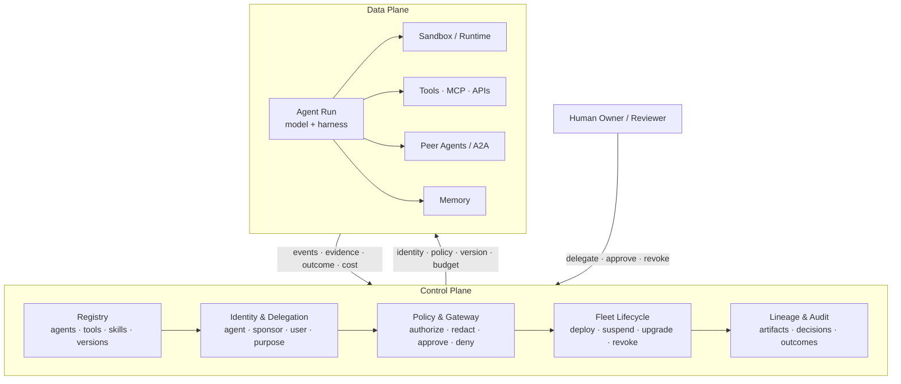

# Chapter 18: Agent Fleets, Identity, and the Control Plane

Loop engineering asks how one autonomous task should start, act, verify, and stop. Production systems now face a larger unit of design: many agents, built by many teams, operating across multiple environments and organizations. The hard questions move from the individual loop to the fleet. Which agents exist? Who published this version? On whose behalf is it acting? Which tools, data, money, and network destinations may it reach? How can an operator suspend, upgrade, or revoke a running agent? What evidence connects an action to the exact identity, policy, model, and artifact that produced it?

The emerging answer is an **agent control plane**. The concept borrows a distinction from distributed systems. The *data plane* performs the work: model calls, tool calls, code execution, and agent-to-agent messages. The *control plane* declares and enforces the operating state around that work, including registry, identity, authorization, routing, lifecycle, policy, lineage, and audit. It does not make an individual agent smarter; it makes a fleet governable.

### 18.1 From Agent Program to Agent Fleet

A single agent can be configured with a prompt, a few tools, and a local state file. At fleet scale, local configuration can no longer answer every operational question. New problems appear:

- duplicate or abandoned agents with unclear ownership;
- several versions sharing a name but not behavior;
- credentials copied into prompts, sandboxes, or environment variables;
- tool access that outlives the task or user who authorized it;
- policy applied differently across chat, scheduled runs, and A2A delegation;
- incidents where no one can reconstruct which artifact or authority caused an action.

The platform shift in §9.2 anticipated this broader scope. A fleet needs a source of truth for agents and capabilities, a runtime authority that can issue and revoke task-scoped access, and lifecycle services that reconcile what *should* be running with what *is* running. AgentOps (Ch 17) keeps the system running and improves it throughout its lifecycle. The control plane provides the shared governance layer on which those operations depend.

The boundary should remain explicit:

- **Data plane:** inference, retrieval, tool execution, sandbox processes, messages, and results.
- **Control plane:** definitions, identities, policy decisions, placement, versions, budgets, revocation, and audit.

The central design move is to keep policy decisions out of the probabilistic parts of the data path wherever possible. The agent may propose an action; deterministic control-plane services decide whether the named identity may perform that operation in the current context.

### 18.2 Agent Identity: Who—or What—Is Acting?

User identity alone is not enough. One user may launch several agents with different purposes and privileges. An agent may continue on a schedule after the initiating session ends, delegate work to another agent, or run alongside other versions of itself. **Agent identity** is the durable machine identity of the agentic principal. It is distinct from the human, service account, runtime process, and model involved in a particular run.

NIST's concept paper on software-agent identity and authority breaks the problem into identification, authentication, authorization, delegation, audit, and non-repudiation. It highlights prompt injection and confused-deputy behavior as reasons that ordinary service identity is insufficient ([NIST — Identity and Authorization for Software Agents](https://www.nist.gov/news-events/news/2026/02/new-concept-paper-identity-and-authority-software-agents)). In practice, an identity record should answer:

- **Principal:** which agent definition and version is acting?
- **Sponsor:** which person or organization owns it?
- **Delegator:** on whose behalf is this particular run acting?
- **Purpose:** what bounded task or workflow justified the authority?
- **Runtime:** which harness, model, sandbox image, and policy versions are executing?
- **Lifetime:** when was the identity issued, and when does it expire or become revocable?

Do not represent this entire chain with one long-lived API key. A fleet should use workload identity and short-lived task tokens, together with explicit delegation chains. The agent authenticates as itself. The authorization service then combines that identity with the delegating user, tenant, purpose, environment, and requested operation. This separation prevents a low-risk research agent from silently inheriting all the authority of the human who launched it.

### 18.3 The Agent Registry

An **agent registry** is the fleet's inventory and discovery layer. It tells humans, orchestrators, gateways, and other agents what exists and which artifact they are about to trust. Google Cloud's Agent Registry models agents alongside MCP servers, endpoints, skills, skill revisions, and publishers. AWS Agent Registry and Microsoft 365's Agent Registry reflect the same shift from scattered deployment URLs to governed catalogs ([Google Cloud — Agent Registry Overview](https://docs.cloud.google.com/agent-registry/overview); [AWS — Agent Registry in AgentCore](https://aws.amazon.com/about-aws/whats-new/2026/04/aws-agent-registry-in-agentcore-preview/); [Microsoft — Agent Registry](https://learn.microsoft.com/en-us/microsoft-365/admin/manage/agent-registry?view=o365-worldwide)).

A useful registry entry contains more than a name and description:

- immutable agent and version identifiers;
- publisher and accountable owner;
- supported tasks, input/output contracts, and endpoints;
- tool, MCP, skill, memory, model, and sandbox dependencies;
- requested permissions, data classes, network destinations, and budget class;
- eval and security attestation for the version;
- deployment status, deprecation date, and revocation state;
- lineage to the source, build, configuration, and policy bundle.

Discovery and governance must meet at the registry. Search results should be filtered to the agents the caller may invoke, and orchestration should resolve an immutable version rather than a mutable display name. Registration is not the same as approval: a new entry may be visible as a draft without being authorized for production traffic. Promotion should require ownership, eval, security, and policy gates. Before a version is deprecated or removed, the registry should identify everything that depends on it.

### 18.4 Runtime Authorization and Delegation

Registration says what an agent *is*. Authorization decides what a particular run *may do now*. The authority granted to one run should be narrower than the union of everything the agent might ever need.

A robust flow is:

1. A user or service starts a run with a stated purpose and tenant.
2. The control plane resolves an approved agent version.
3. Policy computes the permitted scope from the intersection of the agent's capabilities, the delegator's authority, the task's needs, the environment, and the risk.
4. An identity broker issues short-lived, audience-bound credentials or capability tokens.
5. Proxies attach credentials at the tool boundary; raw secrets do not enter the model context or sandbox.
6. Every use records the identity, delegation chain, policy version, operation, resource, and result.
7. The lease is revoked when the run completes or times out, or when a policy change or incident requires it.

AWS AgentCore Identity illustrates how this pattern appears in a product: agent identities, credential providers, and delegated access to external resources without embedding user credentials in agent code ([AWS — AgentCore Identity](https://aws.amazon.com/blogs/machine-learning/introducing-amazon-bedrock-agentcore-identity-securing-agentic-ai-at-scale/)). The underlying architecture is vendor-neutral: issue authority just in time and present it only at the boundary where it is needed.

A2A delegation should make the chain of authority explicit. Agent A should not send Agent B a bearer token containing all of A's privileges. Instead, it should request a narrower token that names B as the audience, identifies the delegated task as the purpose, specifies the permitted operation and resource, and expires quickly. If B delegates again, the new authority cannot exceed the authority carried through the existing chain. This blocks **trust escalation** (Ch 3): a low-trust worker cannot persuade a privileged parent to turn its result into a high-privilege action without a new policy decision.

### 18.5 The Agent Gateway and Policy Enforcement

The **agent gateway** is the enforcement point on the data-plane path. It can broker model calls, MCP and API tool calls, A2A messages, network egress, and sometimes memory access. Instructions such as "never send secrets" are probabilistic. A gateway can instead enforce the rule deterministically by denying an unauthorized destination, stripping a credential, enforcing a budget, or requiring human approval.

Each request should arrive with a signed or otherwise verifiable execution envelope:

```text
agent identity + version
delegating principal + tenant
task purpose + run/session id
requested action + resource
policy and configuration versions
budget and expiry
trace/span correlation id
```

Policy can return more than a binary allow-or-deny decision. Useful outcomes include **allow**, **deny**, **allow with redaction**, **allow in a stronger sandbox**, **require human approval**, and **allow with a lower budget or read-only scope**. Both the decision and its inputs become part of the trace. This makes the stake-proportionate controls of Chapter 15 and the containment matrix of Chapter 5 consistent across the fleet, rather than leaving each team to reimplement them as conventions.

Gateway placement matters. A central gateway provides uniform enforcement and visibility, but it can become a latency bottleneck and a single point of failure. Local sidecars reduce latency and can survive partial disconnection, but they make policy distribution and evidence collection harder. Mature designs often separate centralized policy administration from distributed enforcement. They use signed policy bundles, fail-closed rules for consequential actions, and carefully limited fail-open behavior for low-risk reads only.

### 18.6 Fleet Lifecycle: Reconcile, Suspend, Upgrade, Revoke

An agent needs more lifecycle states than deployed and stopped. A useful fleet state machine includes **draft**, **evaluated**, **approved**, **deployed**, **suspended**, **deprecated**, **revoked**, and **retired**. Runs have a separate state machine—queued, active, waiting for approval, checkpointed, completed, failed, or canceled—and sandboxes have another (Ch 7). The control plane connects these lifecycles without treating them as the same thing.

The governing pattern is reconciliation: compare the declared state with the observed state, then take deterministic action to close the gap.

- If an agent version is revoked, block new runs, revoke credentials, and suspend or terminate affected in-flight runs according to risk.
- If a policy changes, identify which sessions require re-authorization rather than letting old authority persist indefinitely.
- If a version is upgraded, canary it against a bounded traffic slice while retaining the old version for rollback (Ch 17).
- If an owner leaves or a publisher is compromised, traverse the registry's dependency graph to find the agents, skills, MCP servers, and schedules that inherit that trust.
- If a run loses its connection, preserve the durable session and reacquire a sandbox or worker rather than duplicating the task (Ch 7).

Fleet kill switches belong at this layer. They should revoke capabilities at gateways and identity brokers, not merely send "stop" to a model. Scope matters: operators need to stop one run, one version, one publisher, one tenant, one tool dependency, or the entire fleet without reaching for the broadest switch in every incident.

### 18.7 Lineage, Audit, and Non-Repudiation

Ordinary logs answer, "What request reached this service?" An agent audit must answer a longer causal question:

> Which user or service delegated which purpose to which agent version, running under which model, harness, tools, memory, sandbox, and policy; which evidence led to which decision; which authority allowed the side effect; and who approved or overrode it?

The answer takes the form of a lineage graph. It connects registry artifacts, build attestations, identities, delegation events, session and run IDs, trace spans, policy decisions, human approvals, tool results, memory writes, and final outcomes in the environment. Stable content hashes or immutable version identifiers prevent a later edit from rewriting the history of what actually ran.

Use the term **non-repudiation** carefully. A signed event can show that a particular workload identity produced a request and that a policy service authorized it. It cannot prove that a human understood an approval dialog or that a model's natural-language rationale is truthful. A strong audit therefore combines cryptographic integrity with operational evidence: append-only logs, trusted timestamps, credential and policy versions, outcome checks, approval identity, and retention rules. Store enough to investigate, but apply the privacy discipline of Chapter 17. An audit system that indiscriminately preserves prompts, secrets, and personal data creates a second security problem.

Lineage also makes evaluation and improvement safer. A production correction can be traced to the exact artifact that failed, converted into a redacted regression case, and used to promote a new version without mutating the old one (Ch 12). The control plane preserves the chain of custody; the eval gate supplies the evidence for promotion.

### 18.8 Open Problems in the Control Plane

The control plane is still emerging. Its most important open problems include:

- **Portable identity and delegation.** Agent Cards and registries describe capability, but cross-platform standards for principal identity, delegation chains, revocation, and purpose-bound authority remain immature.
- **Policy composition.** User policy, tenant policy, agent policy, tool policy, data-residency rules, and human approvals can conflict. Their precedence and explanations need portable semantics.
- **Memory governance.** Provenance, permission-at-retrieval, expiry, correction, and poisoning defense are not consistently represented across memory products.
- **Cross-organizational lineage.** A2A chains cross audit domains; each organization may expose too little evidence for the other to assess trust, or too much private trace data.
- **Evaluator authority.** A model judge can block a deployment or trigger an incident. Its identity, calibration, conflicts of interest, and appeal path need the same rigor as those of other privileged decision-makers (Ch 10).
- **Fleet-level supervision.** Risk ranking, alert deduplication, and meaningful human control must scale without turning the operator into a rubber stamp (Ch 15).
- **Control-plane compromise.** Centralized registries, policy services, and identity brokers are high-value targets. Their blast radius demands separation of duties, signed artifacts, minimal trust roots, and independent recovery paths.

The standards remain unsettled, but the direction is clear: agents are becoming principals in distributed systems. A mature harness is no longer just a loop around a model. It is a governed relationship among identities, artifacts, policies, environments, evidence, and people.

---

## Diagram: The Agent Control Plane



*The data plane does the work; the control plane decides which identity, artifact, authority, lifecycle, and evidence govern that work.*

---

## Key Takeaways

- **The fleet is the next unit beyond the loop**: loop engineering governs one task; a control plane governs many agents, versions, environments, and organizations.
- **Separate data plane from control plane**: agents propose and execute work; deterministic services register artifacts, issue authority, enforce policy, reconcile lifecycle, and preserve evidence.
- **Agent identity is distinct from user and runtime identity**: bind every run to an agent version, sponsor, delegator, purpose, environment, and expiry.
- **A registry is a governed source of truth**: it should include ownership, dependencies, permissions, attestations, deployment state, and immutable lineage—not only discovery metadata.
- **Authority should be just-in-time and purpose-bound**: use short-lived, audience-scoped credentials attached at the tool boundary, with delegation that can only narrow.
- **The gateway turns policy into enforcement**: allow, deny, redact, strengthen isolation, reduce scope, or require approval—and record why.
- **Lifecycle management is reconciliation**: manage agent definitions, runs, and sandboxes independently; make suspension, migration, canary deployment, rollback, and revocation first-class operations.
- **Audit is a causal lineage graph**: connect user delegation, agent and policy versions, evidence, authorization, side effects, and outcomes while minimizing sensitive content.

## Further Reading

- NIST, *Identity and Authorization for Software Agents*, Feb 2026. https://www.nist.gov/news-events/news/2026/02/new-concept-paper-identity-and-authority-software-agents
- Google Cloud, *Agent Registry Overview*, 2026. https://docs.cloud.google.com/agent-registry/overview
- AWS, *AWS Agent Registry in Amazon Bedrock AgentCore (Preview)*, Apr 2026. https://aws.amazon.com/about-aws/whats-new/2026/04/aws-agent-registry-in-agentcore-preview/
- AWS, *Introducing Amazon Bedrock AgentCore Identity: Securing Agentic AI at Scale*, 2026. https://aws.amazon.com/blogs/machine-learning/introducing-amazon-bedrock-agentcore-identity-securing-agentic-ai-at-scale/
- Microsoft, *Agent Registry in the Microsoft 365 Admin Center*, 2026. https://learn.microsoft.com/en-us/microsoft-365/admin/manage/agent-registry?view=o365-worldwide
- Anthropic Safeguards Research Team, *How We Contain Claude*, May 2026. https://www.anthropic.com/engineering/how-we-contain-claude
- Google Cloud, *Agent Executor: Google's Distributed Agent Runtime*, 2026. https://cloud.google.com/blog/products/ai-machine-learning/agent-executor-googles-distributed-agent-runtime/
- AWS, *AgentOps: Operationalize Agentic AI at Scale with Amazon Bedrock AgentCore*, 2026. https://aws.amazon.com/blogs/machine-learning/agentops-operationalize-agentic-ai-at-scale-with-amazon-bedrock-agentcore/
