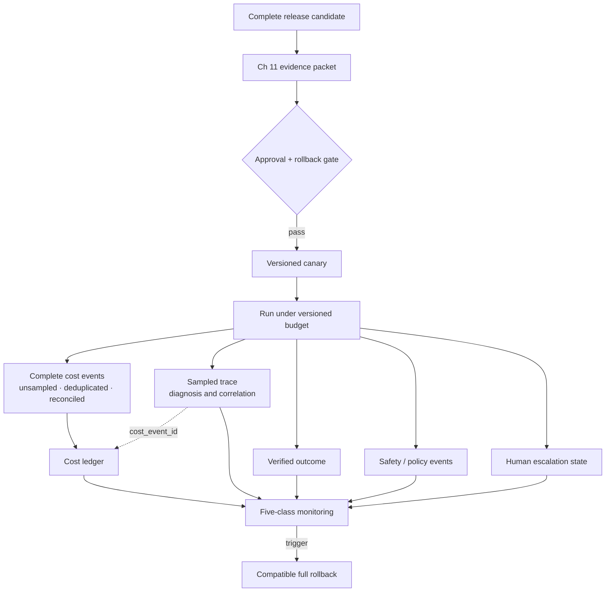

# Chapter 18: AgentOps — Cost, Privacy, and Production Operations

The earlier chapters define how a model-plus-harness system executes, recovers, and produces evaluation evidence. Production adds a different responsibility: operators must keep that exact configuration within cost, privacy, reliability, and release boundaries while real runs are in flight.

This book uses **AgentOps** as a local umbrella term for that operating discipline. It is not the name of one mandatory product or an assertion that every vendor uses the same taxonomy. [Chapter 10](./10-state-event-history-production-factors.md) separates execution state, event history, traces, and audit records; [Chapter 11](./11-evaluation.md) defines release evidence; and [Chapter 17](./17-trace-driven-iteration.md) explains how sampled traces support diagnosis without becoming a system of record. This chapter preserves those boundaries.

### 18.1 Cost Needs a Complete Ledger, Not Just a Trace

A **cost ledger** is the complete, deduplicated set of billable and externally spendable events for a declared accounting scope. A trace may link to those events and make them easier to diagnose, but it is not automatically the ledger and is not the audit record.

OpenTelemetry sampling can decide not to record a span, not to export a recorded span, or to drop its attributes, events, and status. It also permits collection limits that drop span fields ([OpenTelemetry — Trace SDK](https://opentelemetry.io/docs/specs/otel/trace/sdk/)). Therefore:

- a sampled trace cannot prove complete spend;
- a trace backend that loses or delays exports cannot close a billing period by itself;
- only **complete and unlost cost events or cost spans** may feed the cost ledger;
- if cost spans are used, their collection path must be unsampled for the accounting scope, loss-detected, idempotently ingested, and reconciled;
- the trace should carry `cost_event_id` or provider-call references so an operator can join diagnostic spans to ledger entries without collapsing their guarantees.

A useful cost event contains at least:

```text
cost_event_id, session_id, run_id, step_id, action_id, attempt_id, call_id
tenant_id, provider_call_id, model_or_tool_version, billing_item
input_units, output_units, cached_units, reasoning_units
price_catalog_version, amount, currency, external_spend
retry_of, fallback_from, status, occurred_at, recorded_at
```

`amount` must be computed under a pinned price/catalog version or copied from an authoritative provider record. Late events, duplicate delivery, credits, and price corrections need explicit adjustment entries rather than mutation that erases history. Reconcile ledger totals against provider invoices and tool/vendor receipts, and alert on missing call IDs or unexplained differences.

Cost reporting should state both the unit of analysis and the population: per model call, tool call, run, successful run, tenant, release version, or accounting window. A low cost per request can conceal expensive failures if abandoned and retried runs are excluded.

### 18.2 Define Latency Percentiles Where They Are Used

This chapter uses the following local definitions for a declared population and time window:

- **p50** is the median observed latency;
- **p95** is the smallest reported threshold at or below which at least 95% of observations fall;
- **p99** is the corresponding 99% threshold.

Every chart or SLO must say what was measured: end-to-end run latency, model-call latency, tool latency, queue time, approval wait, or another interval. It must also name the time window, release/configuration, sample count, timeout treatment, and whether cancelled or failed runs are included. Do not average independently computed percentiles as though that recreated the combined distribution; aggregate compatible observations or merge an appropriate histogram/sketch.

Report latency beside outcome and cost. A faster run that times out more often or skips required verification is not an operational improvement.

### 18.3 Four Cache Types, Four Correctness Contracts

“Cache” is not one mechanism. This book uses the canonical distinctions introduced in [Chapter 3](./03-context-as-finite-resource.md):

| Cache | Reuse boundary | What is reused | Correctness condition |
|---|---|---|---|
| **Per-request KV cache** | Within one generation/request | The model's internal key/value state for an already processed prefix | Same live generation and compatible model/runtime state |
| **Provider prompt cache** | Across separate provider requests | Provider-managed computation for an exact reusable prompt prefix | Provider-specific exact-prefix, model, retention, and eligibility rules |
| **Application response cache** | Across application requests | A completed response for an exact normalized request | Exact request plus compatible authorization, tenant, versions, freshness, and policy |
| **Semantic cache** | Across application requests | A completed response for a meaning-similar request | Similarity **and** authorization, tenant, version, freshness, provenance, and risk gates all pass |

Provider prompt caching does not reuse the final response: the provider still generates an output for the current request. As a dated product example rather than a portable contract, OpenAI's documentation, checked on **2026-07-31**, describes cache hits for exact prompt prefixes and provider-specific eligibility and retention behavior ([OpenAI — Prompt caching](https://developers.openai.com/api/docs/guides/prompt-caching)). As another dated product example, Microsoft Azure API Management's documentation, checked on **2026-07-31**, describes semantic caching that can return a stored response for meaning-similar prompts and exposes a similarity threshold ([Microsoft — Semantic caching in Azure API Management](https://learn.microsoft.com/en-us/azure/api-management/azure-openai-enable-semantic-caching)). Product behavior may change; these examples do not redefine the four categories.

Semantic similarity is never proof of authorization or factual equivalence. A semantic cache key and admission/lookup gate must include or bind all of the following:

```text
tenant_id
user_id and authorization_scope
model_id and model version
normalized prompt/request and prompt-template version
tool schemas, tool implementations, and relevant tool-result versions
retrieval index, corpus snapshot, filters, and retrieval configuration
policy and safety-rule version
TTL / freshness deadline
invalidation dependencies and invalidation epoch
response provenance: source run, response, citations/artifacts, and creation time
```

The cache must re-check the current caller's authorization and current policy at lookup time. Tenant separation is mandatory; a shared embedding index does not make cross-tenant response reuse safe. Invalidation must cover source-document changes, permission changes, deletions, model/prompt/tool/retrieval/policy releases, and discovered bad responses. TTL is a maximum freshness bound, not a substitute for invalidation.

Disable semantic response reuse by default for sensitive, personalized, or high-impact decisions. Enable a use case only after tests measure false-hit behavior, stale-answer behavior, cross-scope denial, provenance display, invalidation propagation, and safe miss/fallback behavior. Cache hits and misses should still emit complete cost events and policy-relevant records.

### 18.4 A Run Budget Is a Vector

A single token cap is not a production budget. Each run needs a versioned budget vector with at least:

| Dimension | Examples of what counts | Enforcement question |
|---|---|---|
| **Tokens** | input, output, reasoning, cached read/write units | Can the next call start and still leave a reserve for a safe conclusion? |
| **Dollars** | model, retrieval, storage, grader, and tool charges | Will the planned action exceed the run or tenant monetary ceiling? |
| **Tool calls** | attempted calls, including failed calls and branches | Has the loop or fan-out reached its call limit? |
| **Wall time** | queue, model, tool, approval, retry, and cleanup time | Is there enough deadline remaining to finish or stop safely? |
| **External spend** | purchases, transfers, paid API actions, cloud provisioning | Is the side effect separately authorized within amount and destination limits? |
| **Retry/fallback** | retries, hedges, model fallbacks, recovery attempts | Is another attempt allowed, and is its side-effect outcome known? |

The runtime, not the model's prose, owns the counters and rejects work that would cross a hard boundary. The model may receive remaining-budget state to plan, but it cannot grant itself more budget. Soft thresholds can trigger compaction, cheaper routing, reduced fan-out, or human escalation; hard thresholds transition to a declared terminal or paused state.

Reserve budget for verification, durable state writes, cleanup, and a useful handoff. Count retries and fallbacks against both their own limit and every resource they consume. When an earlier side effect is `unknown`, do not spend the retry budget on blind repetition; resolve or escalate it under [Chapter 10](./10-state-event-history-production-factors.md)'s recovery state machine. Budget events that enforce hard ceilings must be complete durable state, not reconstructed from sampled traces.

### 18.5 Privacy Is an End-to-End Data Lifecycle

The NIST Privacy Framework is a voluntary tool for identifying and managing privacy risk through enterprise risk management, not a product-specific telemetry checklist ([NIST — Privacy Framework](https://www.nist.gov/privacy-framework)). For an agent harness, translate that risk discipline into controls across the entire data path:

| Lifecycle point | Required harness control | Evidence to retain |
|---|---|---|
| **Collection and context** | Minimize fields and documents; prefer handles or summaries; classify sensitivity before model/tool use | Purpose, data class, selected fields, source, lawful/organizational basis where required |
| **Redaction** | Remove secrets and unnecessary personal data before prompts, tool arguments, traces, eval fixtures, or support exports; keep access-controlled references when full data is needed | Redaction policy/version, detector result, exception/approval |
| **Retrieval** | Enforce tenant and user authorization before search and again before materialization; carry purpose and scope into filters | Principal, tenant, query/filter, corpus/index version, allow/deny decision |
| **Trace capture and storage** | Declare sampling separately from content capture; default to metadata; encrypt, access-control, and isolate trace stores; never treat sampling as redaction | Capture mode, sampling policy, destination, access log, retention class |
| **Retention** | Assign TTL/retention by data class and evidence purpose; expire caches, traces, memory, artifacts, and derived eval data deliberately | Retention decision, expiry, legal/incident hold where applicable |
| **Egress** | Allowlist provider/tool destinations, constrain region/account where required, redact/minimize payloads, and approve sensitive transfers | Destination, purpose, fields sent, credential audience, approval/policy decision |
| **Deletion** | Propagate deletion or revocation to application caches, semantic indexes, retrieval stores, memory, traces, artifacts, and downstream processors according to policy | Tombstone/request ID, affected objects, completion or documented exception |

Sampling reduces telemetry volume; it does not make retained content non-sensitive. Redaction reduces exposed content; it does not replace retrieval ACLs or egress policy. Retention expiry does not prove deletion unless downstream copies and derived artifacts are in scope and deletion completion is recorded.

### 18.6 Monitor Five Different Operational Questions

Do not put every signal into a single “agent health” score. Separate the questions, data completeness requirements, and owners:

| Signal class | What it asks | Example signals |
|---|---|---|
| **Service health** | Is the serving system available and within resource limits? | availability, request/error rate, queue depth, saturation, model/tool latency, p50/p95/p99 |
| **Agent outcome** | Did the run achieve the independently verified task result? | outcome-grader pass, environment-state success, incomplete/unknown outcomes, recovery success |
| **Safety/policy event** | Did a protected rule trigger or fail? | denial, approval, sandbox violation, cross-tenant attempt, sensitive egress, policy-version mismatch |
| **Cost** | What complete spend was incurred and how quickly are budgets consumed? | ledger amount per run/outcome/tenant/release, missing cost events, invoice variance, budget exhaustion |
| **Human escalation** | Can people review and resolve the work in time? | queue age, approval expiry, unresolved unknown side effects, override rate, handoff completion |

Service uptime cannot establish task success; the agent's statement that it is done cannot establish an external outcome; a sampled trace count cannot establish total cost or policy-event frequency. Each SLO must name its authoritative source and completeness assumption. Dashboards may correlate the five classes by `run_id` and release version, while alerts route to the owner who can act.

Production failures can become [Chapter 11](./11-evaluation.md) regression candidates only after the [Chapter 17](./17-trace-driven-iteration.md) intake process addresses redaction, consent/licensing, deduplication, distribution shift, and evidence reconstruction. Incident investigation still uses traces together with durable histories, ledger records, audit records, configuration, and external-system state.

### 18.7 Release the Whole Model–Harness Configuration

The unit of release is a versioned configuration, not “the prompt” or “the model.” Its manifest must pin at least:

```text
model/provider and inference settings
prompt/instruction templates and context policy
tool schemas and tool implementations
retrieval index/corpus snapshot and retrieval configuration
memory schema and memory policy
sandbox image, capabilities, network policy, and resource limits
policy/approval rules and runtime/router versions
grader versions and evaluation contract
run budgets, retry/fallback policy, and cache policy
```

Any change to one of these components creates a new release candidate and reruns the affected eval slices. OpenAI's evaluation guidance emphasizes reporting the exact tested system, harness, tools, budget, safeguards, and validity checks because those choices determine what an evaluation claim supports ([OpenAI — Trustworthy Third-Party Evaluations](https://openai.com/index/trustworthy-third-party-evaluations-foundations/)).

Carry forward [Chapter 11](./11-evaluation.md)'s **release evidence packet**: claim and scope, immutable configuration, task-suite and slice versions, isolated trial trajectories, grader calibration, outcome/process/safety results, uncertainty, cost and latency, known limitations, exception owner/expiry, approval, canary plan, post-release monitors, and rollback trigger. A release gate passes only when that packet supports the declared claim.

Deploy the approved unit as a canary, correlate every run and ledger entry with its release version, and compare outcome, safety, cost, service health, and escalation signals. Rollback must restore a compatible complete configuration, preserve durable-run migration rules, and be executable when the declared trigger fires. The candidate cannot approve itself or edit its holdout graders.

### 18.8 Governance and Vendor Claims Need Scope and Dates

NIST AI RMF is voluntary risk-management guidance, and OWASP's GenAI project publishes engineering risk guidance; neither is a jurisdiction-specific legal determination ([NIST — AI Risk Management Framework](https://www.nist.gov/itl/ai-risk-management-framework); [OWASP — Top 10 for LLM Applications](https://genai.owasp.org/llm-top-10/)). ISO/IEC 42001:2023 specifies an AI management-system standard, while Regulation (EU) 2024/1689 is the official text of the EU AI Act ([ISO — ISO/IEC 42001:2023](https://www.iso.org/standard/42001); [European Union — Regulation (EU) 2024/1689](https://eur-lex.europa.eu/eli/reg/2024/1689/oj/eng)). A certification, framework mapping, or product feature does not by itself prove that a particular deployment complies with every applicable obligation.

> **Scope note — effective 2026-07-31.** Legal obligations depend on the deployment's jurisdiction, provider/deployer role, use case, affected people, contracts, and the provisions in force on the relevant date. Confirm current official text and qualified counsel for the actual deployment. This chapter is engineering guidance, not legal advice.

Treat rapidly changing vendor “AgentOps,” gateway, observability, cache, evaluation, and governance products only as dated implementation examples. Record the product, documented behavior, region/tier, source URL, and verification date; keep the architecture and release contract independent of the vendor label.

---

## Diagram: Production Evidence and Control Loops



The trace helps explain a run; complete domain records enforce budgets, accounting, policy, recovery, and evidence requirements.

---

## Key Takeaways

- **A sampled trace is not a cost ledger or audit record:** only complete, unlost, deduplicated cost events or cost spans can close the ledger, and sampling breaks that completeness.
- **Define percentiles locally:** state the population, window, interval, configuration, sample count, and timeout/failure treatment for p50/p95/p99.
- **Keep four cache contracts distinct:** per-request KV, provider prompt, application response, and semantic caches reuse different things at different scopes.
- **Semantic cache reuse is authorization-sensitive:** bind tenant, user/auth scope, model, prompt, tool, retrieval, policy version, TTL, invalidation, and provenance; disable sensitive, personalized, and high-impact reuse by default.
- **Budget a vector, not only tokens:** enforce tokens, dollars, tool calls, wall time, external spend, and retry/fallback in durable runtime state.
- **Privacy spans the lifecycle:** minimization, redaction, retrieval ACLs, trace capture/storage, retention, egress, and deletion need separate controls and evidence.
- **Monitor five questions separately:** service health, agent outcome, safety/policy events, cost, and human escalation have different authoritative sources.
- **Release and roll back the complete configuration:** carry Chapter 11's evidence packet and Chapter 17's approval, canary, monitoring, and rollback discipline forward.

## Further Reading

- OpenTelemetry, *Trace SDK*. https://opentelemetry.io/docs/specs/otel/trace/sdk/
- OpenAI, *Prompt caching* (product documentation; checked 2026-07-31). https://developers.openai.com/api/docs/guides/prompt-caching
- Microsoft, *Enable semantic caching for LLM APIs in Azure API Management* (product documentation; checked 2026-07-31). https://learn.microsoft.com/en-us/azure/api-management/azure-openai-enable-semantic-caching
- NIST, *Privacy Framework*. https://www.nist.gov/privacy-framework
- NIST, *AI Risk Management Framework*. https://www.nist.gov/itl/ai-risk-management-framework
- OWASP, *Top 10 for LLM Applications*. https://genai.owasp.org/llm-top-10/
- ISO, *ISO/IEC 42001:2023*. https://www.iso.org/standard/42001
- European Union, *Regulation (EU) 2024/1689*. https://eur-lex.europa.eu/eli/reg/2024/1689/oj/eng
- OpenAI, *A Shared Playbook for Trustworthy Third-Party Evaluations*. https://openai.com/index/trustworthy-third-party-evaluations-foundations/
