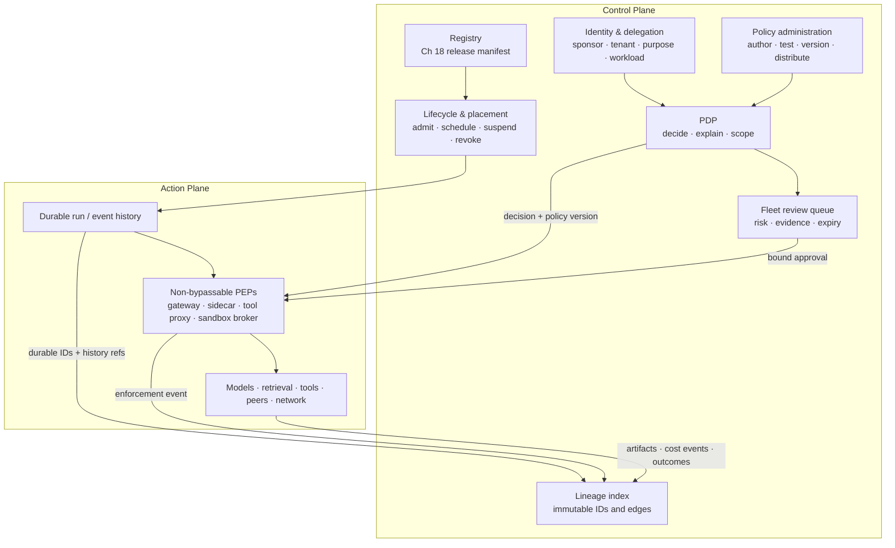

# Chapter 19: Agent Fleets and the Control Plane

Earlier chapters govern one model–harness system: how it receives authority, executes a run, survives failure, asks for approval, and produces evidence. A fleet adds a different coordination problem. Many teams may publish many versions, tenants may share infrastructure without sharing authority, and work may move across runtimes or be delegated to other agents. Operators need one coherent answer to what may run, on whose behalf, under which release and policy, and how that authority can be withdrawn.

This book uses **agent control plane** as an adopted distributed-systems architectural convention, not as the name of one product or the only industry-standard decomposition. Kubernetes, for example, documents a control plane that manages cluster state while worker nodes run workloads; the analogy is useful, but an agent fleet is not a Kubernetes cluster and need not copy its component boundaries ([Kubernetes — Components](https://kubernetes.io/docs/concepts/overview/components/)). Here, the **action plane** performs model calls, retrieval, tool calls, code execution, and agent-to-agent exchanges. The **control plane** manages fleet-wide registry, identity, policy administration and decisions, placement, lifecycle, review queues, and evidence indexes. Enforcement still occurs at explicit, non-bypassable points on the action path.

### 19.1 The Control Plane Governs; the Runtime Executes

Keep four responsibilities distinct:

| Responsibility | Owns | Does not become |
|---|---|---|
| **Model** | Proposals: text, plans, candidate actions, and interpretations | The executor, credential holder, policy authority, or source of final truth |
| **Harness** | Model-adjacent context assembly, tool mediation, validation, loop control, and evidence capture | The fleet-wide source of release, tenant, or identity truth |
| **Runtime** | Durable execution state, event history, queues, retries, scheduling, workers, sandboxes, and cancellation | The policy author or complete audit system merely because it stores events |
| **Control plane** | Registry, identities, policy administration and decisions, desired state, placement constraints, revocation, review queues, and lineage indexes | A mandatory single process, vendor product, or centralized hop for every action |

Central administration can coexist with distributed enforcement. A control-plane API may publish a desired release, signed policy bundle, or revocation epoch; local gateways, sidecars, tool proxies, and sandbox brokers then enforce that state close to the protected resource. Conversely, putting a service on the network and calling it a “control plane” does not give it authority. Its decisions matter only when every relevant action reaches an enforcement point that can block it.

The control plane also does not replace [Chapter 10](./10-state-event-history-production-factors.md)'s runtime contract. If a worker crashes, event history and checkpoints recover the run. The control plane may decide where and whether it is allowed to resume, but it should not reconstruct workflow state from a dashboard or sampled trace.

### 19.2 The Registry Stores Chapter 18's Release Unit

Do not invent a second, weaker “agent record.” The immutable object registered and promoted by the fleet is the complete **release manifest** defined in [Chapter 18](./18-agentops.md): model/provider and inference settings; prompt and context policy; tool schemas and implementations; retrieval snapshot and configuration; memory schema and policy; sandbox image, capabilities, network policy, and limits; policy/approval rules and runtime/router versions; grader and evaluation contract; and budgets, retry/fallback, and cache policy.

The registry adds fleet-management bindings around that manifest rather than copying its fields into mutable columns:

```text
release_id, manifest_digest, release_manifest_ref
publisher_id, accountable_sponsor_id, owner_team_id
release_state, approval_ref, evidence_packet_ref
eligible_tenants, eligible_workload_classes, placement_constraints
endpoints_and_protocol_versions, dependency_release_ids
desired_deployments, observed_deployments
created_at, deprecates_at, revoked_at, revocation_reason
```

Resolve a display name to an immutable `release_id` before a run starts, and stamp that ID into the run. Registration is not approval: `draft`, `evaluated`, `approved`, `deployed`, `suspended`, `deprecated`, `revoked`, and `retired` are distinct fleet states. A release-state transition should name the evidence packet and accountable approver; rollback selects another complete, compatible manifest rather than swapping only the prompt or model.

Discovery metadata is useful but insufficient. A public capability card may help another agent find an endpoint, while the internal registry determines whether that exact release is approved for this tenant, purpose, workload class, and environment. Dependency edges must be queryable so revoking a tool, policy bundle, sandbox image, publisher, or model can identify affected releases and running work.

### 19.3 Identity Is a Chain, Not One API Key

A fleet action needs several identities and constraints. “The agent did it” is too vague, and user identity alone loses which release and workload actually acted. The control plane should bind at least:

```text
release_version_id          # immutable Chapter 18 release
sponsor_id                  # accountable person or organization
delegator_chain             # subject and every acting/delegating principal
tenant_id                   # isolation and policy domain
purpose_id                  # bounded task/workflow justification
runtime_id                  # durable execution service and version
workload_id                 # concrete process/service identity
credential_audience         # intended resource/service
issued_at, not_before, expires_at
credential_id, revocation_epoch, revocation_status
session_id, run_id
```

Keep the release identity, runtime identity, and workload identity separate. One release may have many concurrent workloads; one runtime may host many releases; replacing a process must not silently change the release or delegator. As one implementation building block rather than a required standard, SPIFFE defines a SPIFFE ID that uniquely identifies a workload and an SVID with which that workload proves the identity ([SPIFFE — Concepts](https://spiffe.io/docs/latest/spiffe-about/spiffe-concepts/)). It does not supply the sponsor, purpose, release manifest, or delegation semantics needed by this book, so those remain explicit control-plane claims.

Credentials should be short-lived, audience-bound, and presented only at the protected boundary. Raw credentials must not enter model context, messages, generated code, or general-purpose artifact storage. The PEP verifies issuer, subject/actor chain, tenant, purpose, audience, scope, time bounds, revocation state, release status, and the requested resource/action before use.

### 19.4 Delegation Can Only Narrow Authority

This book adopts a monotonic delegation rule:

```text
child_effective_authority =
    parent_effective_authority
    ∩ approved_child_release_policy
    ∩ tenant_and_environment_policy
    ∩ delegated_actions_and_resources
    ∩ purpose, audience, budget, and time bounds
```

Every hop appends an actor to the chain and can remove actions, resources, destinations, budget, or time. It cannot add authority that the parent did not possess. If broader authority is genuinely required, an authorized principal must make a new grant through the policy and approval path; the child cannot infer it from task text.

OAuth 2.0 Token Exchange distinguishes a subject from an actor and defines `audience`, `resource`, and `scope` parameters, but it explicitly leaves token trust and much deployment policy out of scope ([RFC 8693 — OAuth 2.0 Token Exchange](https://www.rfc-editor.org/rfc/rfc8693.html)). It can encode part of a delegation flow; it does not itself guarantee this book's narrowing invariant, revocation propagation, or purpose binding. The issuer and PDP must enforce those properties.

Most importantly, **a child's output carries information, not the child's permissions**. When parent A accepts a report, plan, artifact, or tool result from child B, A does not inherit B's credential and B does not acquire A's authority. If A wants to turn that output into a privileged action, A submits a new action proposal under A's current identity and policy. This is the fleet-scale form of preventing trust escalation and confused-deputy behavior.

### 19.5 Separate Policy Administration, Decision, and Enforcement

Three functions must remain visible even if one product implements several of them:

| Function | Contract | Typical outputs |
|---|---|---|
| **Policy administration** | Humans and governed automation author, review, version, test, approve, distribute, and retire policy bundles | Immutable policy version, signatures, rollout status, revocation epoch |
| **Policy decision point (PDP)** | Evaluates identity, tenant, release, resource, action, purpose, delegation, environment, budget, and policy | `allow`, `deny`, `redact`, `require_approval`, `sandbox`, narrower scope/budget, reason and decision ID |
| **Policy enforcement point (PEP)** | Intercepts the real request and applies the PDP decision before the protected operation occurs | Blocked or transformed request, approval gate, sandbox route, enforcement event |

There is a terminology trap here. NIST's Zero Trust glossary defines a **Policy Administrator (PA)** as the component that executes a policy engine's decision by commanding a PEP, and treats the policy engine plus PA as a PDP; that request-time PA is not the same as this book's broader policy-authoring and policy-lifecycle function ([NIST — Zero Trust Architecture Glossary](https://pages.nist.gov/zero-trust-architecture/glossary.html)). This chapter therefore writes **policy administration** for authoring/lifecycle and **PDP** for the complete request-time decision service.

A gateway, sidecar, tool proxy, network egress proxy, retrieval materializer, or sandbox broker **may** be a PEP. It qualifies only for the actions it non-bypassably mediates. For example, a tool proxy is not the PEP for shell egress if generated code can reach the network around it. NIST IR 7987 describes a PEP as performing a reference-mediation function; this book makes complete, tamper-resistant mediation an explicit fleet invariant ([NIST IR 7987 Rev. 1 — Policy Machine](https://nvlpubs.nist.gov/nistpubs/ir/2015/nist.ir.7987r1.pdf)). Consequential operations should fail closed when current identity, policy, approval, or revocation state cannot be established.

A prompt is **not** a PEP. “Never transfer money without approval” can help the model propose safely, but it cannot prevent a compromised or mistaken model from emitting a call. The mandatory approval from [Chapter 14](./14-human-agent-interaction.md) becomes real only when a PEP verifies an approval bound to the exact immutable action proposal before execution.

### 19.6 Lifecycle, Placement, and the Kill Switch

Release lifecycle, run lifecycle, and sandbox/worker lifecycle are related but not interchangeable. Revoking a release prevents new runs, yet an already-issued credential and an active run may continue unless their own states are reconciled. A controller should compare desired and observed state and make each consequence explicit:

- scheduling admits only an approved release for the tenant, purpose, workload class, region, and required isolation;
- a run owns durable states such as queued, active, waiting for approval, suspended, cancel-requested, completed, failed, and canceled;
- workers and sandboxes use leases so abandoned execution can be detected and recovered without duplicating the logical run;
- upgrades use the complete release unit and [Chapter 18](./18-agentops.md)'s canary, monitoring, rollback, and durable-run compatibility rules.

A fleet **kill switch is a coordinated state transition**, not a natural-language “stop” message. Depending on scope—credential, run, release, publisher, tenant, tool, or fleet—the control plane must:

1. advance the revocation epoch and revoke or invalidate affected credentials;
2. publish a deny rule to every relevant PEP and stop admission of new work;
3. request suspension or cancellation through the run lifecycle, stop renewing leases, and terminate sandboxes where policy requires;
4. reconcile in-flight actions whose side-effect outcome is `unknown` rather than blindly retrying them;
5. record acknowledgements, unreachable enforcement points, exceptions, and final observed state.

RFC 7009 standardizes an OAuth token-revocation request that invalidates a token and may also affect related tokens or the underlying grant, but access-token revocation support and propagation behavior depend on the implementation ([RFC 7009 — OAuth 2.0 Token Revocation](https://www.rfc-editor.org/rfc/rfc7009.html)). Therefore credential revocation is one required kill-switch actuator, not the whole mechanism. PEP denial closes still-open action paths, while runtime cancellation controls already-running work. A message to the model is at most an additional steering signal.

### 19.7 Trace, Event History, Audit, and Lineage Are Different Products

These records may share identifiers or storage infrastructure, but their contracts do not collapse:

| Evidence product | Canonical meaning | Completeness and use |
|---|---|---|
| **Trace** | Spans with timing, parent/link relationships, attributes, events, and status | Diagnostic and performance evidence; may be sampled or dropped. OpenTelemetry explicitly allows sampling decisions that discard span data ([OpenTelemetry — Trace API](https://opentelemetry.io/docs/specs/otel/trace/api/); [OpenTelemetry — Trace SDK](https://opentelemetry.io/docs/specs/otel/trace/sdk/)) |
| **Event history** | Ordered durable execution events for reconstructing workflow state and recovering progress | Runtime system of record for the declared workflow scope. Temporal, as a concrete example, durably persists an append-only Event History to recover after failure ([Temporal — Events and Event History](https://docs.temporal.io/workflow-execution/event)) |
| **Audit record** | Protected accountability record for a declared control scope | Requires the necessary principal, action, object, outcome, timestamps, integrity, retention, access, and completeness controls; NIST SP 800-53's Audit and Accountability family is the relevant control catalog, not a claim that ordinary logs already meet it ([NIST SP 800-53 Rev. 5](https://csrc.nist.gov/pubs/sp/800/53/r5/upd1/final)) |
| **Lineage** | Provenance graph connecting identities, versions, inputs, artifacts, decisions, actions, and outcomes | Supports causal queries across products; W3C PROV-DM supplies a stable entity/activity/agent and derivation vocabulary, while this chapter defines the fleet-specific graph ([W3C — PROV-DM](https://www.w3.org/TR/prov-dm/)) |

Temporal documentation also uses “audit log for debugging” informally for Event History ([Temporal — Events and Event History](https://docs.temporal.io/workflow-execution/event)). That does not make every event history this book's protected audit record. Likewise, an unsampled trace is still not automatically durable workflow history, and copying audit rows into a graph does not create lineage unless the causal edges and version identities are represented.

### 19.8 The Minimum Fleet Lineage Graph

Lineage should join existing authoritative records by immutable identifiers, not duplicate their mutable prose. For every consequential action, retain edges sufficient to traverse:

```text
session_id → run_id → step_id → action_id → attempt_id → call_id
run_id → release_id → manifest_digest → component artifacts
run_id → sponsor / delegator chain / tenant / purpose / runtime / workload
action_id → policy_decision_id → policy_version + decision inputs
action_id → approval_id → immutable proposal digest + reviewer + expiry
call_id → input/output artifact IDs → content hashes and source versions
call_id → cost_event_id → Chapter 18 cost ledger
action_id → enforcement_event_id → PEP identity and result
records → protected_audit_record_id + trace_id/span_id where available
action_id → external_effect_id → verified outcome or explicit unknown
```

The links matter more than collecting every payload. A reviewer should be able to ask which release and policy produced an expensive or harmful outcome, which runs depend on a revoked artifact, or whether every approved side effect has both a PEP event and an independently verified result. Preserve content hashes and protected references; minimize or redact sensitive prompt, memory, and tool content under [Chapter 18](./18-agentops.md)'s privacy lifecycle.

Cost is part of lineage without turning traces into accounting. Link the complete `cost_event_id` from Chapter 18's ledger to `call_id`, `run_id`, `tenant_id`, and `release_id`; never infer total fleet spend from sampled spans. Similarly, link the protected audit record rather than assuming the lineage index itself satisfies audit retention and integrity.

### 19.9 Fleet Review Is a Cross-Run Control Surface

[Chapter 14](./14-human-agent-interaction.md) defines the single-action approval contract: a mandatory approval is a runtime gate bound to the exact immutable proposal, not a conversational “looks good.” The fleet control plane owns the **cross-run review queue** that brings those proposals to the right reviewers.

Queue items should carry `tenant_id`, `release_id`, `run_id`, `action_id`, risk class, policy reason, evidence links, uncertainty, proposed side effect, resource version, proposal digest, requested approval scope, expiry, and current run/event state. Prioritize by risk, deadline, reversibility, uncertainty, and evidence quality—not arrival order or transcript length. Route by tenant, domain, region, separation-of-duties rule, and reviewer authority.

The queue is a view, not the authorization source. Approval is valid only when the PEP verifies its immutable binding. If the action arguments, resource version, identity chain, release, policy, risk class, scope, or expiry changes, mark the card stale and require a new decision. Cancellation or steering updates durable run state; closing a browser card does not cancel work. Queue SLOs should track age, expired proposals, reassignment, overrides, unresolved `unknown` side effects, and reviewer workload without turning silence into approval.

### 19.10 Dated Standards Snapshot

No source below defines this entire control plane. Record protocol and product status with a date because these surfaces change:

| Surface | Status verified **2026-07-31** | What it covers here—and what it does not |
|---|---|---|
| **A2A** | Latest released specification shown as **1.0.0** | Agent discovery through Agent Cards, messages, tasks, cancellation, and interoperability. The specification explicitly leaves the scope, representation, validity, and revocation semantics of in-task authorization to implementations, so it is not the fleet authority or release registry ([A2A — Protocol Specification](https://a2a-protocol.org/latest/specification/)) |
| **MCP** | Versioned authoritative protocol revision **2025-06-18** | Exposes resources, prompts, and tools between hosts, clients, and servers. It is a capability/data integration protocol, not a standard for release manifests, sponsor/delegator identity, PDP/PEP topology, or fleet lifecycle ([MCP — Specification 2025-06-18](https://modelcontextprotocol.io/specification/2025-06-18)) |
| **W3C PROV-DM** | W3C Recommendation dated **2013-04-30**, described by W3C as stable reference material | Mature, domain-agnostic provenance vocabulary; it does not define the fleet-specific nodes, enforcement guarantees, or retention policy ([W3C — PROV-DM](https://www.w3.org/TR/prov-dm/)) |
| **NIST ZTA terminology** | Current NIST reference vocabulary, checked **2026-07-31** | Useful PDP/PEP/PA definitions for access control; not an agent-control-plane product specification ([NIST — Zero Trust Architecture Glossary](https://pages.nist.gov/zero-trust-architecture/glossary.html)) |

Vendor registries, gateways, identity brokers, runtimes, and observability products may implement parts of this design. When using one as evidence, record product name, documented feature, release/tier/region, source URL, and verification date. Do not let a changing product label redefine the architecture.

---

## Diagram: Decision, Enforcement, and Evidence Across a Fleet



The control plane may be distributed. The invariant is that an approved release and identity reach a PDP, and every protected action reaches a PEP that can enforce the current decision and revocation state.

---

## Key Takeaways

- **Control plane is this book's convention, not a universal standard:** it governs fleet-wide state while runtimes and harnesses execute individual runs.
- **Reuse the complete release unit:** the registry points directly to Chapter 18's immutable release manifest and evidence packet.
- **Carry an identity chain:** release, sponsor, delegators, tenant, purpose, runtime, workload, audience, expiry, and revocation must remain distinguishable.
- **Delegation only narrows:** a child result transfers information, never permission; privileged follow-up needs a new policy decision.
- **Separate policy administration, PDP, and PEP:** a gateway or proxy is a PEP only on paths it non-bypassably mediates; a prompt is never a PEP.
- **Kill switches need three actuators:** revoke credentials, deny at PEPs, and transition durable run/worker lifecycles.
- **Trace, event history, audit, and lineage have different guarantees:** correlate them with durable IDs without treating one as another.
- **Lineage joins authoritative records:** include release, identity, policy, approval, PEP action, artifact, cost event, protected audit reference, and verified outcome.
- **Fleet review extends Chapter 14:** prioritize cross-run work by risk and evidence, while the exact approval remains enforced at runtime.

## Further Reading

- Kubernetes, *Components*. https://kubernetes.io/docs/concepts/overview/components/
- NIST, *Implementing a Zero Trust Architecture — Glossary*. https://pages.nist.gov/zero-trust-architecture/glossary.html
- NIST, *NIST IR 7987 Rev. 1: Policy Machine: Features, Architecture, and Specification*. https://nvlpubs.nist.gov/nistpubs/ir/2015/nist.ir.7987r1.pdf
- IETF, *RFC 8693: OAuth 2.0 Token Exchange*. https://www.rfc-editor.org/rfc/rfc8693.html
- IETF, *RFC 7009: OAuth 2.0 Token Revocation*. https://www.rfc-editor.org/rfc/rfc7009.html
- SPIFFE, *SPIFFE Concepts*. https://spiffe.io/docs/latest/spiffe-about/spiffe-concepts/
- OpenTelemetry, *Trace API* and *Trace SDK*. https://opentelemetry.io/docs/specs/otel/trace/api/ and https://opentelemetry.io/docs/specs/otel/trace/sdk/
- Temporal, *Events and Event History*. https://docs.temporal.io/workflow-execution/event
- NIST, *SP 800-53 Rev. 5*. https://csrc.nist.gov/pubs/sp/800/53/r5/upd1/final
- W3C, *PROV-DM: The PROV Data Model*. https://www.w3.org/TR/prov-dm/
- A2A Protocol, *Protocol Specification*. https://a2a-protocol.org/latest/specification/
- Model Context Protocol, *Specification 2025-06-18*. https://modelcontextprotocol.io/specification/2025-06-18
