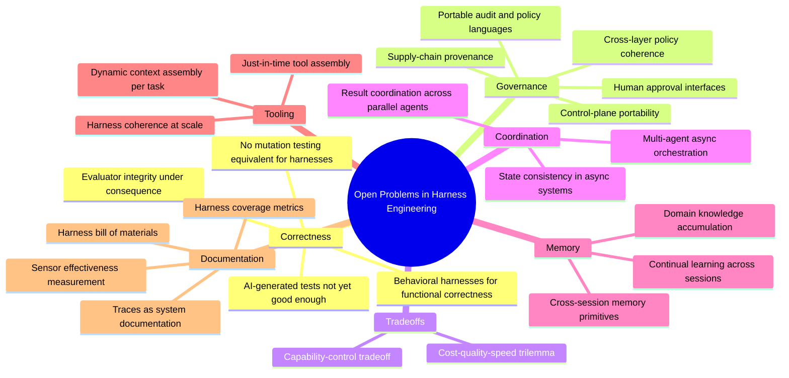

# Chapter 19: Outlook

### 19.1 The Field Is Young

Much of the vocabulary used in this book—initializer agents, context firewalls, sprint contracts, reasoning sandwiches, ambient affordances, and computational versus inferential controls—entered the mainstream agent-engineering conversation within the last twelve to eighteen months. The underlying ideas are sometimes older, but the shared language is recent. Most of the source articles for this textbook were published in 2025 and 2026.

The pace is measurable. METR finds that the task-completion *time horizon* of frontier models—the length of a human task they complete successfully 50% of the time—has doubled roughly every seven months (§7.11) ([Kwa et al. — Measuring AI Ability to Complete Long Tasks](https://arxiv.org/abs/2503.14499)). Any book about what a harness must provide is therefore describing a moving target.

LangChain frames the trajectory plainly: as models improve, some responsibilities that live in the harness today will be absorbed into the model. Models will become better at planning, self-verification, and long-horizon coherence, reducing the need to inject those capabilities through context. Yet the space of useful harness designs does not disappear as models improve; it shifts toward new problems ([LangChain — The Anatomy of an Agent Harness](https://blog.langchain.com/the-anatomy-of-an-agent-harness/); [Anthropic — Harness Design for Long-Running Application Development](https://www.anthropic.com/engineering/harness-design-long-running-apps)).

### 19.2 Open Problems

Several open problems recur across the literature:

- **Behavioral harnesses for functional correctness**. Maintainability and architectural fitness have benefited from decades of tooling. Behavioral harnesses that answer a more basic question—does the application actually do what the user wants?—have not. Most teams currently rely on AI-generated tests, and the consensus is that these are not yet sufficient ([Thoughtworks — Harness Engineering](https://martinfowler.com/articles/exploring-gen-ai/harness-engineering.html)).
- **Harness coherence at scale**. As guides and sensors multiply, how do they remain consistent? When a sensor never fires, how do we distinguish a high-quality system from inadequate detection? Harness coverage has no equivalent of code coverage or mutation testing yet.
- **Control-plane portability**. Registries, identities, policies, gateways, and audit systems now exist, but their schemas and authority models remain platform-specific. It is still difficult to move an agent between clouds or organizations without losing provenance, policy meaning, or revocation semantics (Ch 18).
- **Cross-layer governance coherence**. The OpenReview survey notes that policies, permission prompts, audit logs, constitutional instructions, and runtime hooks often live in separate layers. Instead of composing cleanly, those layers may interfere with one another. Portable policy and audit languages are still missing ([OpenReview — Agent Harness Engineering: A Survey](https://openreview.net/pdf?id=3hXEPbG0dh)).
- **Standardized readiness reporting**. Model scores depend on the execution environment, tool surface, context policy, retry rules, and governance gates. Benchmark reports therefore need a harness bill of materials, but no widely adopted format exists for publishing that configuration ([OpenReview — Agent Harness Engineering: A Survey](https://openreview.net/pdf?id=3hXEPbG0dh)).
- **Cost-quality-speed trilemma**. Stronger sandboxes, richer observability, deeper verification, and stricter governance usually add cost and latency. Mature harnesses need explicit policies for which checks run synchronously, which run offline, and which risks justify more expensive controls ([OpenReview — Agent Harness Engineering: A Survey](https://openreview.net/pdf?id=3hXEPbG0dh)).
- **Capability-control tradeoff**. More tools, memory, autonomy, and network access increase task coverage. They also increase tool-selection errors, exposure to prompt injection, provenance risk, and audit burden. Capability and control belong on one design axis; they are not separate concerns.
- **Multi-agent coordination beyond synchronous orchestration**. Anthropic's research system runs sub-agents synchronously. Asynchronous coordination could unlock more parallelism, but it also makes result coordination, state consistency, and error propagation harder ([Anthropic — How We Built Our Multi-Agent Research System](https://www.anthropic.com/engineering/multi-agent-research-system)).
- **Continual learning at the harness level**. Agents often begin each session without the knowledge gained in earlier ones. Memory primitives that let them accumulate knowledge of a codebase or domain over many sessions remain an active research area ([LangChain — Improving Deep Agents with Harness Engineering](https://blog.langchain.com/improving-deep-agents-with-harness-engineering/)).
- **Human-in-the-loop approval**. There is no settled interface for deciding when a harness should pause for human judgment or how much context to show without overwhelming the operator. Gates that are too coarse tend to be rubber-stamped; gates that are too fine-grained defeat the purpose of autonomy.
- **Just-in-time tool assembly**. Rather than preconfiguring every possible capability, a harness could assemble the tools and context needed for the current task. LangChain and others are exploring this approach ([LangChain — Improving Deep Agents with Harness Engineering](https://blog.langchain.com/improving-deep-agents-with-harness-engineering/)).
- **Tracing as documentation**. LangChain's observation that "in software, the code documents the app; in AI, the traces do" points toward a different model of system documentation, one the field has not yet fully developed ([LangChain — The Anatomy of an Agent Harness](https://blog.langchain.com/the-anatomy-of-an-agent-harness/)).
- **End-to-end supply-chain governance**. Tool integrity is only one part of the problem. Agents also depend on MCP servers, external packages, datasets, retrieval sources, and generated dependency names. Provenance across this full chain remains underdeveloped ([OpenReview — Agent Harness Engineering: A Survey](https://openreview.net/pdf?id=3hXEPbG0dh)).
- **Evaluator integrity under consequence**. Model judges can be influenced by how their verdicts will be used, while generators can learn to optimize against known graders. Blinding, abstention, ensembles, and meta-evals help, but no general method makes a semantic verifier both scalable and independent of those consequences (Ch 10).

### 19.3 The Standing Advice

A few principles appear throughout the literature:

- **Treat context as a finite resource**. Find the smallest set of high-signal tokens that produces the desired outcome.
- **Do the simplest thing that works**. Agents are expensive; workflows often suffice; many tasks need neither.
- **Read the transcripts**. They show where the agent became confused, chose the wrong tool, or stopped using the guidance the harness supplied.
- **Iterate on what is load-bearing**. Stress-test components when models change. Remove what no longer contributes, and tune what still does.
- **Adapt harnesses to models, but ground them in durable principles**. Prompts and tools change from one model to another. The core work—context engineering, tool design, evaluation, sandboxing, and self-verification—remains.

The field is barely old enough to have textbooks. This document is an attempt to write one anyway, with the expectation that it will age faster than most. The citations provide a path back to the original work as the conversation continues.

---

## Diagram: Open Problems Mindmap

---

## Key Takeaways

- **The shared vocabulary is young**: many terms became common in 2025–2026, even when the underlying ideas are older.
- **Models absorb parts of the harness, but harness work moves**: as models take on more capabilities natively, harness engineering shifts toward harder problems rather than disappearing.
- **Open problems now span the full ETCLOVG stack**: behavioral correctness, evaluator integrity, control-plane portability, harness and governance coherence, readiness reporting, cost-quality-speed, capability-control, asynchronous coordination, continual learning, just-in-time tool assembly, and traces as documentation.
- **Five standing principles cut across all contexts**: finite context, simplest-that-works, read-the-transcripts, iterate-load-bearing, tailor-to-model.
- **Harness engineering is ongoing work**: it is not scaffolding to discard once models improve, but the continuing craft of building effective systems around increasingly capable cores.

## Further Reading

- Vivek Trivedy, *The Anatomy of an Agent Harness*, LangChain, Mar 2026. https://blog.langchain.com/the-anatomy-of-an-agent-harness/
- Prithvi Rajasekaran, *Harness Design for Long-Running Application Development*, Anthropic, Mar 2026. https://www.anthropic.com/engineering/harness-design-long-running-apps
- Birgitta Böckeler, *Harness Engineering for Coding Agent Users*, Thoughtworks / martinfowler.com, Apr 2026. https://martinfowler.com/articles/exploring-gen-ai/harness-engineering.html
- Jeremy Hadfield et al., *How We Built Our Multi-Agent Research System*, Anthropic, Jun 2025. https://www.anthropic.com/engineering/multi-agent-research-system
- Vivek Trivedy, *Improving Deep Agents with Harness Engineering*, LangChain, Feb 2026. https://blog.langchain.com/improving-deep-agents-with-harness-engineering/
- *Awesome Harness Engineering* reading list: https://github.com/walkinglabs/awesome-harness-engineering
- Thomas Kwa et al., *Measuring AI Ability to Complete Long Tasks*, METR / arXiv, Mar 2025. https://arxiv.org/abs/2503.14499
- *Agent Harness Engineering: A Survey*, OpenReview / TMLR submission, 2026. https://openreview.net/pdf?id=3hXEPbG0dh
