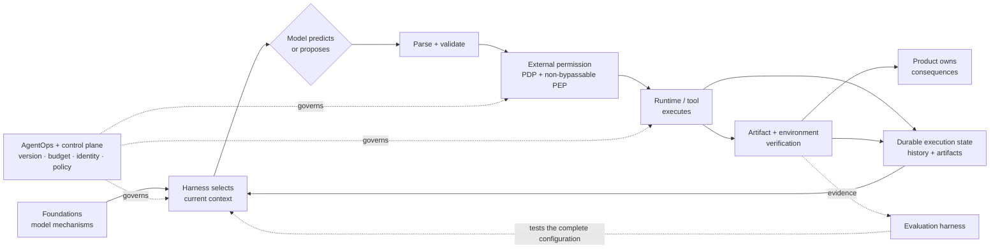

# Chapter 20: Outlook

This volume began with a deliberately precise boundary: an agent is not a model with authority added by fluent prose. It is a model embedded in an external system that selects inputs, governs actions, preserves state, and checks results. Products, model capabilities, protocols, and preferred scaffolds will change. The boundary tells us which claims still require an external guarantee when they do.

This final chapter therefore does not predict one inevitable agent architecture. It closes the two-volume argument, separates durable principles from dated implementation evidence, identifies open engineering questions, and provides a navigation map from model mechanisms in *LLM Foundations* to the corresponding responsibilities in this book.

### 20.1 The Standing Boundary

The final principle is the same one stated in [*LLM Foundations*, Chapter 14](../llm-foundations/14-operational-mental-model.md):

> **The model predicts or proposes. The external system owns context selection, durable state, permissions, execution, verification, and consequences.**

“External system” is not one mandatory service. [Chapter 1](./01-what-is-an-agent-harness.md) divides it into the agent harness, runtime, product/application, platform/control plane, and evaluation harness. A deployment may combine those layers or assign parts to providers, but it must still name the component that supplies each guarantee.

| Responsibility | Model's legitimate role | External owner and required guarantee |
|---|---|---|
| **Context selection** | Interpret the supplied representation; suggest missing information | The agent harness selects, scopes, serializes, and provenance-tracks the input for each call |
| **Durable state** | Propose a transition or summarize progress | Runtime and product persist execution/business state; context and memory are not the sole source of truth |
| **Tool surface and execution** | Select a tool and propose structured arguments | Harness exposes contracts; dispatcher/runtime validates, authorizes, executes, correlates, and normalizes results |
| **Permissions** | State intent, request access, or ask for review | Product/platform policy decides; a non-bypassable PEP enforces the current decision and mandatory approval |
| **Verification** | Produce a critique, estimate, or candidate judgment | Runtime, product, evaluation harness, and humans check artifacts, environment state, process rules, and outcomes |
| **Consequences** | Predict or describe an intended effect | Runtime and integrated systems create, record, reconcile, compensate, or roll back effects and remain accountable for them |

A provider-executed tool, hosted memory feature, or model-generated critique may move an implementation boundary. It does not remove the need to identify who authorizes the operation, which state is authoritative, what evidence establishes the outcome, and who handles failure. Fluency, confidence, schema validity, or a model's statement that work is complete cannot supply those guarantees by themselves.

### 20.2 Durable Design Principles

The following principles should survive changes in model families and product labels:

1. **Separate proposal from effect.** Parse, validate, authorize, approve when required, execute, and confirm outcomes as distinct lifecycle stages.
2. **Treat context as a selected view.** Context is finite input to one call; memory, artifacts, execution state, event history, traces, eval trajectories, cost ledgers, audit records, and lineage have different contracts.
3. **Prefer the least dynamic control regime that satisfies the task.** Deterministic workflows, bounded hybrid nodes, and model-directed loops are choices to evaluate, not rungs on a mandatory autonomy ladder.
4. **Put hard guarantees on unavoidable paths.** Prompt instructions and model self-restraint are defense in depth; permissions, sandboxing, egress, budgets, and mandatory approvals require external enforcement.
5. **Verify the relevant outcome.** A successful API response, attractive artifact, clean transcript, or passing local check establishes only the property it measured.
6. **Design for interruption and ambiguity.** Persist identities, checkpoints, budgets, approval state, idempotency records, and `partial` or `unknown` outcomes so recovery does not become blind repetition.
7. **Evaluate and release the complete configuration.** Model, prompts, tools, retrieval, memory, runtime, sandbox, policy, graders, caches, and budgets jointly determine the claim a result supports.
8. **Keep evidence guarantees explicit.** Correlate trace, event history, eval trajectory, cost ledger, audit record, and lineage without treating one as a synonym for another.

These are ownership and evidence principles, not promises that one implementation is optimal forever. A stronger model may let a team remove a planner, reset, evaluator, or tool-selection aid after controlled evaluation. It cannot approve its own authority, retroactively make an unknown side effect safe, or turn sampled observability into a complete record.

### 20.3 Durable Principles Versus Time-Bound Claims

Readers should classify a claim before relying on it:

| Claim class | Example | Required treatment |
|---|---|---|
| **Durable responsibility boundary** | The model proposes; an external system authorizes and executes | State as a standing design principle and test the claimed external guarantee |
| **Workload-dependent design choice** | Reset context, use an independent grader, defer tools, or choose a routing cascade | Name the task, model-plus-harness configuration, budget, comparison, and measured outcome |
| **Protocol or standard status** | A specification version, conformance level, or section maturity | Cite the official version, publication/status, and verification date; do not infer implementation coverage |
| **Vendor product behavior** | Cache matching, retention, hosted tools, model limits, price, or region support | Cite current official product documentation with model/tier/region and verification date |
| **Research measurement or trend** | A benchmark score or fitted capability horizon | Preserve the task distribution, harness, metric, uncertainty, update date, and limitations; do not rewrite it as a forecast |

The following snapshot illustrates the labeling discipline. It is **not** a ranking or a forecast; every row was verified on **2026-07-31**:

| Item | Status or maturity at verification | What the status does not establish |
|---|---|---|
| OpenTelemetry Trace SDK | The specification labels the SDK **Stable except where otherwise specified**; individual sections can carry another status ([OpenTelemetry — Trace SDK](https://opentelemetry.io/docs/specs/otel/trace/sdk/)) | That exported traces are complete, unsampled, suitable for replay, or compliant audit records |
| MCP tools contract, version `2025-06-18` | A dated protocol specification for discovering and invoking exposed tools, including optional tool-list change notification ([MCP — Tools Specification](https://modelcontextprotocol.io/specification/2025-06-18/server/tools)) | Current authorization, non-bypassable enforcement, resource ownership, or verified external outcomes |
| NIST AI RMF 1.0 | A published voluntary risk-management framework; NIST's page states that 1.0 is being revised ([NIST — AI Risk Management Framework](https://www.nist.gov/itl/ai-risk-management-framework)) | Legal compliance, product certification, or one required agent architecture |
| OpenAI prompt caching | Active provider product documentation checked on the stated date; matching, breakpoints, retention, and accounting are provider/model-specific ([OpenAI — Prompt caching](https://developers.openai.com/api/docs/guides/prompt-caching)) | A portable cache contract or permission to reuse an application response across users or tenants |
| METR Time Horizon 1.1 | A research measurement page last updated **2026-05-08**, fitting reliability against human-expert duration on its declared software-task distribution ([METR — Task-Completion Time Horizons](https://metr.org/time-horizons/)) | How long an arbitrary deployed agent may run autonomously or a forecast for all occupations and environments |
| Anthropic long-running harness case | A dated vendor engineering case in which decomposition and evaluator scaffolding changed as the tested model and task boundary changed ([Anthropic — Harness Design for Long-Running Application Development](https://www.anthropic.com/engineering/harness-design-long-running-apps)) | A universal rule that future models will absorb a particular harness component |

When a dated row changes, update the row and its verification date. Do not change the standing boundary merely because a provider moved a mechanism behind its API.

### 20.4 Open Questions by Responsibility

These are questions for engineering and research, not claims that a particular future solution will win. Progress should be demonstrated with a stated contract, representative evidence, and failure analysis.

| Category | Open questions | Evidence that would support progress |
|---|---|---|
| **Context** | How should a harness measure information lost by selection, compaction, reset, retrieval, and memory consolidation? How can dynamic tool/context assembly preserve authorization, provenance, invalidation, and provider-cache correctness? | Resume tests, adversarial omission cases, provenance coverage, cross-scope negative tests, and measured quality/cost/latency on declared task slices |
| **State** | How should long-running configurations migrate while old runs remain recoverable? How can branches, concurrent workers, compensation, deletion, and nondeterministic model/tool results compose under an honest replay contract? | Recovery drills across version changes, invariant checks, duplicate/unknown-effect tests, deterministic reuse of recorded outputs, and explicit migration/rollback evidence |
| **Tools** | How can schemas express effect class, idempotency, approval materiality, postconditions, cancellation, and partial results portably? How should computer-use and peer-agent interfaces expose enough state for safe verification? | Cross-implementation contract tests, injected timeout/race cases, postcondition recall, safe-retry tests, and outcome evidence independent of model text |
| **Security** | How should identity, delegated authority, retrieval ACLs, sandboxing, egress, supply-chain provenance, PDP decisions, and distributed PEPs compose without gaps? How should residual prompt-injection risk be measured rather than declared solved? | Non-bypass tests, revocation latency, least-privilege analysis, adversarial content/tool suites, cross-tenant tests, and protected records of decisions and effects |
| **Eval** | How can suites remain representative as tasks, models, and user distributions change? How should grader integrity, correlated maker/checker failures, contamination, infrastructure variance, and delayed business outcomes affect release claims? | Versioned tasks and graders, isolated repeated trials, calibration/adjudication sets, per-slice uncertainty, raw failure accounting, and post-release outcome joins |
| **Operations** | How should systems optimize cost, latency, reliability, privacy, and human attention per successful policy-compliant outcome? How can complete ledgers and policy events coexist with sampled telemetry, retention, deletion, and incident response? | Complete reconciled counters, five-class monitoring, budget enforcement tests, privacy lifecycle evidence, canary comparisons, rollback drills, and incident timelines |
| **Identity and standards** | Which portable contracts should represent agent version, sponsor, delegator, tenant, purpose, credential audience, approval, lineage, revocation, and audit semantics across organizations? Which parts belong in protocols versus local policy? | Versioned conformance profiles, multi-vendor interop tests, explicit maturity levels, negative authorization tests, provenance continuity, and revocation/kill-switch demonstrations |

The categories interact. A semantic cache is simultaneously a context, security, and operations problem; an asynchronous peer-agent task is simultaneously state, tools, identity, and eval. Classification does not remove the coupling—it makes each missing guarantee visible.

### 20.5 Two-Volume Navigation

The table below is the shortest route from a model mechanism in *LLM Foundations* to the engineering responsibility it creates in *Agent Harness*. The repository's [complete Foundations → Harness source map](./source-map.md) provides the maintained version with fuller boundary notes.

| Foundations mechanism | Model-side boundary | Harness responsibility | Continue in Harness |
|---|---|---|---|
| [1. Tokens and model outputs](../llm-foundations/01-llm-as-token-machine.md) | Produces token probabilities or structured output, not an external effect | Parse proposals, correlate calls, govern dispatch, and verify effects | [Ch 1](./01-what-is-an-agent-harness.md), [Ch 6](./06-tools-invocation-lifecycle.md) |
| [2. Tokenization](../llm-foundations/02-tokenization.md) | Input cost is representation- and model-specific | Measure actual contracts and enforce context/visual budgets | [Ch 3](./03-context-as-finite-resource.md), [Ch 15](./15-computer-use-multimodal-agents.md) |
| [3. Next-token prediction](../llm-foundations/03-next-token-prediction.md) | Fluent continuation is not proof of fact, permission, execution, or completion | Separate proposal from effect and grade independent evidence/outcomes | [Ch 1](./01-what-is-an-agent-harness.md), [Ch 11](./11-evaluation.md) |
| [4. Attention](../llm-foundations/04-transformer-attention.md) | Operates on current input; does not create durable memory | Select/order context and persist state, memory, artifacts, and provenance externally | [Ch 3](./03-context-as-finite-resource.md), [Ch 5](./05-compaction-memory-context-handoffs.md), [Ch 10](./10-state-event-history-production-factors.md) |
| [5. Training data and scaling](../llm-foundations/05-training-data-and-scaling.md) | Broad capability does not establish workload readiness | Evaluate and release the exact model-plus-harness configuration | [Ch 11](./11-evaluation.md), [Ch 18](./18-agentops.md) |
| [6. Inference and sampling](../llm-foundations/06-inference-and-sampling.md) | Attempts vary; constrained decoding can establish shape, not semantics or authority | Run repeated trials and validate semantics, permissions, and outcomes | [Ch 6](./06-tools-invocation-lifecycle.md), [Ch 11](./11-evaluation.md) |
| [7. Post-training](../llm-foundations/07-post-training.md) | Instruction following is learned behavior, not access control | Compose model-visible guidance but enforce protected actions externally | [Ch 2](./02-system-prompts-instructions-policy.md), [Ch 7](./07-sandboxing-runtime-enforcement.md) |
| [8. Prompting and in-context learning](../llm-foundations/08-prompting-and-in-context-learning.md) | Prompt structure steers behavior; untrusted text can still steer proposals | Track assembly provenance, separate data from authority, and enforce outside the prompt | [Ch 2](./02-system-prompts-instructions-policy.md), [Ch 4](./04-production-retrieval-grounding.md), [Ch 7](./07-sandboxing-runtime-enforcement.md) |
| [9. Context window and caches](../llm-foundations/09-context-window-and-kv-cache.md) | Context is finite; per-request KV state is not every cross-request cache | Budget/transform context and scope each provider, response, and semantic cache correctly | [Ch 3](./03-context-as-finite-resource.md), [Ch 5](./05-compaction-memory-context-handoffs.md), [Ch 18](./18-agentops.md) |
| [10. Knowledge, hallucination, and uncertainty](../llm-foundations/10-knowledge-hallucination-uncertainty.md) | Plausibility and verbal confidence are not verified evidence | Retrieve governed sources, preserve citations/provenance, support abstention, and grade grounding/outcomes | [Ch 4](./04-production-retrieval-grounding.md), [Ch 11](./11-evaluation.md), [Ch 13](./13-loop-engineering.md) |
| [11. Embeddings and retrieval](../llm-foundations/11-embeddings-and-retrieval.md) | Similarity and minimal RAG do not operate a production data lifecycle | Own ingestion, ACLs, freshness, deletion, index versioning, reranking, and retrieval eval | [Ch 4](./04-production-retrieval-grounding.md) |
| [12. Reasoning, tools, and agents](../llm-foundations/12-reasoning-tools-and-agents.md) | Tool/computer actions are proposals and results return as context | Complete invocation, authorization, retry, computer-use, approval, and outcome lifecycles | [Ch 6](./06-tools-invocation-lifecycle.md), [Ch 7](./07-sandboxing-runtime-enforcement.md), [Ch 14](./14-human-agent-interaction.md), [Ch 15](./15-computer-use-multimodal-agents.md) |
| [13. Evaluation of model behavior](../llm-foundations/13-evaluation-for-llm-behavior.md) | Model-level tasks and graders do not establish system reliability or external state | Evaluate complete trajectories, artifacts, environments, infrastructure, policies, and releases | [Ch 11](./11-evaluation.md), [Ch 16](./16-infrastructure-noise.md), [Ch 17](./17-trace-driven-iteration.md) |
| [14. Operational mental model](../llm-foundations/14-operational-mental-model.md) | Model prediction stops before authority, persistence, execution, and consequences | Assign responsibility across harness, runtime, product, control plane/PEPs, and evaluation harness | [Ch 1](./01-what-is-an-agent-harness.md), [Ch 18](./18-agentops.md), [Ch 19](./19-agent-fleets-control-plane.md), [Ch 20](./20-outlook.md) |

### 20.6 A Rule for Future Revisions

When a model, product, protocol, or benchmark changes, ask four questions:

1. **Which measured component became more or less load-bearing?** Rerun the relevant task and risk slices; do not infer the answer from a release announcement.
2. **Did an implementation move, or did a guarantee disappear?** A provider-hosted mechanism still needs an owner, contract, evidence, and failure path.
3. **Which statement is now stale?** Update version, status, date, scope, and source; preserve historical case results as historical cases.
4. **Does the responsibility boundary still hold?** If the model still only predicts or proposes while another system owns the effect, state, authority, verification, or consequence, the boundary has not moved.

The field can change quickly without making the book's conclusion complicated. Use the model for what it does well. Put authority and durable evidence in the systems capable of providing them. Measure the complete configuration, and describe only the claim that the evidence supports.

---

## Diagram: One Boundary, Many External Owners

The model remains central to capability. The surrounding system remains accountable for turning that capability into governed, recoverable, and verified work.

---

## Key Takeaways

- **The standing boundary is durable:** the model predicts or proposes; external systems own context selection, durable state, permissions, execution, verification, and consequences.
- **External ownership is distributed:** agent harness, runtime, product, control plane/PEPs, and evaluation harness supply different guarantees.
- **Principles, designs, standards, products, and measurements age differently:** label version, maturity, scope, date, and evidence accordingly.
- **Open questions fall into seven responsibility groups:** context, state, tools, security, eval, operations, and identity/standards.
- **The two volumes form one map:** Foundations explains the model mechanism; Harness implements and tests the responsibility created at its boundary.
- **Capability improvement is not authority transfer:** remove scaffolding only when controlled evidence supports the change, while preserving external guarantees.

## Further Reading

- OpenTelemetry, *Trace SDK*. https://opentelemetry.io/docs/specs/otel/trace/sdk/
- Model Context Protocol, *Tools Specification*, version 2025-06-18. https://modelcontextprotocol.io/specification/2025-06-18/server/tools
- NIST, *AI Risk Management Framework*. https://www.nist.gov/itl/ai-risk-management-framework
- OpenAI, *Prompt caching* (product documentation; checked 2026-07-31). https://developers.openai.com/api/docs/guides/prompt-caching
- METR, *Task-Completion Time Horizons of Frontier AI Models*, Time Horizon 1.1, updated 2026-05-08. https://metr.org/time-horizons/
- Anthropic, *Harness Design for Long-Running Application Development*, Mar 2026. https://www.anthropic.com/engineering/harness-design-long-running-apps
